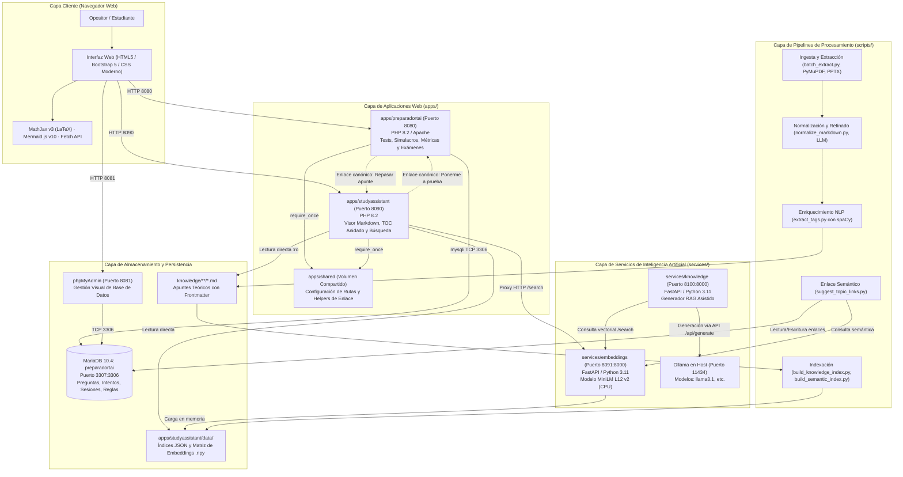
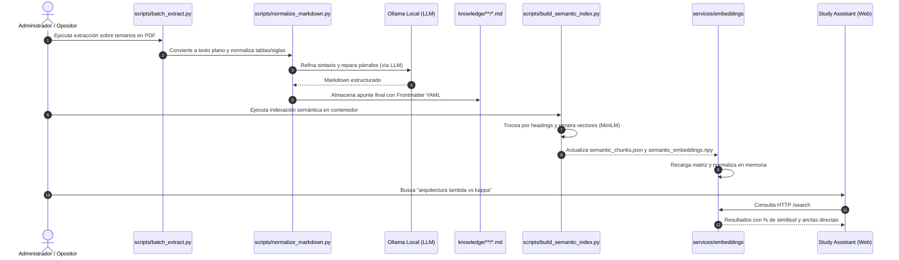
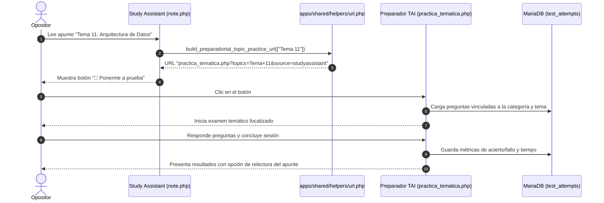

# Arquitectura General del Sistema Preparaopos

Documento técnico de arquitectura global del repositorio **preparaopos**, una plataforma integral diseñada para la preparación de oposiciones tecnológicas mediante aplicaciones interactivas, bases de conocimiento estructuradas en Markdown, modelos locales de inteligencia artificial y búsqueda semántica vectorial.

---

## 1. Principios de Diseño y Filosofía del Sistema

El ecosistema **preparaopos** se rige por cuatro principios fundamentales:

1. **Local-First y Cero Costes de Nube (Zero-Cloud-Cost):**
   Tanto los modelos de embeddings (`sentence-transformers`) como los modelos generativos de lenguaje (LLMs vía Ollama) se ejecutan 100% en infraestructura local (CPU/GPU local). No existen suscripciones externas, costes por token ni exposición de datos privados a APIs de terceros.
2. **Git como Única Fuente de Verdad para el Conocimiento:**
   Los apuntes teóricos no se almacenan como blobs en una base de datos relacional, sino como archivos Markdown (`knowledge/**/*.md`) versionados en Git con metadatos estructurados en YAML frontmatter. Esto permite control de versiones diff, edición colaborativa y legibilidad humana universal.
3. **Desacoplamiento Funcional en Monorepo:**
   El repositorio agrupa aplicaciones web especializadas, microservicios de IA, scripts de procesamiento y esquemas de base de datos en un único monorepo coordinado, comunicados mediante contratos ligeros de URLs y APIs REST internas.
4. **Resiliencia Operativa:**
   Las aplicaciones web cliente (`preparadortai` y `studyassistant`) son completamente funcionales de forma autónoma. Si los microservicios de IA o búsqueda semántica están detenidos, las aplicaciones degradan su funcionalidad de forma elegante sin interrumpir el estudio.

---

## 2. Mapa Global de la Arquitectura



---

## 3. Topología de Contenedores y Red (`docker-compose.yml`)

El entorno de ejecución completo se orquesta mediante **Docker Compose**:

| Servicio | Contenedor | Imagen / Dockerfile | Puerto Host | Puerto Red Docker | Propósito y Responsabilidad |
| :--- | :--- | :--- | :--- | :--- | :--- |
| **`web`** | `preparaopos-preparadortai-web` | `infra/docker/php/Dockerfile` (PHP 8.2 + Apache) | `8080` | `80` | Servidor web de la aplicación interactiva de exámenes **Preparador TAI**. |
| **`studyassistant`** | `preparaopos-studyassistant-web` | `infra/docker/php/Dockerfile` (PHP 8.2 integrado) | `8090` | `8080` | Servidor web del visor de apuntes y catálogo **Study Assistant**. |
| **`embeddings`** | `preparaopos-embeddings` | `infra/docker/embeddings/Dockerfile` (Python 3.11) | `8091` | `8000` | Microservicio FastAPI de búsqueda semántica vectorial en local. |
| **`knowledge-service`** | `preparaopos-knowledge-service` | `services/knowledge/Dockerfile` (Python 3.11) | `8100` | `8000` | Microservicio RAG para generación asistida de contenido con Ollama. |
| **`db`** | `preparaopos-preparadortai-db` | `mariadb:10.4` | `3307` | `3306` | Base de datos relacional del banco de preguntas y sesiones. |
| **`phpmyadmin`** | `preparaopos-preparadortai-phpmyadmin` | `phpmyadmin:5` | `8081` | `80` | Interfaz web de administración de la base de datos MariaDB. |

### Medidas de Seguridad y Aislamiento de Volúmenes:
* **Volúmenes de sólo lectura (`:ro`):**
  * `knowledge/` se monta estrictamente como `:ro` en `studyassistant` y en `embeddings`, evitando cualquier posibilidad de sobreescritura accidental o maliciosa desde la web.
  * `apps/shared/` se monta como `:ro` en ambas aplicaciones web para asegurar un contrato inmutable en tiempo de ejecución.
* **Privilegios de Contenedor:**
  * El contenedor `studyassistant` opera bajo el usuario sin privilegios `www-data` y con la directiva de seguridad `security_opt: no-new-privileges:true`.
* **Conexión con el Host:**
  * El contenedor `knowledge-service` se comunica con el servidor Ollama que corre en la máquina anfitrión a través de `host.docker.internal:11434` mediante la directiva `extra_hosts`.

---

## 4. Estructura de Directorios del Monorepo

```text
preparaopos/
├── apps/                          # Aplicaciones de usuario final
│   ├── preparadortai/             # Plataforma de tests y exámenes (PHP + MariaDB)
│   ├── studyassistant/            # Visor y buscador de apuntes Markdown (PHP + JS)
│   └── shared/                    # Configuración común y generadores de URLs canónicas
│
├── services/                      # Microservicios auxiliares contenerizados
│   ├── embeddings/                # API FastAPI de búsqueda vectorial (Sentence-Transformers)
│   └── knowledge/                 # Servicio RAG de generación y explotación de conocimiento
│
├── knowledge/                     # Base de conocimiento central en Markdown
│   ├── _template/                 # Plantillas formales de apuntes
│   ├── processes/                 # Apuntes organizados por proceso / perfil / apuntes
│   └── sources/                   # Fuentes de origen (PDFs de leyes, manuales, etc.)
│
├── scripts/                       # Pipelines de ingesta, NLP, indexación y mantenimiento
├── db/                            # Base de datos relacional
│   ├── migrations/                # Migraciones SQL versionadas
│   └── local/                     # Dumps de inicialización local (ignorados en Git)
│
├── infra/                         # Dockerfiles de soporte
│   └── docker/
│       ├── php/                   # Entorno PHP 8.2 con extensiones PDO y MySQLi
│       └── embeddings/            # Entorno Python 3.11 con PyTorch y Transformers
│
├── docker-compose.yml             # Orquestación de contenedores y redes
└── ARCHITECTURE.md                # Este documento de arquitectura global
```

---

## 5. Descripción de los Subsistemas Principales

### 5.1. Preparador TAI (`apps/preparadortai`)
* **Rol:** Sistema de evaluación, entrenamiento y administración del banco de preguntas.
* **Capacidades:**
  * Tests aleatorios, tests por bloque/tema, exámenes de convocatorias oficiales con temporizador, práctica de preguntas falladas (*banco de errores*) y relación de conceptos.
  * Persistencia asíncrona de intentos en MariaDB (`test_attempts` y `test_sessions`).
  * Panel estadístico avanzado con soporte para reglas de puntuación oficiales parametrizables (`scoring_rules`).
* **Documentación específica:** [`apps/preparadortai/ARCHITECTURE.md`](file:///c:/repositories/preparaopos/apps/preparadortai/ARCHITECTURE.md).

### 5.2. Study Assistant (`apps/studyassistant`)
* **Rol:** Visor interactivo y catálogo de la base de conocimiento teórico.
* **Capacidades:**
  * Catálogo de apuntes con filtrado rápido en memoria sobre `knowledge_index.json` (por texto, etiqueta, proceso y estado).
  * Renderizador Markdown propio ultraligero que soporta fórmulas matemáticas $\LaTeX$ (MathJax), diagramas Mermaid.js, tarjetas interactivas de cuestionarios tipo test y callouts.
  * Tabla de contenidos (TOC) multinivel y colapsable (`h2` a `h4`).
  * Búsqueda semántica interactiva en lenguaje natural conectada al microservicio de embeddings.
* **Documentación específica:** [`apps/studyassistant/ARCHITECTURE.md`](file:///c:/repositories/preparaopos/apps/studyassistant/ARCHITECTURE.md).

### 5.3. Capa de Interoperabilidad (`apps/shared`)
* **Rol:** Puente de comunicación desacoplado entre las aplicaciones web.
* **Capacidades:**
  * Centralización de puertos y dominios en `config/apps.php`.
  * Helpers canónicos en `helpers/url.php` para generar enlaces parametrizados entre el estudio teórico y la práctica de tests.
* **Documentación específica:** [`apps/shared/ARCHITECTURE.md`](file:///c:/repositories/preparaopos/apps/shared/ARCHITECTURE.md).

### 5.4. Microservicio de Embeddings (`services/embeddings`)
* **Rol:** Inferencia vectorial y cálculo de similitud para búsqueda por significado.
* **Capacidades:**
  * Utiliza el modelo multilingüe `paraphrase-multilingual-MiniLM-L12-v2` (384 dimensiones).
  * Carga en el arranque los fragmentos (`semantic_chunks.json`) y la matriz densa normalizada (`semantic_embeddings.npy`).
  * Computa similitud coseno en microsegundos mediante multiplicación matricial NumPy en CPU: $\text{scores} = \mathbf{E} \cdot \mathbf{q}$.

### 5.5. Microservicio de Generación RAG (`services/knowledge`)
* **Rol:** Generación asistida de nuevos apuntes de estudio y síntesis de contenidos.
* **Capacidades:**
  * Combina búsqueda vectorial sobre el microservicio `embeddings` con inferencia de modelos LLM locales a través de Ollama.
  * Recupera fragmentos relevantes (`TopicRetriever`), redacta el borrador del apunte (`NoteGenerator`) y genera el frontmatter YAML estandarizado de forma determinista (`FrontmatterGenerator`).

### 5.6. Pipelines y Scripts (`scripts/`)
* **Rol:** Cadena de procesamiento de datos por lotes e indexación.
* **Capacidades:**
  * Ingesta y conversión de PDFs y PPTX a Markdown limpio (`batch_extract.py`, `extract_pdf_text.py`, `extract_pptx_text.py`, `normalize_markdown.py`).
  * Refinado ortotipográfico con LLM local y caché SHA-256 (`refine_markdown_llm.py`).
  * Extracción de etiquetas por NLP con spaCy (`extract_tags.py`).
  * Generación de índices léxicos y semánticos (`build_knowledge_index.py`, `build_semantic_index.py`).
  * Enlace inteligente entre preguntas y apuntes (`suggest_topic_links.py`).
* **Documentación específica:** [`scripts/README.md`](file:///c:/repositories/preparaopos/scripts/README.md).

---

## 6. Flujos de Datos Transversales End-to-End

### 6.1. Ciclo de Vida del Conocimiento: De PDF a Consulta Semántica



### 6.2. Ciclo de Aprendizaje Activo: Estudio $\leftrightarrow$ Práctica de Examen



---

## 7. Índice de Documentación de Arquitectura

Para consultar los detalles técnicos de bajo nivel de cada componente, recurra a los documentos específicos del repositorio:

* 📄 **Preparador TAI:** [`apps/preparadortai/ARCHITECTURE.md`](file:///c:/repositories/preparaopos/apps/preparadortai/ARCHITECTURE.md)
* 📄 **Study Assistant:** [`apps/studyassistant/ARCHITECTURE.md`](file:///c:/repositories/preparaopos/apps/studyassistant/ARCHITECTURE.md)
* 📄 **Capa Compartida:** [`apps/shared/ARCHITECTURE.md`](file:///c:/repositories/preparaopos/apps/shared/ARCHITECTURE.md)
* 📄 **Scripts y Pipelines:** [`scripts/README.md`](file:///c:/repositories/preparaopos/scripts/README.md)
* 📄 **Base de Datos y Configuración:** [`docs/database.md`](file:///c:/repositories/preparaopos/docs/database.md)

