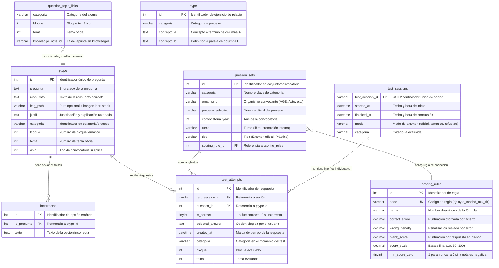
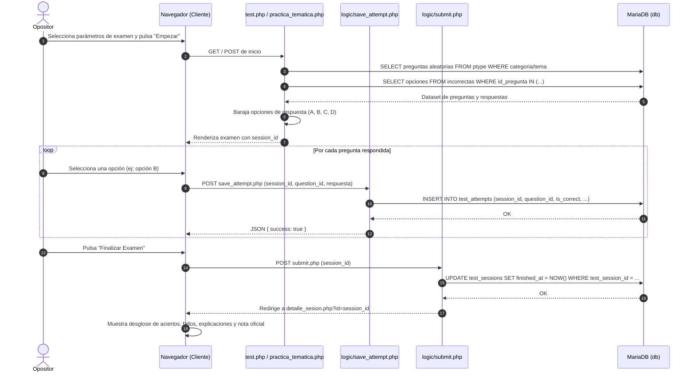

# Arquitectura de Preparador TAI

Documento técnico descriptivo de la arquitectura de software, modelo de datos, flujos operativos y componentes de **Preparador TAI**, la plataforma de entrenamiento para oposiciones, simulacros de examen y gestión del banco de preguntas de **preparaopos**.

---

## 1. Introducción y Propósito

**Preparador TAI** es una aplicación web dinámica orientada a la preparación activa de oposiciones del ámbito tecnológico (inicialmente centrada en el Cuerpo de Técnicos Auxiliares de Informática de la Administración del Estado — TAI, y ampliada a cuerpos de la Administración General del Estado, Comunidad de Madrid y Ayuntamientos).

Sus responsabilidades principales comprenden:
1. **Ejecución interactiva de tests y simulacros:** Soporte para exámenes oficiales con cronómetro, práctica libre, baterías temáticas por bloques/temas, relación de conceptos y refuerzo específico de preguntas falladas.
2. **Registro de intentos y analítica de rendimiento:** Persistencia granular de cada respuesta emitida por el usuario, cálculo de aciertos, porcentajes de precisión y aplicación de reglas de corrección oficiales (con penalización por respuesta errónea y escalas configurables).
3. **Mantenimiento y curación del banco de preguntas:** Panel administrativo para el alta, edición, categorización y justificación razonada de preguntas tipo test y de relacionar.
4. **Interconexión con la base de conocimiento:** Vinculación bidireccional entre preguntas de examen y apuntes teóricos de Markdown (`knowledge/`) a través de la tabla de enlace `question_topic_links` y el módulo compartido `apps/shared`.

---

## 2. Vista General de la Arquitectura

Preparador TAI sigue un patrón arquitectónico clásico de servidor web en PHP respaldado por una base de datos relacional MariaDB, con renderizado en servidor (SSR) asistido por JavaScript asíncrono para la persistencia no bloqueante de intentos:

```mermaid
flowchart TD
    subgraph Cliente["Navegador Web (Cliente)"]
        UI_Views["Vistas HTML5 / Bootstrap 5 / FontAwesome"]
        JS_Engine["JavaScript del Examen (Cronómetro / Fetch Asíncrono)"]
    end

    subgraph App_Web["Contenedor: preparaopos-preparadortai-web (PHP 8.2 / Apache)"]
        subgraph Vistas_Principales["Módulos de Usuario y Examen"]
            Dashboard["index.php (Dashboard y Métricas Rápidas)"]
            TestEngine["test.php (Motor Principal de Tests)"]
            ThematicPractice["practica_tematica.php (Práctica por Temas)"]
            FailureReinforce["refuerzo.php (Batería de Fallos Anteriores)"]
            MatchEngine["relacionar.php (Preguntas de Relacionar Conceptos)"]
            OfficialExams["examenes.php (Convocatorias Oficiales)"]
        end

        subgraph Modulos_Analitica["Módulos de Historial y Estadísticas"]
            Stats["estadisticas.php (Métricas Avanzadas y Reglas Oficiales)"]
            History["historial_sesiones.php (Histórico Cronológico)"]
            SessionDetail["detalle_sesion.php (Revisión Detallada de Sesión)"]
            Progress["progreso_cuestionarios.php (Avance por Bloques)"]
        end

        subgraph Modulos_Admin["Módulos de Gestión del Banco"]
            Manage["gestionar.php (Buscador y Listado)"]
            AddEdit["agregar.php / editar.php (CRUD de Preguntas)"]
            Taxonomy["categorias.php / temas.php (Taxonomía)"]
        end

        subgraph Capa_Logica["Capa Lógica Asíncrona (logic/)"]
            SaveAttempt["logic/save_attempt.php (Persistencia Inmediata de Respuesta)"]
            StartSession["logic/start_topic_test.php (Inicialización de Sesión)"]
            SubmitTest["logic/submit.php (Cierre y Consolidación de Test)"]
            SyncSets["logic/sync_question_sets.php (Sincronización de Conjuntos)"]
        end

        subgraph Includes_Core["Módulos Compartidos e Includes (includes/)"]
            Config["includes/config.php (Conexión mysqli)"]
            TopicLinks["includes/topic_links.php (Consultas a question_topic_links)"]
            QuestionSearch["includes/question_search.php (Filtros Avanzados)"]
        end
    end

    subgraph Modulo_Shared["Librería Compartida (apps/shared/)"]
        SharedUrl["helpers/url.php (Generador de URLs Canónicas)"]
        SharedConfig["config/apps.php (Endpoints del Monorepo)"]
    end

    subgraph Base_Datos["Contenedor: preparaopos-preparadortai-db (MariaDB 10.4)"]
        DB[(preparadortai)]
    end

    subgraph StudyAssistant_App["Study Assistant (Puerto 8090)"]
        StudyNotes["note.php (Lectura de Apunte Teórico)"]
    end

    %% Relaciones Cliente - Vistas
    UI_Views --> Dashboard
    UI_Views --> TestEngine
    UI_Views --> ThematicPractice
    UI_Views --> Stats
    UI_Views --> Manage

    %% Relaciones Asíncronas JS
    JS_Engine -->|POST save_attempt.php| SaveAttempt
    JS_Engine -->|POST start_topic_test.php| StartSession
    JS_Engine -->|POST submit.php| SubmitTest

    %% Relaciones Vistas - Lógica / Includes
    TestEngine --> Config
    ThematicPractice --> Config
    ThematicPractice --> TopicLinks
    Stats --> Config
    Manage --> QuestionSearch
    SaveAttempt --> Config
    SubmitTest --> Config

    %% Conexión a Base de Datos
    Config -->|mysqli TCP 3306| DB
    SaveAttempt --> DB
    SubmitTest --> DB

    %% Integración con Shared y Study Assistant
    ThematicPractice --> SharedUrl
    SharedUrl --> SharedConfig
    ThematicPractice -.->|"Enlace 'Ver Apunte'"| StudyNotes
    StudyNotes -.->|"Enlace 'Ponerme a prueba'"| ThematicPractice
```

---

## 3. Modelo de Datos y Esquema de Tablas

El almacenamiento persistente se organiza en MariaDB (`preparadortai`) estructurado en torno a tres grandes áreas: banco de contenidos, trazabilidad de exámenes y reglas de corrección oficiales.

---

## 4. Componentes y Flujos de Ejecución

### 4.1. Motores de Evaluación y Práctica

* **`test.php` (Motor General y Examen Oficial):**
  * Presenta interfaces de configuración con selección de número de preguntas, orden aleatorio o secuencial, temporizador regresivo opcional y modo examen estricto (sin mostrar retroalimentación hasta finalizar) o modo tutor (con corrección inmediata y justificación visible).
  * Realiza consultas parametrizadas sobre `ptype` e `incorrectas` barajando aleatoriamente la posición de la respuesta correcta respecto a las incorrectas.
* **`practica_tematica.php` (Práctica Orientada por Temas):**
  * Permite al opositor seleccionar uno o varios temas concretos de un bloque para generar una batería intensiva.
  * Permite recepción de parámetros GET directos (`?topics=Tema+X&source=studyassistant`), facilitando que el estudiante pase de leer un apunte en Study Assistant a resolver preguntas de ese mismo tema con un solo clic.
* **`refuerzo.php` (Banco de Fallos):**
  * Consulta las preguntas que han acumulado respuestas incorrectas (`is_correct = 0`) en `test_attempts` para priorizarlas en una sesión de consolidación de puntos débiles.
* **`relacionar.php` (Emparejamiento de Conceptos):**
  * Carga registros de `rtype` y renderiza dos columnas desordenadas para que el usuario trace o seleccione las parejas correctas (término $\leftrightarrow$ definición).

### 4.2. Capa Lógica y Persistencia Asíncrona (`logic/`)

Para evitar la pérdida de respuestas ante desconexiones o cierres involuntarios del navegador, la aplicación desacopla el registro de intentos:
* **`save_attempt.php`:** Cada vez que el usuario marca una opción en el cliente, JavaScript realiza una llamada asíncrona mediante `fetch()` o `XMLHttpRequest` registrando el intento en `test_attempts` con su sesión asociada (`test_session_id`).
* **`start_topic_test.php`:** Orquesta la generación de nuevas sesiones temáticas asignando identificadores de sesión UUID y preparando el conjunto de preguntas elegible.
* **`submit.php`:** Consolida la sesión al terminar, marca la hora de finalización en `test_sessions`, calcula el resumen de aciertos/fallos y redirige a la vista de resultados.

### 4.3. Motor de Estadísticas y Reglas de Puntuación (`estadisticas.php`)

El módulo analítico de Preparador TAI implementa consultas SQL analíticas avanzadas (usando Expresiones de Tabla Común — CTEs) para calcular:
1. **Métricas generales:** Total de preguntas respondidas, volumen de sesiones, tasa media de acierto porcentual (`accuracy_percentage`).
2. **Corrección según Convocatoria Oficial:** Mediante la asociación `question_sets` $\rightarrow$ `scoring_rules`, calcula la nota directa y la escala final:
   $$\text{Nota Directa} = (\text{Aciertos} \times \text{PtosAcierto}) - (\text{Fallos} \times \text{Penalización}) + (\text{Blancos} \times \text{PtosBlanco})$$
   $$\text{Nota Oficial} = \max\left(0, \frac{\text{Nota Directa} \times \text{Escala}}{\text{PreguntasTotales} \times \text{PtosAcierto}}\right)$$
3. **Bandas de Rendimiento:** Clasificación semántica de resultados en rangos (Alto $\ge 80\%$, Medio $\ge 60\%$, Bajo $< 60\%$).
4. **Tendencia Reciente:** Comparativa de los últimos 3 simulacros frente a los 3 anteriores para medir la evolución del opositor.

---

## 5. Diagrama de Secuencia: Ciclo de Vida de una Sesión de Examen

---

## 6. Integración con el Ecosistema Preparaopos

Preparador TAI no funciona de forma aislada; colabora activamente con los demás subsistemas del monorepo:

1. **Enlace desde Study Assistant:**
   * La vista de apuntes de Study Assistant (`note.php`) lee las etiquetas y metadatos del tema y genera dinámicamente un botón *"📝 Ponerme a prueba"*.
   * El enlace apunta canónicamente a `apps/preparadortai/practica_tematica.php?topics=...` gracias a la función `build_preparadortai_topic_practice_url()` de `apps/shared/helpers/url.php`.
2. **Enlace hacia Study Assistant:**
   * Mediante `includes/topic_links.php`, Preparador TAI puede consultar la tabla `question_topic_links` para mostrar al opositor un enlace directo *"📖 Repasar apunte teórico"* cuando falla una pregunta.
3. **Curación Semántica Asistida (`scripts/suggest_topic_links.py`):**
   * El script toma muestras de preguntas reales desde `test_attempts` y `ptype`, consulta el microservicio `embeddings:8000` y propone emparejamientos con los temas teóricos de `knowledge/` para poblar `question_topic_links`.

---

## 7. Despliegue, Infraestructura y Configuración

* **Contenedor Web:** `preparaopos-preparadortai-web` ejecuta PHP 8.2 con extensiones `mysqli`, `pdo` y `pdo_mysql` sobre Apache con `mod_rewrite` activo.
* **Puerto Host:** Mapeado en `http://localhost:8080`.
* **Variables de Entorno (`includes/config.php`):**
  * `DB_SERVER`: Host de base de datos (nombre de red del contenedor: `db`).
  * `DB_USERNAME`: Usuario de conexión (`preparaopos`).
  * `DB_PASSWORD`: Contraseña (`preparaopos`).
  * `DB_NAME`: Nombre de la base de datos (`preparadortai`).
* **Seguridad y Persistencia:**
  * Volumen de datos persistente: `preparaopos_preparadortai_db_data` en MariaDB (puerto local 3307).
  * Inyecciones iniciales controladas vía `/docker-entrypoint-initdb.d` en `db/local/`.
  * Los dumps SQL con datos reales están excluidos de Git por directivas en `.gitignore`.

