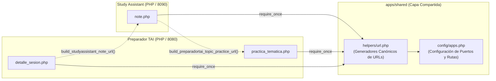

# Arquitectura de Apps Shared

Documento técnico sobre el diseño, propósito y catálogo de funciones de **`apps/shared`**, la capa común de configuración e interoperabilidad entre aplicaciones web del monorepo **preparaopos**.

---

## 1. Propósito y Filosofía de Diseño

En una arquitectura de monorepo con múltiples aplicaciones web independientes (como **Preparador TAI** en el puerto `8080` y **Study Assistant** en el puerto `8090`), surgen dependencias cruzadas naturales:
* El estudiante lee un apunte teórico en Study Assistant y desea pulsar *"Ponerme a prueba"* para abrir un test temático en Preparador TAI.
* El estudiante falla una pregunta en Preparador TAI y necesita un enlace directo *"Repasar apunte"* para abrir el tema correspondiente en Study Assistant.

Para evitar URLs cableadas (*hardcoded*), duplicación de rutas y fragilidad ante cambios de puertos o dominios, **`apps/shared`** actúa como la **fuente de verdad canónica** para la resolución de URLs y configuración inter-aplicación.



---

## 2. Estructura de Componentes

El paquete se organiza en dos subdirectorios sin dependencias de librerías externas:

```text
apps/shared/
├── config/
│   └── apps.php       # Declaración de endpoints base y prefijos de ruta
└── helpers/
    └── url.php        # Funciones globales generadoras de enlaces canónicos
```

### 2.1. Archivo de Configuración (`config/apps.php`)

Centraliza las direcciones base y los puntos de entrada oficiales de cada subsistema:

```php
return [
    'preparadortai_url' => 'http://localhost:8080',
    'studyassistant_url' => 'http://localhost:8090',

    'preparadortai' => [
        'base_path' => '/apps/preparadortai',
        'practice_topic_path' => '/apps/preparadortai/practica_tematica.php',
    ],

    'studyassistant' => [
        'base_path' => '/apps/studyassistant',
        'note_path' => '/apps/studyassistant/note.php',
    ],
];
```

### 2.2. Librería de Enlace (`helpers/url.php`)

Proporciona funciones utilitarias puras con control defensivo de codificación URL y saneamiento de cadenas:

| Función | Parámetros | Retorno | Descripción |
| :--- | :--- | :--- | :--- |
| `app_config()` | Ninguno | `array` | Devuelve el array completo de configuración cargado desde `config/apps.php`. |
| `get_tai_url(string $path = '')` | `$path` (opcional) | `string` | Resuelve una URL absoluta contra el host de Preparador TAI eliminando barras redundantes. |
| `get_studyassistant_url(string $path = '')` | `$path` (opcional) | `string` | Resuelve una URL absoluta contra el host de Study Assistant. |
| `build_studyassistant_note_url(string $id)` | `$id` (ID del apunte) | `string` | Construye el enlace canónico hacia un apunte específico (`note.php?id={id}`). |
| `build_preparadortai_topic_practice_url(array $topics, array $context = [])` | `$topics` (array de temas), `$context` (metadatos) | `string` | Construye la URL de examen temático con parámetros normalizados (`practica_tematica.php?topics=...&source=...`). |

---

## 3. Montaje e Integración en Docker

En `docker-compose.yml`, este directorio se monta como **volumen de sólo lectura** (`:ro`) en los contenedores de las aplicaciones que lo consumen:

```yaml
services:
  web:
    # Contenedor de Preparador TAI
    volumes:
      - ./apps/preparadortai:/var/www/html
      - ./apps/shared:/var/www/shared:ro

  studyassistant:
    # Contenedor de Study Assistant
    volumes:
      - ./apps/studyassistant:/workspace/apps/studyassistant:ro
      - ./knowledge:/workspace/knowledge:ro
      - ./apps/shared:/workspace/apps/shared:ro
```

Esto garantiza que:
1. Ambas aplicaciones utilicen exactamente el mismo código compartido sin duplicación.
2. Ninguna de las aplicaciones pueda mutar ni sobreescribir los archivos compartidos en tiempo de ejecución.
3. El despliegue mantenga un acoplamiento mínimo: si se cambia un puerto de servicio o un dominio en `config/apps.php`, el cambio se propaga de forma inmediata y sincronizada a todo el ecosistema.

---

## 4. Guía de Extensión

Para incorporar nuevos enlaces o una tercera aplicación al ecosistema:
1. **Registrar la nueva aplicación en `config/apps.php`:** Añadir la clave correspondiente (`nuevaapp_url`) y las rutas de sus controladores principales.
2. **Añadir el generador de enlace en `helpers/url.php`:** Crear la función `build_nuevaapp_...()` aplicando `rawurlencode()` o `http_build_query()` con arrays limpios y filtrados (`array_filter`).
3. **Montar el volumen en `docker-compose.yml`:** Incluir `./apps/shared:/workspace/apps/shared:ro` en la definición del nuevo servicio.

