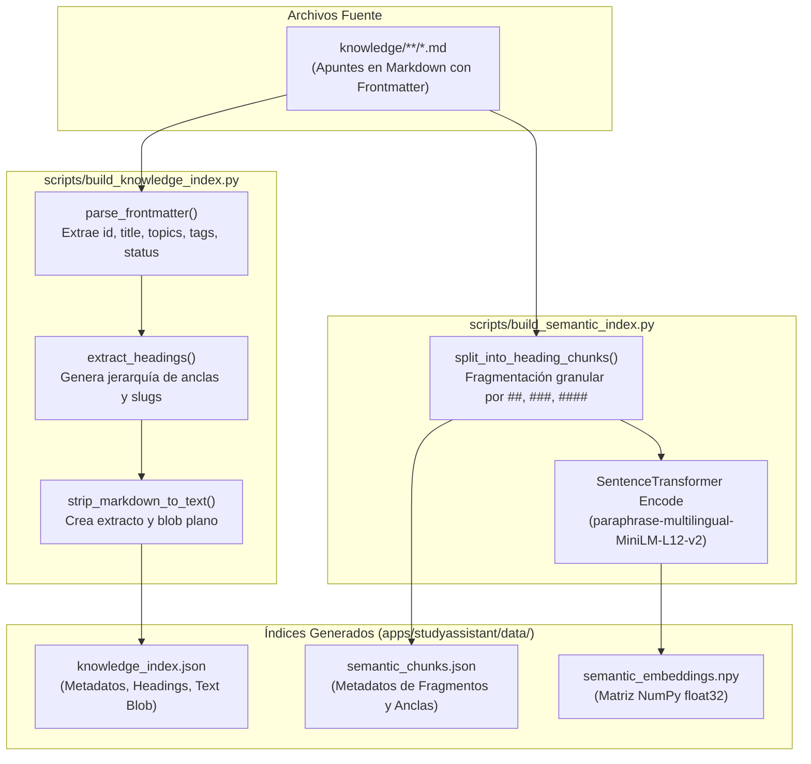
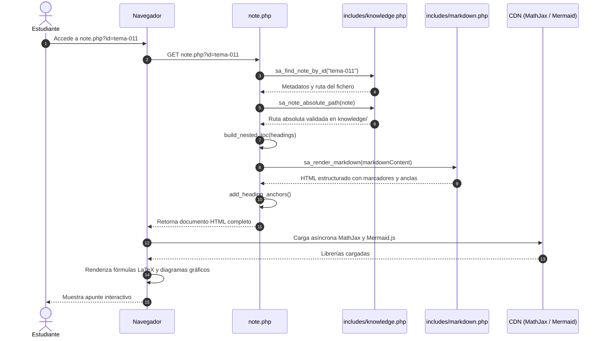
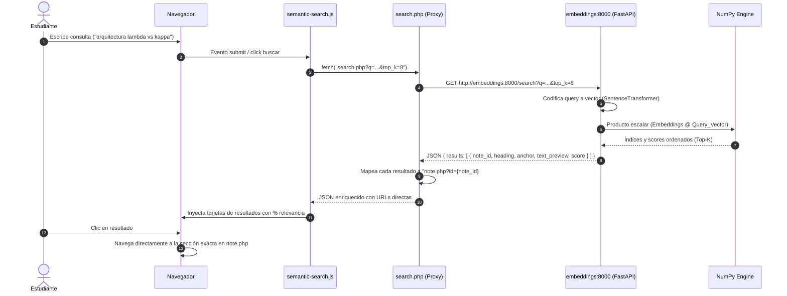
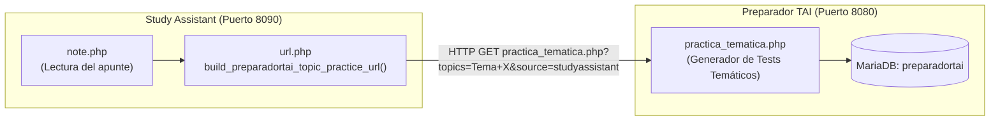

# Arquitectura de Study Assistant

Documento técnico descriptivo de la arquitectura de software, infraestructura, flujo de datos y componentes de **Study Assistant**, el subsistema de consulta, estudio y búsqueda semántica sobre la base de conocimiento Markdown de **preparaopos**.

---

## 1. Introducción y Objetivos

**Study Assistant** es una aplicación web desacoplada, rápida y orientada al opositor para la exploración y estudio de los temas y apuntes estructurados en Markdown (`knowledge/**/*.md`).

Sus objetivos clave son:
1. **Navegación e indexación estructurada:** Permitir localizar rápidamente apuntes por proceso de oposición, temas oficiales, perfiles y etiquetas.
2. **Lectura enriquecida sin dependencias pesadas:** Renderizar apuntes con soporte para fórmulas matemáticas ($\LaTeX$ mediante MathJax), diagramas dinámicos (Mermaid.js), bloques de examen interactivos y tabla de contenidos (TOC) multinivel y colapsable.
3. **Búsqueda híbrida (Léxica + Semántica):** Ofrecer filtrado instantáneo por metadatos y palabras clave en servidor, y búsqueda vectorial por significado basada en modelos locales de Embeddings, sin depender de servicios de pago en la nube ni exponer claves externas.
4. **Interoperabilidad con el ecosistema preparaopos:** Conectar los temas leídos con simulacros y tests activos en la aplicación complementaria **preparadortai**.

---

## 2. Vista General de la Arquitectura

Study Assistant adopta una arquitectura en capas complementada con un microservicio auxiliar de procesamiento de lenguaje natural (NLP):

```mermaid
flowchart TD
    subgraph Cliente["Cliente (Navegador Web)"]
        UI["Interfaz de Usuario (HTML5 / CSS3)"]
        JS_Search["semantic-search.js (Fetch API)"]
        Mermaid_Lib["Mermaid.js v10 (Diagramas ESM)"]
        MathJax_Lib["MathJax v3 (Fórmulas LaTeX)"]
    end

    subgraph App_Web["Contenedor: preparaopos-studyassistant-web (PHP 8.2)"]
        IndexController["index.php (Catálogo y Filtros)"]
        NoteController["note.php (Visor con TOC y Práctica)"]
        SearchProxy["search.php (Proxy Búsqueda Semántica)"]
        AssetServer["asset.php (Servidor Seguro de Recursos)"]
        
        subgraph Modulos_Internos["Módulos Core (includes/)"]
            KnowledgeLib["knowledge.php (Gestor de Índice y Rutas)"]
            MarkdownLib["markdown.php (Parser Markdown + Math + Quizzes)"]
        end
    end

    subgraph Vector_Service["Contenedor: preparaopos-embeddings (Python 3.11 / FastAPI)"]
        FastAPI_App["FastAPI Service (main.py)"]
        Model_MiniLM["Modelo: paraphrase-multilingual-MiniLM-L12-v2"]
        Matrix_Math["NumPy (Cálculo Coseno Matricial en CPU)"]
    end

    subgraph Almacenamiento_Persistente["Almacenamiento en Disco (Volúmenes)"]
        Knowledge_MD["knowledge/**/*.md (Base de Conocimiento)"]
        Index_JSON["data/knowledge_index.json (Índice Léxico)"]
        Semantic_Chunks["data/semantic_chunks.json (Fragmentos)"]
        Semantic_Embeddings["data/semantic_embeddings.npy (Vectores)"]
    end

    subgraph App_Externa["Ecosistema Preparadortai"]
        PreparadorTAI["preparadortai (Entrenador de Tests / MariaDB)"]
    end

    %% Relaciones Cliente
    UI --> IndexController
    UI --> NoteController
    JS_Search --> SearchProxy
    UI --> AssetServer
    UI --> Mermaid_Lib
    UI --> MathJax_Lib

    %% Relaciones Web
    IndexController --> KnowledgeLib
    NoteController --> KnowledgeLib
    NoteController --> MarkdownLib
    KnowledgeLib --> Index_JSON
    MarkdownLib --> Knowledge_MD
    AssetServer --> Knowledge_MD
    SearchProxy -->|HTTP GET /search| FastAPI_App

    %% Relaciones Embeddings
    FastAPI_App --> Model_MiniLM
    FastAPI_App --> Matrix_Math
    FastAPI_App --> Semantic_Chunks
    FastAPI_App --> Semantic_Embeddings

    %% Integración Externa
    NoteController -.->|"Enlace de Práctica (?topics=...)"| PreparadorTAI
```



---

## 3. Componentes del Sistema

### 3.1. Capa Web Frontend y Controladores PHP

Study Assistant utiliza PHP nativo moderno sin sobrecargas de frameworks pesados, optimizado para latencia mínima y facilidad de despliegue:

* **`index.php` (Catálogo y Filtrado Léxico):**
  * Carga el índice `knowledge_index.json` en memoria.
  * Proporciona filtrado multi-criterio por cadena de búsqueda (título, contenido, etiquetas, proceso), etiqueta (`tag`), proceso administrativo (`process`) y estado del apunte (`status`).
  * Agrupa las tarjetas de apuntes visualmente por proceso de oposición.
* **`note.php` (Visor de Apunte):**
  * Valida y resuelve el apunte solicitado mediante `sa_note_absolute_path()`.
  * Construye dinámicamente un **TOC (Table of Contents) anidado** en niveles `h2` a `h4`, interactivo con `<details><summary>` para la navegación en escritorio y móvil.
  * Inyecta anclas accesibles (`#slug`) en los encabezados del contenido renderizado.
  * Genera el botón de llamada a la acción *"📝 Ponerme a prueba"*, comunicando el apunte con los exámenes temáticos de `preparadortai`.
* **`search.php` (Endpoint Proxy para Búsqueda Semántica):**
  * Actúa como intermediario seguro entre el frontend y el microservicio `embeddings:8000`.
  * Realiza la llamada HTTP interna usando streams nativos de PHP (`file_get_contents` con `stream_context_create`), evitando dependencias adicionales como cURL.
  * Enriquece los resultados vectoriales calculando la URL final directa con su correspondiente ancla (`note.php?id=ID#anchor`).
* **`asset.php` (Servidor de Recursos Estáticos):**
  * Resuelve y sirve de forma segura imágenes y diagramas vinculados en los Markdown (`.png`, `.jpg`, `.svg`, `.webp`).
  * Implementa **control estricto de Path Traversal** verificando que la ruta canónica `realpath()` resida obligatoriamente dentro de `knowledge/`.

### 3.2. Módulos Internos (`includes/`)

* **`includes/knowledge.php`:**
  * Define la gestión del ciclo de vida del índice: lectura de `data/knowledge_index.json`, búsqueda por identificador (`id`), y recolección de valores únicos para facetas y menús desplegables.
  * Normalización y extracción de temas de práctica (`practice.topics` o `tags`) para enviar a `preparadortai`.
* **`includes/markdown.php`:**
  * Parser y convertidor customizado de Markdown a HTML:
    * **Preservación matemática:** Detecta fórmulas inline (`$...$`) y en bloque (`$$...$$`), sustituyéndolas temporalmente por marcadores seguros (`%%SA_MATH_n%%`) para evitar que el renderizado interfiera con caracteres matemáticos, restaurándolas luego para MathJax.
    * **Bloques Mermaid:** Convierte bloques ```` ```mermaid ```` en etiquetas `<pre class="mermaid">` para ser procesadas en cliente.
    * **Cuestionarios tipo test (Quiz cards):** Detecta bloques que comiencen por `Pregunta N.` y opciones `A) B) C) D)`, formateándolos en tarjetas interactivas con la respuesta correcta oculta bajo acordeón.
    * **Tablas GFM:** Parsea tablas con encabezados, divisores y saltos de línea enriquecidos.
    * **Anotaciones y Callouts:** Transforma citas blockquote `> Nota:` en etiquetas `<aside class="note">`.
    * **Reescritura de imágenes:** Traduce rutas relativas locales a llamadas a `asset.php?note=ID&path=PATH`.

### 3.3. Microservicio de Embeddings (`services/embeddings/`)

Servicio independiente contenerizado basado en **FastAPI** y **Sentence-Transformers**:
* **Modelo NLP:** `paraphrase-multilingual-MiniLM-L12-v2`, ligero (~470 MB), con soporte nativo en español y 384 dimensiones.
* **Cálculo Vectorial:** Al arrancar, normaliza los vectores precomputados a norma $L_2 = 1$. Al recibir una consulta, codifica la query del usuario en un vector normalizado y computa las puntuaciones de similitud coseno instantáneamente mediante multiplicación matricial directa con NumPy:
  $$\text{scores} = \mathbf{E} \cdot \mathbf{q}$$
* **Endpoints:**
  * `GET /health`: Estado del servicio y número de fragmentos indexados.
  * `GET /search?q={query}&top_k={k}`: Devuelve los mejores $k$ fragmentos ordenados por similitud decreciente.

---

## 4. Flujos de Indexación y Procesamiento de Datos

La aplicación opera sobre índices estáticos precomputados para garantizar una latencia casi nula en tiempo de ejecución.



### 4.1. Indexación Léxica (`build_knowledge_index.py`)
1. Escanea el directorio `knowledge/` filtrando notas válidas en subcarpetas `apuntes/`.
2. Parsea el YAML frontmatter normalizando listas de procesos, perfiles y etiquetas.
3. Extrae todos los títulos de sección (niveles 2 a 4) para construir los anclajes de navegación.
4. Genera un extracto contextual (`excerpt`) y un blob de texto optimizado para búsquedas por substring en PHP.

### 4.2. Indexación Semántica (`build_semantic_index.py`)
1. Divide cada apunte en unidades semánticas acotadas (*chunks*) correspondientes a cada encabezado.
2. Añade contexto al fragmento prefijando `Título del apunte — Nombre de sección`.
3. Codifica todos los fragmentos a vectores densos mediante el modelo multilingüe.
4. Serializa los fragmentos en formato JSON y la matriz densa en formato binario NumPy (`.npy`).

---

## 5. Diagramas de Secuencia Operativa

### 5.1. Consulta y Lectura de Apunte con TOC Dinámico



### 5.2. Flujo de Búsqueda Semántica Vectorial



---

## 6. Integración Inter-Aplicaciones (`preparadortai`)

Study Assistant está diseñado para integrarse de forma desacoplada con la suite de evaluación **preparadortai**:



* Los apuntes definen en su YAML frontmatter la clave `practice.topics` o etiquetas vinculadas al temario de oposición.
* El helper `build_preparadortai_topic_practice_url()` genera enlaces parametrizados hacia `preparadortai/practica_tematica.php`.
* Esto permite al opositor pasar del estudio teórico a la resolución inmediata de tests del tema específico con un solo clic.

---

## 7. Despliegue e Infraestructura Docker

En el entorno Docker del proyecto (`docker-compose.yml`), los servicios se orquestan de la siguiente manera:

| Servicio | Imagen / Dockerfile | Puerto Host | Puerto Interno | Función |
| :--- | :--- | :--- | :--- | :--- |
| **`studyassistant`** | `infra/docker/php/Dockerfile` | `8090` | `8080` | Servidor web PHP para la interfaz de Study Assistant y proxy de búsqueda. |
| **`embeddings`** | `infra/docker/embeddings/Dockerfile` | `8091` | `8000` | Microservicio FastAPI con el modelo vectorial en memoria. |
| **`knowledge-service`** | `services/knowledge/Dockerfile` | `8100` | `8000` | Servicio RAG avanzado para generación y consulta asistida por LLMs locales (Ollama). |
| **`web`** | `infra/docker/php/Dockerfile` | `8080` | `80` | Servidor web de la aplicación legacy `preparadortai`. |
| **`db`** | `mariadb:10.4` | `3307` | `3306` | Base de datos relacional de `preparadortai`. |

### Volúmenes y Aislamiento:
* `knowledge/` se monta como volumen de **sólo lectura** (`:ro`) tanto en `studyassistant` como en `embeddings`, impidiendo modificaciones accidentales en los apuntes desde la web.
* `apps/studyassistant/data/` se monta con permisos de lectura/escritura en `embeddings` para permitir la regeneración y almacenamiento de los índices vectoriales.
* `studyassistant` se ejecuta con el flag de seguridad `security_opt: no-new-privileges:true` y bajo el usuario sin privilegios `www-data`.

---

## 8. Consideraciones de Rendimiento y Seguridad

1. **Prevención de Directory Traversal:**
   Tanto `note.php` como `asset.php` utilizan validación defensiva con `realpath()` garantizando que ninguna ruta solicitada por parámetro URL pueda apuntar fuera de la carpeta `knowledge/`.
2. **Filtrado Léxico en Servidor Sin SQL:**
   Al no utilizar una base de datos relacional para Study Assistant, la superficie de ataque frente a inyecciones SQL en este módulo es nula. La búsqueda léxica se realiza sobre `knowledge_index.json` en memoria.
3. **Inferencia en CPU y Cero Costes:**
   El modelo `paraphrase-multilingual-MiniLM-L12-v2` está optimizado para ejecución ultrarrápida en CPU (~10-30 ms por búsqueda en un procesador estándar), sin requerir GPU dedicada ni llamadas a APIs de pago (como OpenAI o Anthropic).
4. **Resiliencia ante Caídas del Microservicio Vectorial:**
   Si el contenedor `embeddings` no está disponible o el índice no ha sido generado, `search.php` responde con códigos HTTP claros y mensajes informativos, mientras que el resto de funcionalidades de Study Assistant (lectura de apuntes, filtrado léxico y TOC) permanecen 100% operativas.

