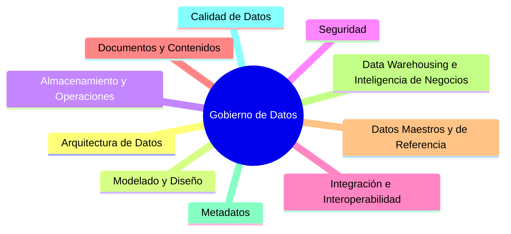
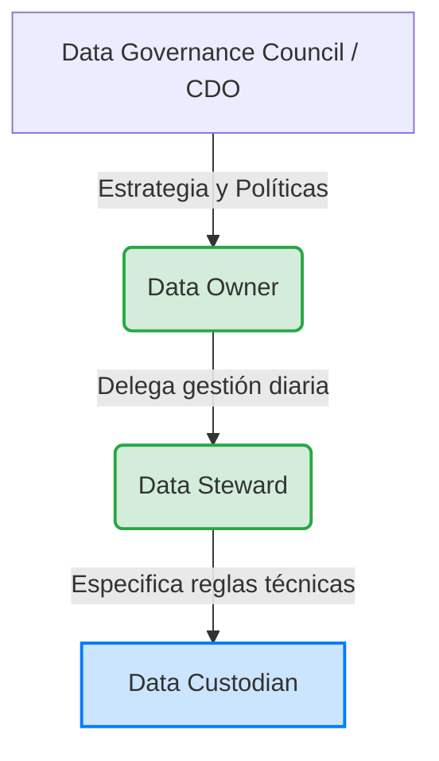

# Tema 8. Gobierno del dato y marco DAMA-DMBOK

## 1. Concepto de gobierno del dato

**Definición e implicaciones**
El Gobierno del Dato (Data Governance) se define como el ejercicio de autoridad, control y toma de decisiones compartida (planificación, monitorización y ejecución) sobre la gestión de los activos de datos de una organización. Su objetivo principal es asegurar que los datos sean fiables, seguros, accesibles, documentados y utilizables, alineando su gestión con los objetivos estratégicos de la entidad.

*   **Gobierno del dato:** Estrategia, políticas, roles, métricas, evaluación y dirección (QUÉ se debe hacer y QUIÉN).
*   **Gestión del dato:** Ejecución técnica, operativa y ciclo de vida (CÓMO se hace).

**Especificaciones UNE (Oficina del Dato - España)**
El ecosistema de estandarización español, promovido por la **Oficina del Dato** (dependiente de la Secretaría de Estado de Digitalización e Inteligencia Artificial - SEDIA), ha creado un corpus normativo fundamental publicado en 2023. En los test suelen cruzar los números con sus descripciones:

*   **UNE 0077:2023 - Gobierno del dato:** Se enfoca en la evaluación, dirección y monitorización. Define el marco estratégico.
*   **UNE 0078:2023 - Gestión del dato:** Se centra en el ciclo de vida del dato (creación, almacenamiento, uso, archivo y destrucción).
*   **UNE 0079:2023 - Gestión de la calidad del dato:** Define métricas, procesos de perfilado y aseguramiento para que el dato se adecúe al uso pretendido.
*   **UNE 0085:2024 - Implantación del gobierno del dato:** Establece un modelo de madurez y los pasos para evaluar e implantar progresivamente el gobierno, gestión y calidad. Las cuatro especificaciones están diseñadas para aplicarse de forma conjunta y coordinada, y las tres primeras (UNE 0077, 0078 y 0079) incorporan cada una un modelo de evaluación de capacidad de procesos y un modelo de madurez organizativa basados en la familia de normas ISO/IEC 33000.

**Reglamento (UE) 2022/868: Gobernanza Europea de Datos (Data Governance Act - DGA)**
*   **Aplicabilidad:** Plenamente aplicable desde el **24 de septiembre de 2023**.
*   **Objetivos principales (Art. 1):**
    1.  Reutilización de datos del sector público sujetos a derechos de terceros (secretos comerciales, propiedad intelectual, datos personales).
    2.  Regulación de los **servicios de intermediación de datos** (exige neutralidad estricta: el intermediario no puede usar los datos para otros fines).
    3.  Cesión **altruista** de datos (creación de organizaciones de altruismo de datos con registro voluntario).
    4.  Creación del **Comité Europeo de Innovación en materia de Datos** (European Data Innovation Board).

## 2. Marco DAMA-DMBOK: áreas de conocimiento

El DAMA-DMBOK (Data Management Body of Knowledge), en su segunda edición (DMBOK2, publicada en 2017), es el marco de referencia internacional estándar desarrollado por **DAMA International (Data Management Association)** para la gestión integral de datos.

El propio DMBOK2 define formalmente la **Gestión de Datos (Data Management)** como el desarrollo, la ejecución y la supervisión de planes, políticas, programas y prácticas que entregan, controlan, protegen y mejoran el valor de los datos y los activos de información a lo largo de sus ciclos de vida. Entre los objetivos que persigue esta disciplina se encuentran: comprender y satisfacer las necesidades de información de la organización y de sus grupos de interés; capturar, almacenar, proteger y garantizar la integridad de los activos de datos; asegurar la calidad de los datos y de la información; garantizar la privacidad y la confidencialidad de los datos de los interesados; y prevenir el acceso no autorizado o inapropiado a los mismos.

El modelo visual de DAMA se representa mediante la **Rueda de DAMA** (DAMA Wheel), que sitúa el Gobierno del Dato en el centro, interactuando de forma radial con otras 10 Áreas de Conocimiento (Knowledge Areas), puesto que el gobierno resulta necesario para garantizar la coherencia y el equilibrio entre el resto de funciones. El propio DMBOK2 define el Gobierno de Datos, en su acepción de área de conocimiento central, como "la planificación, supervisión y control sobre la gestión y el uso de los datos" (*Planning, supervision and control over data management and use*).

1.  **Gobierno de Datos** (Data Governance): Eje central. Define la dirección estratégica, la supervisión, las políticas, las métricas y la toma de decisiones sobre los activos de datos.
2.  **Arquitectura de Datos** (Data Architecture): Define la estructura global de los datos de la empresa, los modelos de datos a alto nivel y el diseño de la arquitectura tecnológica que soporta el flujo de información (Data Warehouse, Data Lake, Lakehouse).
3.  **Modelado y Diseño de Datos** (Data Modeling & Design): Proceso de descubrimiento, análisis y especificación de requisitos de datos, representados en modelos conceptuales, lógicos y físicos.
4.  **Almacenamiento y Operaciones de Datos** (Data Storage & Operations): Diseño, implementación y soporte del almacenamiento de datos, maximizando su valor durante su ciclo de vida y garantizando el rendimiento y la recuperación.
5.  **Seguridad de los Datos (Data Security):** Garantizar la privacidad, la confidencialidad y el acceso adecuado a los datos en cumplimiento con el marco regulatorio (RGPD, ENS).
6.  **Datos Maestros y de Referencia** (Reference & Master Data): Gestión continua (MDM - Master Data Management) de los datos críticos de la organización (clientes, productos, ciudadanos) para asegurar que conforman una única fuente de la verdad ("Single Source of Truth").
7.  **Data Warehousing e Inteligencia de Negocios** (Data Warehousing & Business Intelligence): Planificación, implementación y control de procesos que proporcionan datos para la toma de decisiones, análisis y reporting.
8.  **Integración e Interoperabilidad de Datos** (Data Integration & Interoperability): Procesos de adquisición, extracción, transformación, movimiento, entrega, replicación (ETL/ELT) e intercambio de datos entre sistemas y unidades organizativas. Área de conocimiento incorporada como tal en la propia DMBOK2.
9.  **Gestión de Documentos y Contenidos** (Document & Content Management): Almacenamiento, protección, indexación y acceso a datos no estructurados y semiestructurados.
10. **Metadatos** (Metadata): Planificación, implementación y control de actividades para asegurar el acceso a metadatos integrados, precisos y de alta calidad. Incluye la creación de catálogos de datos y metadatos.
11. **Calidad de los Datos** (Data Quality): Planificación y ejecución de técnicas de medición, evaluación, mejora y certificación de la aptitud de los datos para su uso previsto.

Según la propia estructura oficial de DAMA International, el orden numerado de las 11 Áreas de Conocimiento del DMBOK2 es: 

1. Data Governance.
2. Data Architecture.
3. Data Modeling and Design.
4. Data Storage and Operations.
5. Data Security.
6. Reference and Master Data.
7. Data Warehousing and Business Intelligence.
8. Data Integration and Interoperability.
9. Documents and Content.
10. Metadata.
11. Data Quality.

Junto a las 11 Áreas de Conocimiento, el DMBOK2 identifica también los **elementos que rodean cada área** en la representación gráfica de la Rueda de DAMA, comunes a todas ellas: personas, procesos y tecnología, que interactúan de forma transversal con cada área de conocimiento para su correcta implementación.

**El Hexágono de Factores del Entorno (Environmental Factors Hexagon)**

El DMBOK2 desarrolla estos tres elementos mediante una representación en forma de hexágono, que constituye la clave para interpretar el diagrama de contexto de cada área de conocimiento. Dicho hexágono articula, en torno a los objetivos de negocio de la organización, los siguientes factores:

*   **Personas (People):** La cultura organizativa, los roles y las responsabilidades asociadas a la gestión de los datos.
*   **Procesos (Process):** Las actividades y las técnicas empleadas para ejecutar la gestión de datos.
*   **Tecnología (Technology):** Las herramientas y los entregables que dan soporte técnico a dicha gestión.

**El Diagrama de Contexto del Área de Conocimiento (Knowledge Area Context Diagram)**

Cada una de las 11 áreas de conocimiento del DMBOK2 se describe, además, mediante un diagrama de contexto normalizado, inspirado en el concepto SIPOC (*Suppliers, Inputs, Process, Outputs, Consumers*) propio de la metodología Six Sigma. Este diagrama sitúa en su centro las actividades del área, clasificadas en cuatro fases o grupos de actividad: **Planificar (Plan), Desarrollar (Develop), Operar (Operate) y Controlar (Control)** —conocidas habitualmente por sus siglas P-D-O-C—, dado que dichas actividades son las que producen los entregables que satisfacen los requisitos de los interesados. A la izquierda del diagrama se sitúan los proveedores y las entradas (*suppliers* e *inputs*) que alimentan dichas actividades, y a la derecha los entregables y los consumidores (*deliverables* y *consumers*) que resultan de ellas, indicándose además los participantes (roles) asociados a cada actividad, así como las herramientas, técnicas y métricas que influyen en el área de conocimiento correspondiente.

## 3. Roles y responsabilidades en la gestión del dato

La estructura organizativa del gobierno del dato exige la definición formal de roles con responsabilidades segregadas. Según las directrices de DMBOK y las mejores prácticas de la industria, destacan las siguientes figuras:

*   **Chief Data Officer** (CDO): Ejecutivo (C-Level) responsable de liderar la estrategia corporativa de datos. Pasa de un enfoque puramente tecnológico (CIO) a uno de valor y negocio.
*   **Comité/Consejo de Gobierno del Dato** (Data Governance Council): Órgano colegiado directivo interdepartamental. Resuelve conflictos de máximo nivel y aprueba políticas.
*   **Propietario del Dato** (Data Owner):*Perfil de NEGOCIO (no IT)*. Es el "dueño" del dato (ej. el Director de RRHH es el Owner de los datos de empleados). Es el responsable final (*accountable*) de su calidad, seguridad y de autorizar quién accede a ellos.
*   **Gestor del Dato** (Data Steward):*Perfil de NEGOCIO/Liaison*. Es la figura operativa del Owner. Vela diariamente por la calidad, resuelve anomalías, documenta los metadatos y glosarios. Actúa como puente entre Negocio y TI.
*   **Custodio del Dato** (Data Custodian):*Perfil TÉCNICO*. Pertenece a Sistemas/TI (ej. un DBA o un Arquitecto). NO decide quién accede, sino que *implementa* los controles de acceso dictados por el Owner. Gestiona las copias de seguridad, rendimiento de BBDD, etc.

**Tipología de Data Steward según DMBOK2**

El propio DMBOK2 matiza y desarrolla la figura del Gestor del Dato (Data Steward), distinguiendo distintos perfiles según su procedencia profesional y su nivel de actuación dentro de la organización:

*   **Business Data Steward:** perfil de negocio, con conocimiento experto sobre un dominio de datos concreto, responsable de velar por su calidad y su correcta definición.
*   **Technical Data Steward:** perfil técnico, encargado de la implementación de las reglas y requisitos de gestión de datos definidos desde el negocio sobre los sistemas y las plataformas tecnológicas.
*   **Coordinating Data Steward:** perfil de enlace o coordinación, responsable de armonizar la actuación de los distintos stewards de negocio y técnicos entre sí.
*   **Chief Data Steward / Executive Data Steward:** perfiles de carácter directivo, con responsabilidad de supervisión y coordinación del conjunto del programa de stewardship a nivel corporativo.

DAMA representa a los stewards, en su conjunto, como aquellas personas o grupos de personas que representan los intereses de todos los interesados (stakeholders) y que deben adoptar una perspectiva de conjunto de la organización para garantizar que los datos empresariales son de alta calidad y pueden utilizarse de forma efectiva.

En el ámbito específico del Reglamento (UE) 2022/868, aparecen además roles institucionales propios de la gobernanza pública de datos, distintos de los roles corporativos de DAMA pero complementarios a ellos:

*   **Organismos competentes para la reutilización:** designados por cada Estado miembro para asistir a los organismos del sector público que conceden o deniegan el acceso a determinadas categorías de datos protegidos con vistas a su reutilización (Capítulo II del Reglamento).
*   **Autoridades competentes en materia de servicios de intermediación de datos:** responsables de la notificación y supervisión de las entidades que prestan servicios de intermediación de datos entre titulares y usuarios de datos (Capítulo III).
*   **Autoridades competentes para el registro de organizaciones de datos altruistas:** encargadas de la inscripción y supervisión de las entidades que recogen datos con fines de interés general de forma altruista (Capítulo IV).
*   **Comité Europeo de Innovación en materia de Datos:** órgano de nivel europeo, creado por el propio Reglamento, que asesora y asiste a la Comisión Europea en el desarrollo de una práctica coherente en materia de gobernanza de datos (Capítulo VI).

## 4. Ciclo de vida del dato

El ciclo de vida del dato (Data Lifecycle) aborda las diferentes etapas por las que transita la información desde su concepción hasta su eventual destrucción. A diferencia del ciclo de vida del desarrollo de sistemas (SDLC), el ciclo de vida del dato tiene una persistencia mayor e independiente de los sistemas que lo albergan. DAMA lo estructura en las siguientes fases fundamentales:

1.  **Planificación / Ideación (Plan):** Definición de la necesidad, los requerimientos analíticos o de IA, y el diseño de la arquitectura y el modelo de datos.
2.  **Creación / Captura (Create/Obtain):** Fase de entrada de la información. Incluye la captura directa mediante transacciones, ingesta mediante pipelines (ETL/ELT, streaming), adquisición de terceros o generación mediante sistemas de Inteligencia Artificial.
3.  **Almacenamiento y Mantenimiento (Store & Maintain):** Persistencia técnica de los datos en plataformas (Data Lake, Lakehouse, bases de datos). Involucra operaciones de enriquecimiento, depuración, cifrado y perfilado para asegurar la calidad.
4.  **Uso (Use):** Explotación de los datos. Incluye la integración de sistemas, la analítica avanzada, la apertura de datos (Open Data), el Business Intelligence y el entrenamiento e inferencia en modelos de IA (Machine Learning).
5.  **Archivo (Archive):** Traslado de los datos que ya no son activamente necesarios para las operaciones transaccionales, pero que deben conservarse por imperativo legal, regulatorio (ej. ENS, Esquema Nacional de Interoperabilidad) o histórico, a un medio de almacenamiento secundario a largo plazo.
6.  **Destrucción / Eliminación (Destroy/Dispose):** Eliminación segura y definitiva de los datos una vez finalizado su plazo de conservación legal, técnica y operativa, garantizando el cumplimiento de la LOPDGDD y el RGPD.

En el ámbito analítico avanzado y de Inteligencia Artificial, la gestión del ciclo de vida del dato se integra ineludiblemente con la gestión del ciclo de vida de la IA (MLOps, LLMOps, AgentOps end-to-end), aplicando los estándares de experimentación, validación, despliegue, monitorización (drift) y mejora continua.

La UNE 0079:2023 (Gestión de la calidad del dato), en coherencia con este ciclo de vida, insiste en que la calidad debe medirse y garantizarse en cada una de sus fases, y no únicamente en el momento de la captura, dado que un dato de calidad adecuada en su origen puede degradarse durante su almacenamiento, transformación o uso si no existen controles de calidad continuos a lo largo de todo el ciclo.

## 5. Buenas prácticas en gobierno del dato

La implementación exitosa del gobierno del dato exige un enfoque paulatino e integral, que transcienda la dimensión tecnológica para abordar las dimensiones cultural y organizativa.

**Implantación de la Cultura del Dato**
La adopción de una cultura del dato y la ética en la IA resulta fundamental. Como se establece en el Plan Estratégico de Madrid Digital 2022-2026, las organizaciones aprovechan al máximo el valor de sus datos cuando tienen una cultura del dato. Para su correcta implantación, no basta con la tecnología; es ineludible llevar a cabo un cambio cultural que modifique la mentalidad, las actitudes y los hábitos, integrando los datos en la propia identidad de la organización. El personal debe querer usar los datos y alentar a otros a hacer lo mismo.

**Directrices operativas y estratégicas**
*   **Gestión Integral (Disponibilidad, Integridad, Usabilidad y Seguridad):** Se requiere gestionar estos atributos a todos los niveles (operativo, táctico y estratégico) para maximizar el valor de la información y alinearlos con la estrategia corporativa.
*   **Cohesión y Visión Unificada:** Establecer una cultura de análisis de datos a nivel organizativo potencia la cohesión. Disponer de la información integrada ayuda a unificar visiones y tomar decisiones que beneficien al conjunto de la organización, evitando los silos de información.
*   **Medición y Monitorización (KPIs):** Definir y realizar un seguimiento de indicadores y cuadros de mando que permitan medir el impacto, la adopción, la calidad y el valor aportado por los proyectos de datos e IA.
*   **Fomento de la Interoperabilidad y la Reutilización:** Aplicar estándares, contratos de datos comunes e interfaces para favorecer la reutilización de datos, la portabilidad y la escalabilidad de las soluciones de analítica avanzada. En el sector público, esta directriz conecta directamente con las condiciones de reutilización de datos protegidos del Capítulo II del Reglamento (UE) 2022/868.
*   **Estrategia Iterativa:** Adoptar metodologías ágiles en la implantación del gobierno del dato, focalizando esfuerzos inicialmente en dominios de datos críticos (Master Data) mediante casos de uso priorizados por valor, riesgo y factibilidad.
*   **Aplicación de las especificaciones UNE de forma conjunta:** dado que la Oficina del Dato concibe las UNE 0077, 0078 y 0079 como un conjunto coherente y no como normas aisladas, una buena práctica consiste en implantarlas de forma conjunta y coordinada: primero definiendo la estrategia y las políticas de gobierno (UNE 0077), después estableciendo los procesos operativos de gestión (UNE 0078), y finalmente garantizando la calidad de los datos resultantes (UNE 0079), de modo que las tres dimensiones (gobierno, gestión y calidad) se refuercen mutuamente en lugar de abordarse de forma aislada.

## Referencias normativas y técnicas

*   Reglamento (UE) 2022/868 del Parlamento Europeo y del Consejo, de 30 de mayo de 2022, relativo a la gobernanza europea de datos (Reglamento de Gobernanza de Datos / Data Governance Act), de aplicación desde el 24 de septiembre de 2023.
*   Especificación UNE 0077:2023, Gobierno del dato.
*   Especificación UNE 0078:2023, Gestión del dato.
*   Especificación UNE 0079:2023, Gestión de la calidad del dato.
*   Especificación UNE 0085:2024, Implantación del gobierno del dato.
*   Familia de normas ISO/IEC 33000, Ingeniería de software y de sistemas — Evaluación de procesos.
*   DAMA International, DAMA-DMBOK: Data Management Body of Knowledge, 2ª edición (DMBOK2), 2017.
*   Plan Estratégico de Madrid Digital 2022-2026 (PEMD), apartado relativo a la cultura del dato.
