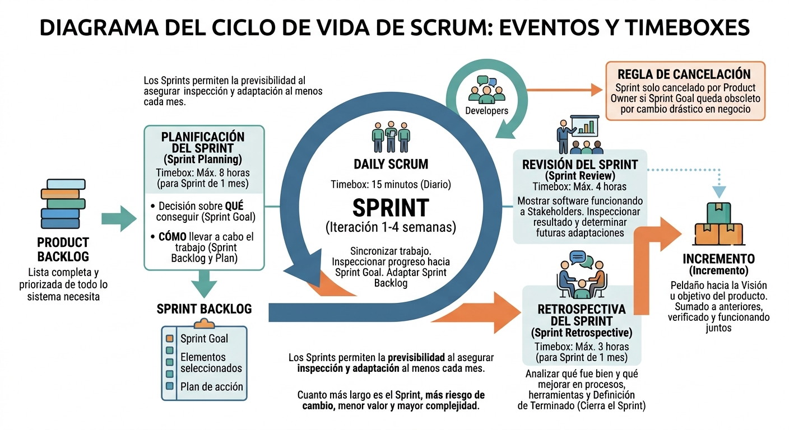
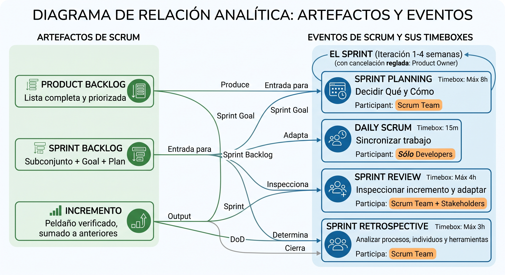
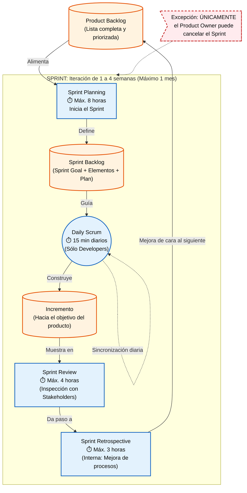
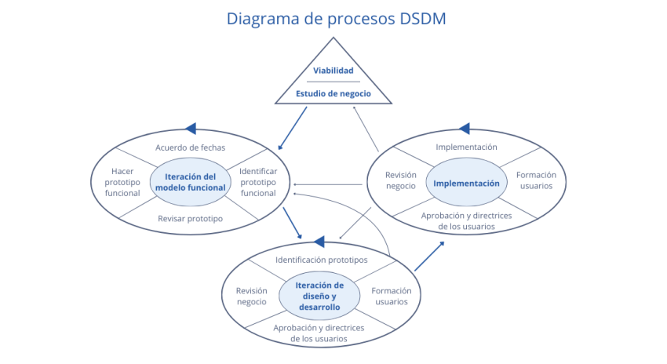
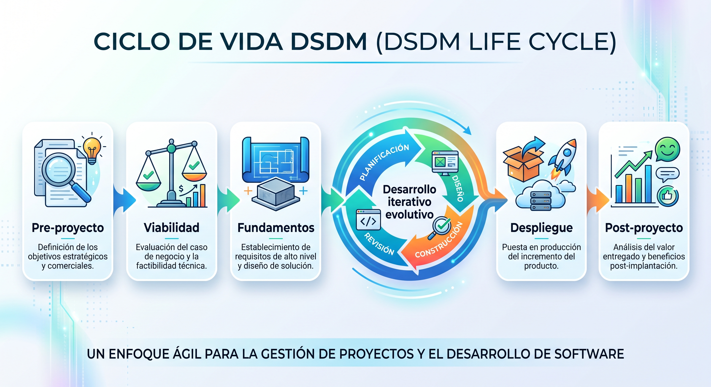
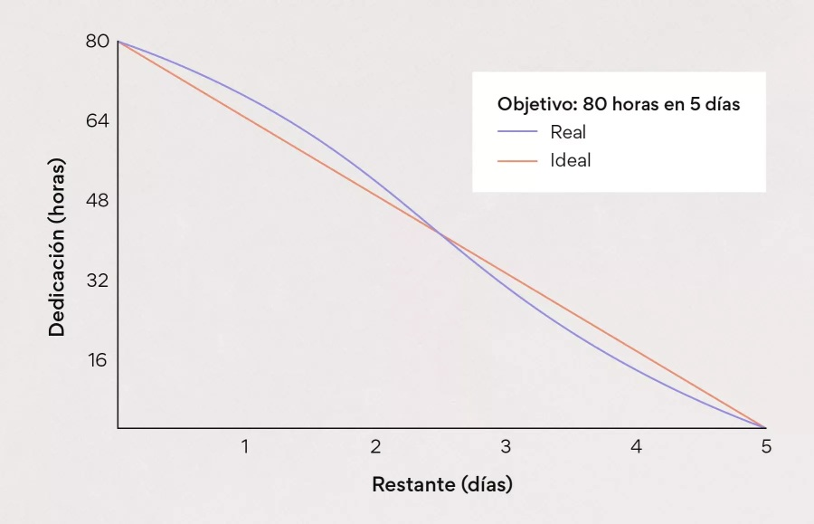
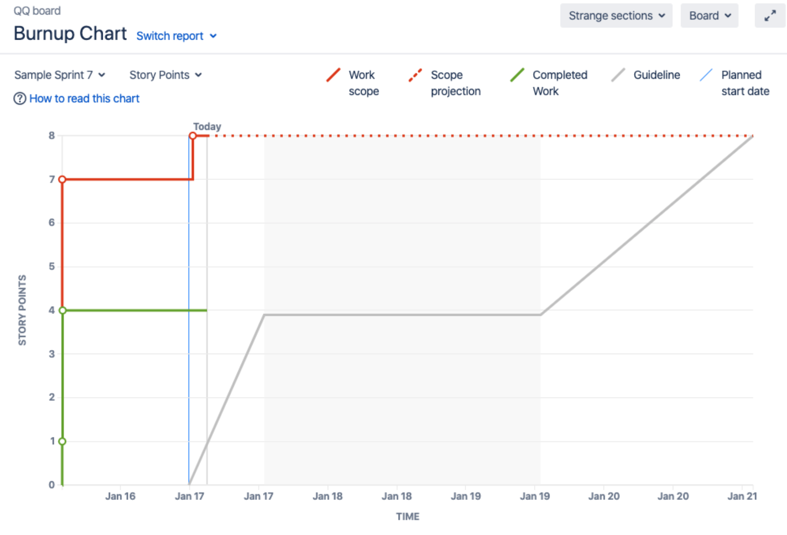
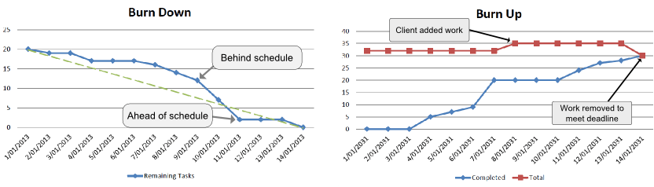
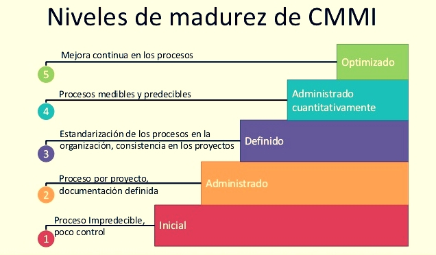

# Tema 3. Análisis funcional/diseño

## 1. Análisis Funcional y de Requisitos

El análisis funcional es la fase donde definimos **qué** debe hacer el sistema, sin entrar todavía en **cómo** lo va a hacer técnicamente a nivel de código. La base de esto es la Ingeniería de Requerimientos.

### 1.1. Ingeniería de Requerimientos
Su tarea principal es generar especificaciones correctas, claras y sin ambigüedades sobre el comportamiento del sistema.

> **Norma de referencia:** El estándar internacional que regula formalmente la Ingeniería de Requisitos es la **ISO/IEC/IEEE 29148:2018** *"Systems and software engineering — Life cycle processes — Requirements engineering"*, que sustituyó a los antiguos IEEE 830, IEEE 1233 e IEEE 1362. 
> 
> Define el **proceso de elicitación de requisitos** (*requirements elicitation*) como el proceso mediante el cual el adquirente y los proveedores del sistema descubren, revisan, articulan, entienden y documentan los requisitos del sistema y sus procesos de ciclo de vida.

**Técnicas principales de obtención de requisitos:**
*   **Entrevistas:** Encuentros "cara a cara" con los usuarios. Requieren preparación previa, envío de un guion y elaboración de un acta final.
*   **Reuniones JAD (Joint Application Design):** **Sesiones** de trabajo **largas y preparadas** para conseguir consenso rápido. Reúnen a usuarios, desarrolladores y un moderador. El objetivo es reducir el tiempo de desarrollo manteniendo la calidad.
*   **Reuniones JRP (Joint Requirement Planning):** **Similares a las JAD**, pero enfocadas a la **Alta Dirección** para tomar decisiones estratégicas.
*   **Cuestionarios/encuestas:** útiles cuando el número de usuarios afectados es muy grande y no es viable entrevistar a todos.
*   **Observación directa** (*Job shadowing*): el analista observa al usuario realizar su trabajo real, útil para detectar requisitos implícitos que el usuario no verbaliza.
*   **Tormenta de ideas** (*brainstorming*) y **talleres de trabajo:** generación creativa de requisitos en grupo.
*   **Prototipado:** construcción de una versión preliminar (maqueta o prototipo funcional) del sistema para validar requisitos con el usuario antes de construir la solución final.
*   **Análisis de documentación existente:** manuales, normativa, procedimientos y sistemas legados como fuente de requisitos.
*   **Técnicas de grupo nominal y Delphi:** para llegar a **consenso entre expertos** de forma estructurada, **minimizando sesgos de grupo**.

### 1.2. Tipos de requisitos y sus atributos de calidad

**Clasificación de requisitos:**

*   **Requisitos funcionales (RF):** describen **qué** debe hacer el sistema; una acción o comportamiento concreto ante una entrada.
*   **Requisitos no funcionales (RNF):** describen **cómo** debe comportarse el sistema en términos de calidad (rendimiento, seguridad, usabilidad, disponibilidad, mantenibilidad, portabilidad, etc.), sin especificar una función concreta.
*   **Requisitos de negocio, de usuario, de sistema y de diseño/implementación:** distintos niveles de abstracción según la ISO/IEC/IEEE 29148, desde la necesidad de negocio hasta el requisito técnico concreto que implementa el desarrollador.

El estándar **ISO/IEC 25010** (modelo de calidad de producto software, sucesor de ISO/IEC 9126) es la referencia oficial para clasificar los **requisitos no funcionales** en 8 características: 

*   Functional suitability (*idoneidad funcional*).
*   Performance efficiency (*eficiencia de desempeño*).
*   Compatibility.
*   Usability.
*   Reliability.
*   Security.
*   Maintainability.
*   Portability.

La edición **ISO/IEC 25010:2023** sustituye a la edición de 2011 y establece un modelo de calidad de producto con **9 características**: 

*   Adecuación funcional (*functional suitability*).
*   Eficiencia de desempeño (*performance efficiency*).
*   Compatibilidad (*compatibility*).
*   Capacidad de interacción (*interaction capability*).
*   Fiabilidad (*reliability*).
*   Seguridad (*security*).
*   Mantenibilidad (*maintainability*).
*   Flexibilidad (*flexibility*).
*   Seguridad de uso (*safety*). 

El modelo se utiliza para especificar, medir y evaluar la calidad de productos TIC y software.

**Atributos de un buen requisito (ISO/IEC/IEEE 29148):** necesario, no ambiguo, completo, singular (atómico), factible, verificable, correcto y conforme (con estándares aplicables).

**Documento de Especificación de Requisitos (SRS / SyRS):**
Según las directrices consolidadas de la IEEE 830 (y recogidas en la ISO 29148), el documento formal de especificación se estructura típicamente en tres grandes bloques:
1.  **Introducción:** Propósito, alcance, definiciones y visión general.
2.  **Descripción General:** Perspectiva del producto, funciones, características de los usuarios, restricciones y suposiciones.
3.  **Requisitos Específicos:** Funcionales, no funcionales (rendimiento, diseño) e interfaces, detallados para permitir el diseño y las pruebas.

**Trazabilidad de requisitos:** capacidad de seguir la vida de un requisito desde su origen (necesidad de negocio) hasta su implementación y prueba, en ambas direcciones (hacia atrás y hacia adelante). Es clave para la gestión del cambio y para la auditoría en procesos certificados bajo **CMMI** o **ISO 9001**.

**Validación vs. Verificación de requisitos:**

*   **Verificación:** ¿estamos construyendo el sistema correctamente? (¿el producto cumple la especificación?).
*   **Validación:** ¿estamos construyendo el sistema correcto? (¿la especificación satisface la necesidad real del usuario?).

### 1.2.1. Análisis funcional y diseño del sistema

El análisis funcional transforma las necesidades y requisitos de los interesados en una especificación estructurada del comportamiento que debe proporcionar el sistema. El diseño parte de los requisitos establecidos y determina la estructura y las características de la solución que permitirán satisfacerlos.

En el análisis funcional deben identificarse, como mínimo:

* **Actores e interesados:** personas, organizaciones, sistemas externos u otros elementos que interactúan con el sistema o condicionan sus requisitos.
* **Procesos y actividades de negocio:** secuencia y reglas que permiten alcanzar los objetivos de la organización.
* **Funciones del sistema:** servicios que el sistema debe proporcionar para soportar los procesos identificados.
* **Datos e información:** entidades, atributos, relaciones, entradas, salidas y reglas de negocio relevantes.
* **Reglas de negocio:** restricciones, políticas, condiciones o cálculos que determinan el comportamiento del sistema.
* **Requisitos funcionales y de calidad:** comportamiento esperado y características de calidad que debe satisfacer la solución.
* **Interfaces externas:** intercambios de información con usuarios, sistemas, dispositivos o servicios externos.
* **Criterios de aceptación:** condiciones objetivas que permiten determinar si un requisito o producto satisface lo especificado.

El diseño del sistema se desarrolla a partir de los requisitos y puede comprender la arquitectura lógica y física, la descomposición en componentes, las interfaces, los modelos de datos, la gestión de errores, los mecanismos de persistencia y las decisiones tecnológicas necesarias para implementar la solución.

La especificación de requisitos debe mantener la correspondencia entre las necesidades identificadas, los requisitos, los elementos de diseño, la implementación y las pruebas. Esta trazabilidad permite controlar el impacto de los cambios y comprobar la cobertura de los requisitos.

### 1.2.2. Gestión de cambios y línea base de requisitos

Los requisitos están sujetos a cambios durante el ciclo de vida del sistema. La gestión de requisitos comprende la identificación, documentación, análisis, priorización, aprobación y seguimiento de dichos cambios.

Una **línea base de requisitos** es un conjunto de requisitos formalmente revisado y aprobado que constituye una referencia para las actividades posteriores. Los cambios posteriores a la línea base deben quedar identificados y controlados, manteniendo su trazabilidad y evaluando su impacto sobre alcance, coste, plazo, calidad, arquitectura, desarrollo y pruebas.

La **matriz de trazabilidad de requisitos** relaciona los requisitos con sus fuentes, elementos de diseño, componentes de implementación, casos de prueba y resultados de las pruebas. Puede establecerse trazabilidad hacia delante, desde el requisito hasta su realización y verificación, y hacia atrás, desde un elemento de la solución hasta el requisito que lo justifica.

### 1.3. Casos de Uso e Historias de Usuario

Son las dos herramientas principales para documentar requisitos, dependiendo de si usamos metodologías tradicionales o ágiles.

*   **Historias de Usuario (Metodologías Ágiles - XP/Scrum):**
    *   Son tarjetas de papel donde el cliente describe brevemente una característica que el sistema debe tener.
    *   Se descomponen luego en tareas de programación.
    *   **Estructura patrón:** "Como [**Rol**], quiero [**Funcionalidad**], para [**Beneficio/Objetivo**]". *Ejemplo real: "Como ciudadano, quiero un botón de descarga en PDF para guardar mi certificado de empadronamiento"*.

*   **Casos de Uso (Metodologías Tradicionales/UML - Métrica v3):**
    *   Definen la interacción exacta entre un "Actor" (un usuario u otro sistema) y el sistema.
    *   Especifican el comportamiento del sistema.
    *   Tienen un flujo principal (lo que pasa si todo va bien) y flujos alternativos (excepciones).

**Anatomía completa de un Caso de Uso (UML/ISO 29148):**
*   **Nombre:** verbo + sustantivo (ej. "Solicitar certificado").
*   **Actor principal:** quien inicia la interacción (puede ser humano u otro sistema).
*   **Actores secundarios:** los que participan pero no inician.
*   **Precondiciones:** estado del sistema necesario antes de ejecutar el caso de uso.
*   **Postcondiciones (garantías de éxito):** estado del sistema tras completarse con éxito.
*   **Flujo principal (camino feliz):** secuencia numerada de pasos sin errores.
*   **Flujos alternativos:** variaciones válidas del flujo principal.
*   **Flujos de excepción:** gestión de errores.
*   **Relaciones entre casos de uso (UML):**
    *   **Include** (`<<include>>`): un caso de uso *siempre* incluye la ejecución de otro (obligatorio, ej. "Realizar pedido" incluye "Verificar stock").
    *   **Extend** (`<<extend>>`): un caso de uso *opcionalmente* extiende a otro en ciertas condiciones (ej. "Pagar con tarjeta" extiende a "Realizar pedido").
    *   **Generalización:** un actor o caso de uso especializa a otro más general.   

**Historias de Usuario, criterio INVEST y criterios de aceptación:**

*   **I**ndependiente: puede desarrollarse sin depender estrictamente de otra.
*   **N**egociable: no es un contrato cerrado, se puede discutir con el cliente.
*   **V**aliosa: aporta valor de negocio al usuario final.
*   **E**stimable: el equipo puede estimar su esfuerzo.
*   **S**mall (pequeña): cabe en un sprint.
*   **T**estable: existen criterios claros para comprobar que está terminada.   

> Una buena historia de usuario debe cumplir el acrónimo **INVEST**.

Las historias de usuario se acompañan de **criterios de aceptación**: condiciones concretas que deben cumplirse para considerar la historia "terminada" (*Done*). Frecuentemente se redactan en formato **Gherkin** (Dado/Cuando/Entonces), enlazando con BDD.

Jerarquía habitual en ágil: **Épica** (gran bloque de valor, varias historias) → **Historia de usuario** → **Tareas** (unidades técnicas de trabajo del equipo).

**Cuándo usar cada técnica:**

| Aspecto | Casos de Uso | Historias de Usuario |
| :--- | :--- | :--- |
| Metodología típica | Tradicional/UML (Métrica v3, RUP) | Ágil (Scrum, XP) |
| Nivel de detalle | Alto, formal, exhaustivo | Bajo, conversacional |
| Foco | Interacción actor-sistema | Valor de negocio para el usuario |
| Cuándo se completa el detalle | Al inicio (documento cerrado) | Progresivamente, justo a tiempo |
| Verificación | Flujos alternativos/excepción | Criterios de aceptación |

### 1.3.1. Modelado de sistemas y diseño mediante UML

Un **diagrama de casos de uso UML** representa las funcionalidades del sistema desde el punto de vista de los actores externos. El límite del sistema delimita qué elementos pertenecen al sistema y qué elementos son externos a él.

Para dominar el modelado y el diseño, es imprescindible conocer la **clasificación oficial de diagramas UML (OMG UML 2.5.1)**. Se dividen en dos grandes grupos:

1.  **Diagramas Estructurales (Modelan la arquitectura estática):**
    *   Diagrama de Clases.
    *   Diagrama de Objetos.
    *   Diagrama de Componentes.
    *   Diagrama de Despliegue.
    *   Diagrama de Estructura Compuesta.
    *   Diagrama de Paquetes.
    *   Diagrama de Perfiles.
2.  **Diagramas de Comportamiento (Modelan la dinámica funcional):**
    *   Diagrama de Actividad.
    *   Diagrama de Casos de Uso.
    *   Diagrama de Máquina de Estados.
    *   *Diagramas de Interacción (subgrupo de comportamiento):* Diagrama de Secuencia, Diagrama de Comunicación, Diagrama de Tiempos y Diagrama Global de Interacciones.

Sus elementos principales en Casos de Uso son:

* **Actor:** clasificador que representa un papel desempeñado por una entidad externa que interactúa con el sistema. Un actor no tiene por qué ser una persona; puede representar otro sistema, dispositivo u organización.
* **Caso de uso:** especificación del comportamiento que el sistema proporciona a los actores para alcanzar un resultado observable.
* **Asociación:** relación que representa la comunicación entre un actor y un caso de uso.
* **Generalización:** relación en la que un elemento más específico hereda las características de otro elemento más general.
* **`<<include>>`:** relación en la que el comportamiento del caso de uso incluido forma parte del comportamiento del caso de uso base. Se utiliza para extraer comportamiento común y reutilizable.
* **`<<extend>>`:** relación en la que un caso de uso de extensión añade comportamiento al caso de uso base bajo determinadas condiciones. El caso de uso base define puntos de extensión y puede ejecutarse sin la extensión.

El modelo de casos de uso se utiliza para delimitar el alcance funcional, identificar interacciones con sistemas externos y servir de base para la especificación detallada de requisitos y para el diseño de pruebas funcionales.

### 1.3.2. Historias de usuario y refinamiento del Product Backlog

En entornos ágiles, una **historia de usuario** constituye una **descripción breve de una necesidad** desde la **perspectiva del usuario o interesado**. La historia no constituye por sí misma una especificación técnica completa; su detalle se desarrolla mediante conversación, refinamiento y criterios de aceptación.

El **refinamiento del Product Backlog** consiste en **descomponer y definir con mayor precisión** los elementos del **Product Backlog**, añadiendo información como descripción, orden, tamaño y criterios de aceptación cuando resulte necesario. Los elementos suficientemente preparados para ser seleccionados en un Sprint deben presentar el grado de claridad necesario para que el equipo pueda comprender el trabajo y realizar una previsión razonable.

Los **criterios de aceptación** establecen las **condiciones que debe cumplir un elemento para ser aceptado**. Deben ser observables y verificables y pueden utilizarse como base para el diseño de pruebas funcionales.

## 2. Metodologías Ágiles de Desarrollo

Las metodologías ágiles valoran la adaptación al cambio, las entregas tempranas y la interacción de los individuos por encima de los procesos rígidos y la documentación exhaustiva.

**Manifiesto Ágil (2001):** 

Origen formal de la filosofía ágil, que establece **4 valores**:

1. Individuos e interacciones sobre procesos y herramientas.
2. Software funcionando sobre documentación extensiva.
3. Colaboración con el cliente sobre negociación contractual.
4. Respuesta ante el cambio sobre seguimiento de un plan.

Y **12 principios**: 

1. Satisfacción temprana (Software de valor)  
2. Aceptar el cambio (Incluso tarde)  
3. Entregas frecuentes (Semanas)  
4. Negocio y desarrolladores juntos (A diario)  
5. Individuos motivados (Confianza)
6. Comunicación cara a cara (Eficiencia)
7. Software funcionando (Medida de progreso)
8. Ritmo sostenible (Indefinido)
9. Excelencia técnica y buen diseño
10. Simplicidad (El arte de no hacer trabajo innecesario)
11. Equipos auto-organizados (Mejores arquitecturas)
12. Mejora continua (Reflexión a intervalos regulares)

### 2.1. Modelos y metodologías de desarrollo de sistemas

El desarrollo de sistemas de información puede organizarse mediante distintos modelos de ciclo de vida. Entre los principales se encuentran:

* **Modelo en cascada:** las actividades se organizan en fases secuenciales, con una definición progresiva de requisitos, análisis, diseño, implementación, pruebas y mantenimiento. Los cambios posteriores pueden requerir volver a fases anteriores.
* **Modelo en V:** relaciona las actividades de especificación y diseño con las correspondientes actividades de verificación y validación. Cada nivel de definición tiene asociado un nivel de pruebas.
* **Modelo incremental:** el sistema se desarrolla mediante incrementos sucesivos, cada uno de los cuales aporta funcionalidad al producto.
* **Modelo iterativo:** la solución se desarrolla mediante ciclos sucesivos de análisis, construcción, evaluación y refinamiento.
* **Modelo en espiral:** combina desarrollo iterativo con una gestión explícita del riesgo, realizando ciclos en los que se determinan objetivos, alternativas, riesgos, desarrollo y evaluación.
* **Modelos ágiles:** organizan el desarrollo en ciclos cortos y frecuentes de inspección, adaptación y entrega de valor, admitiendo cambios de requisitos durante el desarrollo.

> Los modelos de ciclo de vida no deben confundirse con una metodología o marco de trabajo concreto. Un estándar de ciclo de vida puede establecer procesos y actividades aplicables con diferentes enfoques de desarrollo, sin imponer una metodología única.

### 2.2. Scrum
Es un marco de trabajo **iterativo e incremental** para proyectos en **entornos complejos**.

#### 2.2.1. Modificaciones clave de la Guía Scrum (Edición 2020) y Compromisos
Para asegurar la máxima precisión en preguntas tipo test de la AGE, es fundamental conocer las actualizaciones de la **Scrum Guide 2020**:

De **"3 Roles"** a **"Un único Scrum Team con Responsabilidades":** Se elimina la división rígida de roles. Ahora existe un único *Scrum Team* (10 o menos personas) enfocado en un mismo objetivo, compuesto por 3 responsabilidades (*Accountabilities*).
   
*   **Roles:**
    *   **Product Owner** (*El cliente*): 
        *   Único responsable de maximizar el valor del producto y de la gestión efectiva del *Product Backlog*. 
        *   Escribe las historias de usuario y prioriza el trabajo (Product Backlog) basándose en el valor de negocio.
        *   Incluyendo redactar los elementos, ordenarlos por valor y asegurar que sean transparentes y comprendidos por el equipo.
    *   **Scrum Master** (*El facilitador*): 
        *   Responsable de la efectividad del *Scrum Team* y de adoptar Scrum según la Guía.
        *   Mantiene el proceso, elimina obstáculos (impedimentos) y protege al equipo de interrupciones externas. No es un jefe, es un facilitador.
        *   Es responsable de establecer Scrum tal y como se define en la Guía Scrum, ayudando a todos a entender la teoría y práctica de Scrum, tanto dentro del Scrum Team como en la organización.
    *   **Team/Developers** (*El equipo de desarrollo*): 
        *   Equipo autoorganizado (de 4 a 9 personas) que construye el software.
        *   Profesionales comprometidos a crear cualquier aspecto de un *Incremento* utilizable utilizable en cada Sprint. 
        *   Pasan de ser definidos como "autoorganizados" a **autogestionados** (deciden *quién*, *qué*, *cuándo* y *cómo* se realiza el trabajo).

*   **Artefactos y Eventos** (y sus *Timeboxes* obligatorios):

    *   **Sprint:** 
        *   Iteración de 1 a 4 semanas. Durante el Sprint, los requisitos están congelados.
        *    Cada Sprint puede considerarse un proyecto corto y tiene una duración máxima de **un mes**; cuanto más largo es el Sprint, más riesgo de que cambie la definición de "hecho", el valor se reduzca o la complejidad aumente. 
        *    Los Sprints permiten la **previsibilidad** al asegurar inspección y adaptación al menos cada mes.
        *   **Regla de Cancelación:** El Sprint solo puede ser cancelado por el **Product Owner**, normalmente si el Sprint Goal queda obsoleto debido a un cambio drástico en el negocio.
    *   **Product Backlog:** 
        *   Lista completa y priorizada de todo lo que el sistema necesita.
    *   **Sprint Backlog:** 
        *   Subconjunto del Product Backlog que el equipo se compromete a hacer en el Sprint actual.
           Está compuesto por el objetivo del Sprint (*Sprint Goal*), los elementos del Product Backlog seleccionados para el Sprint y un plan de acción para entregar el Incremento.
    *   **Incremento:** 
        *   Es un peldaño concreto hacia la Visión u objetivo del producto.
        *   Cada Incremento se suma a los anteriores y se verifica exhaustivamente, garantizando que todos los Incrementos funcionan juntos.
    *   **Daily Scrum:** 
        *   Reunión diaria de 15 minutos, de pie, para sincronizar el trabajo.
           La realizan únicamente los **Developers**.
           Es un evento para inspeccionar el progreso hacia el Sprint Goal y adaptar el Sprint Backlog si es necesario.
    *   **Sprint Planning:** 
        *   Inicia el Sprint.
        *   En ella se decide qué se puede conseguir en el Sprint (Sprint Goal) y cómo se llevará a cabo el trabajo elegido.
        *   *Timebox:* Máximo de 8 horas para un Sprint de un mes.
    *   **Sprint Review:** 
        *   Reunión al final del Sprint para mostrar el software funcionando a los interesados (**Stakeholders**).
           Su propósito es inspeccionar el resultado del Sprint y determinar futuras adaptaciones.
        *   *Timebox:* Máximo de 4 horas para un Sprint de un mes.
    *   **Sprint Retrospective:** 
        *   Reunión interna del equipo para analizar qué ha ido bien y qué mejorar en sus procesos.
        *   Cierra el Sprint.
        *   El Scrum Team inspecciona cómo fue el último Sprint en cuanto a individuos, interacciones, procesos, herramientas y su Definición de Terminado.   
        *   *Timebox:* Máximo de 3 horas para un Sprint de un mes.

*   **Definición de Terminado** (*Definition of Done*, DoD):
    *   Descripción formal del estado del Incremento cuando cumple las medidas de calidad requeridas para el producto. 
    *   En cuanto un elemento del Product Backlog cumple la DoD, nace un Incremento. 
    *   Garantiza transparencia y calidad homogénea.

*   Los **3 Compromisos** (*Commitments*) asociados a cada Artefacto:
    *   Para el **Product Backlog** $\rightarrow$ **Product Goal** (Objetivo del Producto, la meta a largo plazo).
    *   Para el **Sprint Backlog** $\rightarrow$ **Sprint Goal** (Objetivo del Sprint, la meta concreta de la iteración).
    *   Para el **Incremento** $\rightarrow$ **Definition of Done** (Definición de Terminado, el criterio de calidad).

*   **Base normativa:** 
    *   Scrum se define formalmente en la **Scrum Guide** (Ken Schwaber y Jeff Sutherland), documento de referencia oficial y gratuito, actualizado por última vez en 2020. Scrum se define allí como un **marco de trabajo ligero** (no una metodología, no un proceso ni una técnica) que ayuda a las personas, equipos y organizaciones a generar valor a través de soluciones adaptativas a problemas complejos.
    *   Scrum se fundamenta en el **empirismo** (el conocimiento procede de la experiencia y de tomar decisiones basadas en lo observado) y en la teoría de control de procesos **Lean**, apoyándose en **3 pilares**: **Transparencia, Inspección y Adaptación**.

*   **Valores de Scrum (5):** 
    * Compromiso.
    * Foco.
    * Apertura.
    * Respeto.
    * Coraje.

### 2.3. Kanban
Método para gestionar el flujo de trabajo con énfasis en la entrega "justo a tiempo".

> **Origen y principios:** Kanban (palabra japonesa: "tarjeta visual") proviene del sistema de producción de Toyota (Lean Manufacturing) y fue adaptado al desarrollo software por David J. Anderson. 
> 
> A diferencia de Scrum, **no exige roles ni eventos fijos**, no trabaja en Sprints con duración fija, y puede aplicarse como capa de mejora continua sobre cualquier proceso existente (incluido Scrum, dando lugar a "Scrumban").

#### 2.3.1. Los 4 principios básicos de Kanban:

1. Empezar con lo que se hace ahora (no exige rediseñar el proceso desde cero).
2. Acordar realizar cambios incrementales y evolutivos.
3. Respetar inicialmente los roles, responsabilidades y cargos actuales.
4. Fomentar el liderazgo en todos los niveles.

#### 2.3.2. Patrón Lógico y Reglas Clave:

1.  **Mostrar el proceso:** Uso de un tablero visual con columnas (Ej: Cola, Análisis, Desarrollo, Pruebas).
2.  **Limitar el Trabajo en Curso (WIP - Work In Progress):** Regla fundamental. Se fija un límite máximo de tareas por columna para evitar cuellos de botella.
3.  **Optimizar el flujo (Cycle Time / Lead Time):** Se mide el tiempo desde que una tarea entra al tablero hasta que sale.
    *  El **Lead Time** mide desde que la tarea se *solicita* hasta que se *entrega*. 
    *  El **Cycle Time** mide desde que el equipo *empieza a trabajar* en ella hasta que se *completa*. 
4.  **La Ley de Little (Little's Law):** Fórmula matemática esencial en Kanban y teoría de colas que relaciona las variables de flujo. Se formula como $\text{WIP} = \lambda \times W$, donde $\lambda$ es la tasa de entrega (*Throughput*) y $W$ es el tiempo medio de permanencia (*Lead Time*).
5.  **Gestionar el flujo explícitamente:** definir y comunicar políticas claras de cómo se mueven las tareas entre columnas.
6.  **Mejora colaborativa mediante modelos y método científico:** uso de métricas (como el diagrama de flujo acumulado) para detectar cuellos de botella y mejorar continuamente.

### 2.4. DSDM (Dynamic Systems Development Method)

Enfoque iterativo e incremental basado en el desarrollo rápido de aplicaciones (**RAD**).

*   **Ciclo de vida DSDM:** 
    *   Pre-proyecto → Viabilidad → Fundamentos → Desarrollo iterativo evolutivo → Despliegue → Post-proyecto.

  
*   **Relación con RAD:** DSDM nació en 1994 como una respuesta estructurada al RAD (*Rapid Application Development*), aportando disciplina y gobernanza al desarrollo rápido, algo que el RAD original no garantizaba.

#### 2.4.1. Patrón Lógico de DSDM:

*   **Fijo:** El tiempo (plazos) y el presupuesto están fijados estrictamente desde el principio.
*   **Variable:** Los requisitos son variables y se negocian para asegurar que se cumple el plazo.

#### 2.4.2. Los 8 Principios de DSDM:

1. Centrarse en la necesidad del negocio (*Focus on the business need*).
2. Entregar a tiempo (*Deliver on time*).
3. Colaborar (*Collaborate*).
4. No comprometer nunca la calidad (*Never compromise quality*).
5. Construir incrementalmente sobre cimientos firmes (*Build incrementally from firm foundations*).
6. Desarrollar iterativamente (*Develop iteratively*).
7. Comunicarse de forma continua y clara (*Communicate continuously and clearly*).
8. Demostrar control (*Demonstrate control*).

#### 2.4.3. Priorización MoSCoW: 

Técnica de priorización de requisitos característica de DSDM (aunque usada también en otras metodologías), que clasifica cada requisito en:
*   **M**ust have (imprescindible).
*   **S**hould have (importante pero no crítico).
*   **C**ould have (deseable si hay tiempo).
*   **W**on't have this time (aplazado a una futura iteración).

#### 2.4.4. Scrum vs. Kanban vs. DSDM 

| Característica | Scrum | Kanban | DSDM |
| :--- | :--- | :--- | :--- |
| Iteraciones | Sprints de duración fija (1-4 semanas) | Flujo continuo, sin iteraciones fijas | Timeboxes, con plazo y presupuesto fijos |
| Roles definidos | Sí (PO, SM, Developers) | No exige roles nuevos | Sí (varios roles formales: Business Sponsor, Business Visionary, Technical Coordinator, etc.) |
| Qué es fijo | El calendario del Sprint | El límite WIP | Tiempo y presupuesto |
| Qué es variable | El alcance dentro del Sprint | El orden/prioridad de tareas | El alcance/requisitos (vía MoSCoW) |
| Métrica clave | Velocidad del equipo | Lead Time / Cycle Time | Cumplimiento de plazo con calidad |

### 2.5. Estimación y Seguimiento en Metodologías Ágiles

Los tribunales TIC prestan especial atención a las técnicas de estimación y métricas de seguimiento ágil, que difieren de la gestión tradicional:

*   **Puntos de Historia** (*Story Points*): Medida relativa utilizada por los equipos ágiles para estimar el esfuerzo, la complejidad y el riesgo de implementar una Historia de Usuario, en lugar de utilizar horas exactas.
*   **Planning Poker:** Técnica de estimación basada en el **consenso**. El equipo (Developers) utiliza una baraja basada en la **sucesión de Fibonacci** (1, 2, 3, 5, 8, 13, 21...). 
    *   Si aparecen estimaciones muy dispares (ej. un 3 y un 13), **nunca se hace la media ni decide el Scrum Master**; la buena práctica dicta que los miembros con valores extremos justifiquen su postura y se repita la votación hasta alcanzar el consenso.
*   **Velocidad** (*Velocity*): Cantidad de Puntos de Historia que un equipo es capaz de completar (cumpliendo la *Definition of Done*) en un **único Sprint**. Sirve para predecir **cuántos Sprints** se necesitarán para acabar el **Product Backlog**.
*   **Radiadores de Información (Gráficos de seguimiento):**
    *   **Burndown Chart (Gráfico de trabajo pendiente):** 
        *   Muestra el esfuerzo restante (eje Y) frente al tiempo (eje X). La línea debe tener tendencia descendente. 
        *   Si la línea tiene una **tendencia ascendente**, no significa que el equipo trabaje mal, sino que **se está incrementando el trabajo pendiente** (se han añadido nuevas tareas o reestimado el esfuerzo al alza).
    *   **Burnup Chart (Gráfico de trabajo completado):** 
        *   Muestra cuánto trabajo se ha completado y los cambios en el alcance total del proyecto.
    *   **Diagrama de Flujo Acumulado (*Cumulative Flow Diagram - CFD*):** Fundamental en Kanban. Muestra la cantidad de tareas en cada estado (columna) a lo largo del tiempo. Permite detectar visualmente los cuellos de botella (cuando una franja se ensancha bruscamente).

#### 2.5.1. Burndown chat

Existen fundamentalmente **3 tipos de gráficos de burndown** que suelen utilizarse en **Scrum**: sprint burndown chart, release burndown chart y product burndown chart.

##### Sprint burndown chart

Durante la creación del **Sprint Backlog** cada miembro del equipo determinará el esfuerzo y tiempo que requiere cada tarea pendiente del sprint. 

Según avanza el sprint, cada miembro actualizará el esfuerzo dedicado y tiempo utilizado en cada tarea. Con toda esta información del backlog, el **Scrum Master** creará el **gráfico de trabajo pendiente del Sprint**.

##### Release burndown chart

Un lanzamiento en **Scrum** es el proceso que conlleva las tareas desde el desarrollo del producto hasta que éste llega al cliente. 

En **metodologías Agile**, se dice que es posible liberar o lanzar el producto cuando cumple los requisitos de funcionalidad y expectativas del cliente. 

Un lanzamiento de producto en **Scrum** generalmente constará de uno o varios **Sprints** cada uno de ellos de la misma duración. 

Así, este gráfico mostrará el **progreso del equipo hasta la fecha final del lanzamiento del producto**.

##### Product burndown chart

Un **Product burndown chart** monitoriza la **cantidad de trabajo pendiente que queda para cumplir con los objetivos de producto definidos inicialmente** con el cliente.

Este gráfico burndown **representa** los **story points** del **Product Backlog**. 

El gráfico **muestra los puntos de las historias para cada sprint completado**, por lo que representa la **evolución del cumplimiento de los requisitos del producto a lo largo del tiempo**. 

> El Backlog y el Product burndown chart suelen actualizarse al final de cada sprint.

##### ¿Cómo funcionan los burndown chart?

Con los gráficos **burndown** se estima la **cantidad de trabajo que queda por hacer** y **se comparan** con el **tiempo que llevará completar el trabajo**. El **objetivo** es representar con precisión el tiempo asignado para **planificar con anticipación los recursos** futuros.

##### Cómo interpretar un gráfico burndown

Un **Burndown chart** suele incluir lo siguiente:

* **Eje X**: Representa la **cantidad de tiempo que queda para completar el proyecto**. Esto generalmente se muestra en **días**.

* **Eje Y**: Representa el **esfuerzo restante** necesario **para completar el proyecto**. Es decir, aquí aparecerán las **tareas del Backlog pendiente** o **Sprint Backlog**.

* **Línea de trabajo real**: Representa el **trabajo real que aún queda por realizar**. A menudo difiere de la estimación inicial debido a los posibles obstáculos que surgen durante el proyecto y al tiempo adicional que a veces se necesita para completar el trabajo. La línea de trabajo real puede ser recta en algunos casos, pero tiende a ser un trazado menos lineal debido a los inconvenientes que surgen en el transcurso del proyecto y al trabajo no previsto. 

* **Línea ideal de trabajo restante** (trabajo estimado): Representa la **cantidad de trabajo** que calculaste en un **escenario ideal**. A menudo, es una trayectoria más recta en comparación con la línea de trabajo real. 

* **Puntos de historia**: Los equipos ágiles suelen usar los puntos de historia para estimar el trabajo pendiente. En un burndown chart, los puntos de historia se representan en los ejes X e Y. Por ejemplo, el eje Y puede tener de 0 a 100 puntos de historia, que representan la dedicación, y el eje X puede tener de 1 a 30 puntos de historia, que representan los días que quedan para completar el trabajo.

* **Objetivo del sprint**: por último, para que un gráfico burndown sea eficaz, debe incluir el objetivo general del sprint. Por ejemplo, tu objetivo de sprint podría ser una línea recta que represente el 50 % del esfuerzo durante 12 días. Si bien es posible que tu trabajo real no cumpla con este objetivo de manera exacta, siempre es bueno tener un objetivo a alcanzar para que las tareas sigan avanzando. 

Los **burndown charts** son excelentes para **visualizar** rápidamente el **trabajo pendiente y el tiempo que se necesita para completar ese trabajo**. Sin embargo, no brindan información sobre la trayectoria de un proyecto, como por ejemplo, los cambios realizados. Esto hace que sea difícil saber si los cambios se deben a que se finalizaron tareas de la lista de trabajos pendientes o a un cambio en los puntos de historia.

Este es el motivo por el cual **los gráficos burndown suelen combinarse** con una **lista del trabajo pendiente** del producto, gestionada por el **Product Owner**, y un **proceso de control de cambios** para realizar un **seguimiento** eficaz del **progreso** del proyecto.

A continuación, se muestra un ejemplo de un **gráfico burndown**.

> Como puedes ver, la línea de trabajo real es ligeramente diferente a la del trabajo ideal. El esfuerzo de trabajo real fue mayor de lo previsto al principio, pero menor de lo esperado al final. Por lo tanto, aunque el camino fue ligeramente diferente, el resultado final fue el mismo.

#### Beneficios de usar un burndown chart

Un **gráfico burndown** es una excelente herramienta para **visualizar** el **trabajo que se debe realizar en comparación con el tiempo que lleva completarlo**. Por lo tanto, es ideal para equipos que trabajan en **Sprints**.

Otros beneficios de usar un **gráfico burndown** incluyen:

* **Comparación directa**: el **gráfico burndown** muestra una comparación directa entre el trabajo que se necesita realizar y el esfuerzo requerido para completar el sprint. Esta información ayuda a los equipos a conectar las tareas con los objetivos más grandes y avanzar para cumplir los objetivos del sprint. 

* **Mantiene sintonía**: los miembros del equipo tienen información a la que pueden acceder para visualizar el trabajo necesario y el esfuerzo diario estimado, lo que les permite dar seguimiento y estar al día con el trabajo.

* **Información sobre la productividad del equipo**: un **burndown chart** no solo es una excelente herramienta para visualizar el trabajo, sino que también puede darte información sobre la productividad de tu equipo y la velocidad con la que se finalizan los trabajos.

Todos estos beneficios hacen que los **gráficos burndown** sean una herramienta excelente para dar **seguimiento a la gestión de recursos** del equipo, al esfuerzo y la productividad.

#### 2.5.2. Burnup chat

Un **gráfico burnup** es una hoja de ruta que representa el trabajo en dos líneas a lo largo de un eje vertical. Una línea indica la carga de trabajo total del proyecto. La otra muestra el trabajo completado hasta el momento. Cuando se termina el proyecto, las dos líneas se unen.

##### Cómo interpretar un gráfico burnup

Un **Burndown chart** suele incluir lo siguiente:

* **Eje X**: Representa la línea temporal de todo el proyecto. Permite ver el tiempo que se tarda en completar las tareas y ayuda a representar gráficamente los **Sprints**.
* **Eje Y**: Representa el trabajo completado. Esta medida puede ser puntos de historia en los incrementos que se consideren adecuados.

##### Beneficios de usar un burndown chart

Estas son algunas de las ventajas de utilizar un gráfico de avance en proyectos ágiles y Scrum:

* **Indica claramente el progreso:** una ventaja respecto a los **diagramas de Gantt** es que los **gráficos burnup** se pueden leer de un solo vistazo. No son tan complejos ni confusos como un diagrama de Gantt. Y, a diferencia de un **gráfico burndown**, un **gráfico burnup** muestra el trabajo completado en una gráfica ascendente con mayor detalle. Muestra tanto el trabajo total como el trabajo completado.

* **Facilita la previsión:** los **gráficos burnup** permiten a tu equipo determinar una fecha aproximada de finalización. Es posible trabajar hacia atrás para establecer métricas o puntos de referencia de **Scrum**.

* **Destaca los cambios en el alcance y gestiona la desviación del alcance:** a diferencia de un **gráfico burndown**, es posible marcar fácilmente cualquier cambio en el alcance y relacionarlo con el progreso del equipo. Esto ayuda a **mitigar** cualquier **desviación del alcance** antes de que se vaya de las manos.

* **Permite la detección temprana de problemas:** los **gráficos burnup** permiten mitigar los problemas antes de que se conviertan en grandes quebraderos de cabeza.

* **Aporta transparencia para todos:** los **gráficos burnup** son más fáciles de leer y facilitan una transparencia total entre el equipo, lo que ayuda a tomar mejores decisiones sobre el proyecto.

#### 2.5.3. Comparativa entre Burdown and Burnup charts

En ambos casos, la abscisa del gráfico representa el tiempo; realizando un gráfico por sprint, se puede utilizar como unidad el día, pero esto se puede adaptar a la temporalidad del producto. La ordenada representa el trabajo realizado en el caso del **Burnup**, o el trabajo que queda por hacer en el caso del **Burndown**.

Los dos tipos de gráficos satisfacen la misma necesidad pero ofrecen diferentes ventajas.

El **gráfico burndown**, que se usa a menudo a nivel de **Sprint**, permite al equipo **visualizar** mejor el **trabajo que queda por hacer en un periodo corto de tiempo**.

El **gráfico burnup** permite **representar** mejor los **cambios en el alcance del Sprint o del producto completo** al distinguir dos líneas:

* Una línea (en azul arriba) que representa el alcance del producto o una liberación del producto. Esta línea crece cuando agregamos elementos del backlog.
* La otra línea representa el trabajo ya realizado.

El **gráfico burnup** a menudo brinda una visión precisa del ritmo de desarrollo: en el siguiente caso, el **gráfico burndown** da la impresión de un equipo que no está progresando, mientras que el **gráfico burnup** muestra que en realidad el alcance esperado evoluciona tan rápido como la capacidad de producción del equipo.

> Una versión mejorada consiste en agregar otra línea que represente el ritmo «ideal» de trabajo, haciendo posible determinar visualmente cada día si el desarrollo está delante o detrás del ritmo teórico.

## 3. Pruebas Funcionales y Metodologías Dirigidas por Pruebas

**Tipos y niveles de prueba (marco general, examinable):**
*   **Pruebas unitarias:** verifican el correcto funcionamiento de una unidad mínima de código (función, método) de forma aislada.
*   **Pruebas de integración:** comprueban la correcta comunicación entre varios módulos o componentes.
*   **Pruebas de sistema:** validan el sistema completo frente a los requisitos funcionales especificados.
*   **Pruebas de aceptación (UAT — User Acceptance Testing):** las realiza el usuario/cliente final para confirmar que el sistema cumple sus necesidades reales; son las que dan el visto bueno final antes de producción.
*   **Pruebas de regresión:** se repiten tras cada cambio para verificar que no se han introducido nuevos errores.
*   **Pruebas funcionales vs. no funcionales:** las funcionales verifican *qué hace* el sistema (entradas/salidas esperadas); las no funcionales verifican *cómo lo hace* (rendimiento, carga, seguridad, usabilidad).

### 3.1. Planificación y diseño de pruebas funcionales

Las pruebas deben planificarse en función de los requisitos, los riesgos y los objetivos de calidad. Un caso de prueba debe permitir identificar las condiciones de entrada, los datos necesarios, las acciones o pasos de ejecución y los resultados esperados.

El diseño de casos de prueba debe apoyarse en la **clasificación formal de técnicas (caja negra y caja blanca)**, tal como establecen ISTQB y la norma ISO 29119-4.

**Técnicas de Caja Negra (Basadas en especificación):** No consideran la estructura interna del código.
* **Particiones de equivalencia:** divide el dominio de entrada o salida en clases cuyos elementos se consideran equivalentes a efectos de prueba, seleccionando representantes de cada clase.
* **Análisis de valores límite:** selecciona valores situados en los límites de las clases de equivalencia, donde es frecuente encontrar defectos.
* **Tablas de decisión:** representan combinaciones de condiciones y las acciones asociadas a cada combinación. Son apropiadas para reglas de negocio complejas.
* **Pruebas de transición de estados:** verifican el comportamiento del sistema ante eventos que provocan transiciones entre estados.
* **Pruebas basadas en casos de uso:** derivan escenarios de prueba de los flujos principales, alternativos y de excepción de los casos de uso.

**Técnicas de Caja Blanca (Basadas en estructura):** Analizan el código interno. Incluyen la **cobertura de sentencias**, la **cobertura de ramas (branch coverage)** y la **cobertura de caminos**.

La **cobertura de requisitos** permite determinar qué requisitos han sido objeto de pruebas. La trazabilidad entre requisitos y pruebas facilita demostrar que los requisitos han sido verificados y permite identificar el impacto de los cambios.

Las pruebas pueden ser **estáticas**, cuando se examinan productos de trabajo sin ejecutar el software, o **dinámicas**, cuando se ejecuta el software o sistema objeto de prueba. Las revisiones son una forma de prueba estática; las pruebas funcionales ejecutadas sobre el sistema son pruebas dinámicas. Dentro de las estáticas, encontramos técnicas formales como las **Inspecciones** y técnicas informales como los *Walkthroughs* (Revisiones guiadas).

La serie **ISO/IEC/IEEE 29119** establece un marco internacional para las pruebas de software. Incluye conceptos generales, procesos de prueba, documentación de pruebas y técnicas de diseño de pruebas.

### 3.1.1. Pruebas funcionales en el ciclo de vida

Las pruebas funcionales pueden realizarse en diferentes niveles:

1. **Pruebas de componente o unidad:** verifican elementos individuales de software.
2. **Pruebas de integración:** verifican las interacciones entre componentes o sistemas.
3. **Pruebas de sistema:** verifican el sistema integrado frente a sus requisitos especificados.
4. **Pruebas de aceptación:** proporcionan evidencia para determinar si el sistema satisface los criterios de aceptación y las necesidades de los interesados.

Las **pruebas de regresión** comprueban que los cambios realizados no han provocado efectos adversos en funcionalidades previamente verificadas. Pueden aplicarse en cualquiera de los niveles de prueba en los que resulte necesario.

### 3.2. TDD (Test Driven Development - Desarrollo Guiado por Pruebas)
Metodología donde **primero se escribe la prueba** antes de escribir el código fuente.

*   **Ciclo patrón:**

    1. Escribir una prueba que falla (porque el código no existe).
    2. Escribir el código más simple posible (KISS) para que la prueba pase.
    3. Refactorizar (limpiar y optimizar el código eliminando duplicidades).

    Este ciclo se conoce popularmente como **Red-Green-Refactor** (rojo: la prueba falla; verde: la prueba pasa; refactor: se mejora el código sin romper la prueba). Fue popularizado por Kent Beck en el contexto de Extreme Programming (XP). Su beneficio principal es que el diseño del código emerge de las propias pruebas, favoreciendo bajo acoplamiento y alta cohesión.

### 3.3. BDD (Behavior Driven Development - Desarrollo Orientado al Comportamiento)
Evolución del TDD que fomenta la colaboración entre desarrolladores, probadores y clientes. Se usan lenguajes naturales estructurados (como Gherkin: `Dado que... Cuando... Entonces...`) para definir el comportamiento del sistema de forma que el cliente lo entienda fácilmente.

BDD nació de la mano de Dan North como refinamiento de TDD, trasladando el foco desde "probar unidades de código" hacia "describir comportamientos de negocio". Herramientas típicas asociadas: **Cucumber**, **SpecFlow**, **JBehave**.

#### 3.4. Pirámide de Pruebas y Especificación mediante Gherkin
*   **Pirámide de Pruebas (Mike Cohn):**
    *   **Base (Mayor volumen, ejecuciones rápidas y de bajo coste):** Pruebas Unitarias.
    *   **Capa Intermedia (Volumen medio):** Pruebas de Servicio / Integración (APIs, componentes).
    *   **Cúspide (Menor volumen, ejecuciones lentas y de alto coste):** Pruebas de Interfaz de Usuario (UI) / Pruebas de Aceptación End-to-End.
*   **Estructura Formal de Gherkin (BDD / DSL):**
    *   `Dado que` (Given): Define el contexto previo o precondición del sistema.
    *   `Cuando` (When): Especifica la acción o evento desencadenante ejecutado por el usuario.
    *   `Entonces` (Then): Establece el resultado o postcondición esperada observable.
 La estructura Gherkin (`Given / When / Then`) permite que los criterios de aceptación de una historia de usuario se conviertan directamente en pruebas automatizables, cerrando el círculo entre requisitos ágiles (historias de usuario) y pruebas funcionales.

**ATDD (Acceptance Test Driven Development):** enfoque hermano de TDD y BDD donde los criterios de aceptación se escriben de forma colaborativa (cliente, desarrollador, tester) *antes* de codificar, y se convierten directamente en las pruebas de aceptación del sistema.

## 4. Enfoque CMMI (Capability Maturity Model Integration)

CMMI es un modelo para evaluar la madurez de los procesos de desarrollo de software de una organización. Identifica 5 niveles de madurez:

1.  **Inicial:** Procesos impredecibles, reactivos y caóticos. Depende del heroísmo individual.
2.  **Gestionado (Managed):** Proyectos planificados, medidos y controlados a nivel básico.
3.  **Definido:** Procesos estandarizados y documentados a nivel de toda la organización.
4.  **Gestionado Cuantitativamente:** Se usan métricas estadísticas para controlar el rendimiento.
5.  **En Optimización:** Mejora continua de los procesos.

**Origen y titularidad:** CMMI fue desarrollado originalmente por el **Software Engineering Institute (SEI)** de la Universidad Carnegie Mellon, y actualmente su mantenimiento corresponde al **CMMI Institute** (integrado en ISACA). Es un modelo de referencia para la mejora de procesos, aplicable a desarrollo (CMMI-DEV), adquisición (CMMI-ACQ) y servicios (CMMI-SVC).

** Representaciones CMMI:**

*   **Representación por Etapas** (*Staged*): la organización avanza por los 5 **niveles de madurez** de forma secuencial y global (los descritos arriba). Es la más citada en oposición.
*   **Representación Continua** (*Continuous*): la organización mejora **áreas de proceso individuales**, cada una con su propio **nivel de capacidad** (0 a 3: Incompleto, Realizado, Gestionado, Definido), sin necesidad de seguir un orden global.

**Áreas de proceso (Process Areas) relacionadas directamente con el análisis funcional (CMMI-DEV):**
*   **Requirements Management (REQM)** — Gestión de Requisitos: área de **Nivel de madurez 2**. Su propósito es gestionar los requisitos del proyecto y sus productos, e identificar inconsistencias entre esos requisitos y los planes/productos de trabajo del proyecto.
*   **Requirements Development (RD)** — Desarrollo de Requisitos: área de **Nivel de madurez 3**.

#### 4.1. Representaciones de CMMI y Áreas de Proceso para Análisis de Requisitos
Es habitual que en el examen tipo test de la AGE pregunten sobre la distinción entre las dos representaciones de CMMI:
*   **Representación por Etapas** (*Staged*): Mide la madurez global de la **organización**. Se evalúa en **5 Niveles de Madurez** (1. Inicial, 2. Gestionado, 3. Definido, 4. Gestionado Cuantitativamente, 5. En Optimización).
*   **Representación Continua** (*Continuous*): Mide la capacidad de un **Área de Proceso individual**. Se evalúa en **Niveles de Capacidad** (0. Incompleto, 1. Realizado, 2. Gestionado, 3. Definido).
*   **Desglose de Áreas de Proceso (CMMI-DEV v1.3):**
    *   **Requirements Management (REQM - Gestión de Requisitos):** Situada en el **Nivel de Madurez 2 (Gestionado)**. Se centra en gestionar los cambios, mantener la trazabilidad e identificar inconsistencias entre los requisitos y los planes del proyecto.
    *   **Requirements Development (RD - Desarrollo de Requisitos):** Situada en el **Nivel de Madurez 3 (Definido)**. Se centra en elicitar, analizar, definir y validar los requisitos de cliente, producto y componentes.
 Su propósito es **elicitar, analizar y establecer** los requisitos de cliente, producto y componentes de producto, mediante tres metas específicas: 1) Desarrollar los Requisitos del Cliente, 2) Desarrollar los Requisitos del Producto, y 3) Analizar y Validar los Requisitos.

 Cada área incluye una serie de prácticas genéricas y específicas que deben implementarse y evidenciarse para alcanzar los niveles deseados. En el enfoque por etapas (niveles de madurez) las áreas de proceso están agrupadas según el nivel de madurez -según el nivel, se debe poner el foco en una u otra cosa-:

| Nivel de madurez | Foco del nivel | Ejemplos de áreas de proceso y prácticas |
| :--- | :--- | :--- |
| Nivel 2 – *Gestionado* | Gestión básica de proyectos | Gestión de requisitos, planificación del proyecto, seguimiento y control, aseguramiento de la calidad, gestión de la configuración |
| Nivel 3 – *Definido* | Procesos organizativos estandarizados | Definición de procesos, formación, gestión del conocimiento, coordinación entre grupos, ingeniería de producto |
| Nivel 4 – *Cuantitativamente gestionado* | Control estadístico de procesos | Medición y análisis avanzado, gestión cuantitativa de proyectos, gestión de calidad |
| Nivel 5 – *Optimizado* | Mejora continua basada en datos | Análisis causal, innovación, mejora continua del proceso |

Mientras que el enfoque por etapas (o escalonado) evalúa a la organización en su conjunto y le asigna un nivel de madurez global (del 1 al 5), el enfoque continuo evalúa **cada área de proceso por separado**, asignándole un nivel de capacidad (del 0 al 5).

> Mientras que en el anterior se hablaba de “madurez organizativa”, aquí se habla de “capacidad”.

En el enfoque continuo, se definen **6 niveles de capacidad**, que indican la madurez de cada área de proceso individual:

| Nivel | Nombre | Qué significa... |
| :--- | :--- | :--- |
| 0 | Incompleto | El proceso no está implementado o no cumple su propósito. |
| 1 | Ejecutado | El proceso se lleva a cabo y produce los resultados previstos. |
| 2 | Gestionado | El proceso es planificado, supervisado y se gestiona adecuadamente. |
| 3 | Definido | El proceso está estandarizado y adaptado a la organización. |
| 4 | Cuantitativamente gestionado | Se controla mediante análisis estadístico y métricas. |
| 5 | Optimizando | Se mejora de forma continua mediante innovación y retroalimentación. |

Los niveles son “acumulativos”: si el proceso está gestionado, también está ejecutado.

En el enfoque continuo, cada área de proceso puede ir madurando de forma independiente. Por ejemplo, una empresa podría tener:

* **Nivel 3** en “Gestión de requisitos” (porque lo tiene bien definido y documentado),
* **Nivel 2** en “Planificación y seguimiento de proyectos” (todavía no está estandarizado a nivel organizativo),
* **Nivel 1** en “Medición y análisis” (solo se recopilan datos básicos, sin gestión ni análisis profundo).

**Comparativa**

| ----- | Enfoque por etapas | Enfoque continuo |
| :--- | :--- | :--- |
| **Resultado final** | Nivel de madurez organizativo (1-5) | Nivel de capacidad por área de proceso |
| **Enfoque** | Global, estructurado | Flexible, progresivo |
| **Aplicación** | Todas las áreas de un nivel | Cada área puede avanzar a su ritmo |
| **Adecuado para** | Organizaciones grandes o maduras | Organizaciones |
| **Objetivo** | Estabilidad y coherencia organizativa | Priorización de mejoras en áreas de proceso |

>   En CMMI v2.0, ambas áreas se han unificado conceptualmente en la práctica **Requirements Development and Management — RDM**.

**Relación CMMI ↔ Ágil:** aunque tradicionalmente se percibían como incompatibles (CMMI = documentación exhaustiva vs. Ágil = documentación mínima), el propio SEI reconoce que se pueden combinar: los niveles de madurez CMMI valoran *qué* procesos deben existir y ser medibles, no *cómo* se ejecutan; Scrum o XP pueden ser el "cómo" que satisface las metas de REQM/RD exigidas por CMMI (enfoque conocido como "Agile + CMMI" o, en investigación académica, propuestas como "xScrum").

### 4.2. CMMI V3.0 y gestión de requisitos

La evolución de CMMI ha sustituido la estructura histórica de áreas de proceso de CMMI-DEV v1.3 por una estructura de **dominios y áreas de práctica**. La versión actual CMMI V3.0 integra prácticas de mejora del desempeño organizativo en diferentes dominios, entre ellos **Development (DEV)**.

En CMMI V3.0, el área **Requirements Development and Management (RDM)** integra las actividades relacionadas con el desarrollo y la gestión de requisitos. Entre sus prácticas se incluyen actividades orientadas a:

* obtener y desarrollar los requisitos;
* establecer y mantener la comprensión común de los requisitos;
* gestionar los cambios de requisitos;
* mantener la trazabilidad y la consistencia de los requisitos con los productos y planes relacionados;
* establecer y mantener criterios que permitan evaluar los requisitos;
* asegurar que los requisitos se encuentran preparados para las actividades posteriores del ciclo de vida.

La referencia a **REQM = nivel 2** y **RD = nivel 3** corresponde a la estructura de **CMMI-DEV v1.3** y no debe trasladarse directamente a CMMI V3.0. En la estructura actual, el desarrollo y la gestión de requisitos se abordan conjuntamente mediante RDM.

CMMI V3.0 mantiene los conceptos de **niveles de madurez** para las valoraciones que utilizan una representación por madurez. Los niveles de madurez permiten expresar la evolución de las capacidades organizativas, mientras que las áreas de práctica permiten concretar las capacidades y prácticas que deben implantarse.

CMMI puede aplicarse junto con enfoques ágiles. El modelo define prácticas de desempeño y capacidad, pero no obliga a utilizar un único marco de desarrollo. Por tanto, prácticas ágiles como Scrum pueden emplearse dentro de una organización que utilice CMMI, siempre que se establezcan y mantengan las prácticas y evidencias requeridas por el modelo.

## 5. Metodologías Ágiles: cuadro-resumen normativo

> **Tabla síntesis final (repaso rápido antes de examen):**

| Metodología | Tipo de enfoque | Qué es fijo | Qué es variable | Documento/fuente oficial |
| :--- | :--- | :--- | :--- | :--- |
| Scrum | Marco de trabajo empírico, iterativo-incremental | Duración del Sprint | Alcance dentro del Sprint | Scrum Guide (Schwaber & Sutherland, 2020) |
| Kanban | Método de gestión de flujo continuo | Límite WIP por columna | Orden y ritmo de entrada de tareas | Origen: Toyota Production System / D.J. Anderson |
| DSDM | Framework ágil de gestión de proyectos (extensión de RAD) | Tiempo y presupuesto | Requisitos/alcance (vía MoSCoW) | DSDM Agile Project Framework |
| TDD | Práctica de desarrollo dirigida por pruebas | El ciclo Red-Green-Refactor | El diseño interno del código | Kent Beck / Extreme Programming |
| BDD | Práctica de especificación de comportamiento | El lenguaje Gherkin (Given/When/Then) | La granularidad del escenario | Dan North |

## 6. Referencias normativas y técnicas

* **ISO/IEC/IEEE 29148:2018**, *Systems and software engineering — Life cycle processes — Requirements engineering*.
* **ISO/IEC 25010:2023**, *Systems and software engineering — Systems and software Quality Requirements and Evaluation (SQuaRE) — Product quality model*.
* **ISO/IEC/IEEE 12207:2026**, *Systems and software engineering — Software life cycle processes*.
* **ISO/IEC/IEEE 29119-1:2022**, *Software and systems engineering — Software testing — Part 1: General concepts*.
* **ISO/IEC/IEEE 29119-2:2021**, *Software and systems engineering — Software testing — Part 2: Test processes*.
* **ISO/IEC/IEEE 29119 series**, *Software and systems engineering — Software testing*.
* **OMG UML 2.5.1**, *Unified Modeling Language Specification*.
* **The Scrum Guide, November 2020**, Ken Schwaber y Jeff Sutherland.
* **CMMI V3.0**, ISACA / CMMI Institute.
* **DSDM Agile Project Framework**, Agile Business Consortium.

## 7. Resumen

| Concepto | Palabra Chivata en el Test |
| :--- | :--- |
| **Scrum** | "Marco de trabajo", "Iterativo e incremental", "Autoorganizado/auto-gestionado", "Sprints", "Empirismo", "Transparencia-Inspección-Adaptación". |
| **Product Owner** | "Voz del cliente", "Prioriza el Backlog", "Maximiza el valor", "Único responsable del Product Backlog". |
| **Scrum Master** | "Elimina impedimentos/obstáculos", "Facilitador", "No es un jefe". |
| **Developers/Equipo** | "Auto-gestionado", "Construye el Incremento", "10 o menos personas". |
| **Kanban** | "Límites WIP", "Tablero visual", "Flujo continuo", "Just in time", "No exige roles ni Sprints". |
| **DSDM** | "Presupuestos y plazos estrictos/fijos", "Extensión de RAD", "MoSCoW", "8 principios". |
| **JAD (Joint Application Design)** | "Reuniones largas estructuradas", "Usuarios y desarrolladores", "Prototipos". |
| **JRP (Joint Requirement Planning)** | "Alta Dirección", "decisiones estratégicas". |
| **TDD** | "Prueba antes que el código", "Refactorización", "Red-Green-Refactor". |
| **BDD** | "Dado/Cuando/Entonces", "Gherkin", "Comportamiento", "Colaboración cliente-dev-tester". |
| **CMMI** | "5 niveles de madurez", "Requirements Management = Nivel 2", "Requirements Development = Nivel 3", "SEI/CMMI Institute". |
| **Casos de uso** | "Actor", "flujo principal/alternativo/excepción", "include/extend". |
| **Historias de usuario** | "Como... quiero... para...", "INVEST", "criterios de aceptación". |