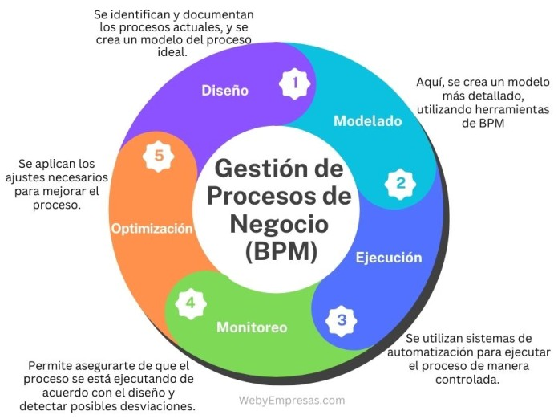

# Tema 4. Análisis dinámico de sistemas

Este tema aborda cómo modelar el comportamiento temporal y procedimental de un sistema o negocio. A diferencia del análisis estático (que define "qué elementos hay", como un Diagrama de Clases o un Modelo Entidad-Relación), el análisis dinámico define **"qué ocurre, en qué orden y bajo qué condiciones"**.

## 1. Modelado de Procesos

El modelado de procesos es la representación gráfica y estructurada de los procesos de negocio de una organización. Es el paso fundamental para la digitalización, ya que no se puede automatizar un proceso que no se comprende.

*   **AS-IS (Situación actual):** Modelado de cómo funciona el proceso hoy en día, con sus ineficiencias, cuellos de botella y tareas manuales.
*   **TO-BE (Situación futura):** Modelado de cómo debería funcionar el proceso tras la mejora o implantación del nuevo sistema de información.
*   **BPR (Business Process Reengineering):** Reingeniería de procesos. Implica rediseñar un proceso desde cero para lograr mejoras drásticas, a diferencia del BPM (Business Process Management), que busca la mejora continua y progresiva.

### 1.1. BPM (Business Process Management) y su ciclo de vida

El **BPM** no es solo una notación gráfica, sino una disciplina de gestión completa que abarca descubrir, modelar, ejecutar, monitorizar y optimizar los procesos de negocio de forma continua. Su ciclo de vida se estructura habitualmente en **5 fases**, muy preguntables porque distintos autores/herramientas usan nombres ligeramente distintos que conviene saber equiparar:

1.  **Diseño / Descubrimiento** (*Design/Discover*): se analiza el proceso AS-IS existente, identificando actividades, responsables (propietarios de tarea) y puntos de mejora.
2.  **Modelado** (*Model*): se construye la representación visual del proceso TO-BE, habitualmente en notación **BPMN**, incluyendo tareas, decisiones, eventos y flujos de datos.
3.  **Ejecución** (*Execute*): el proceso modelado se implementa, bien mediante un motor BPM (BPMS) que interpreta directamente el diagrama, bien integrándolo en las aplicaciones existentes; se suele validar primero con una prueba piloto.
4.  **Monitorización** (*Monitor*): se hace seguimiento en tiempo real del proceso en ejecución, midiendo indicadores clave de rendimiento (KPI) como tiempos de ciclo, cuellos de botella y tasas de excepción.
5.  **Optimización** (*Optimize*): con los datos reales obtenidos, se ajusta y mejora el proceso (eliminando pasos sin valor, automatizando decisiones repetitivas), cerrando el ciclo y volviendo a la fase de diseño de forma iterativa (enfoque tipo PDCA/Kaizen aplicado a procesos).

Esta naturaleza cíclica y de mejora continua es precisamente lo que distingue al **BPM** del **BPR**: el BPR rompe con el proceso existente y lo rediseña desde cero buscando un salto drástico de rendimiento, mientras que el BPM gestiona el proceso de forma evolutiva a lo largo de su ciclo de vida completo.

### 1.2. Elementos del modelado de procesos

El modelado de procesos permite identificar las actividades que componen un proceso, su secuencia, los responsables de su ejecución, los eventos que condicionan su desarrollo, las decisiones que se adoptan y la información que se intercambia.

Entre los elementos que deben identificarse se encuentran:

* **Actividades:** unidades de trabajo realizadas durante el proceso.
* **Eventos:** sucesos que inician, modifican o finalizan el comportamiento del proceso.
* **Flujos:** relaciones que determinan la secuencia de ejecución o el intercambio de mensajes.
* **Decisiones:** puntos en los que el flujo se determina a partir de condiciones o reglas.
* **Participantes y responsables:** organizaciones, unidades, roles o sistemas que intervienen en el proceso.
* **Entradas y salidas:** información, documentos, productos o servicios que recibe o genera el proceso.
* **Reglas de negocio:** condiciones que determinan el comportamiento del proceso o la adopción de decisiones.

El modelo debe mantener una correspondencia clara entre las actividades, los responsables, las entradas y salidas y las reglas que gobiernan el proceso.

### 1.3. Procesos y subprocesos

Un proceso puede descomponerse jerárquicamente en subprocesos para representar diferentes niveles de detalle. La descomposición permite pasar de una visión general del proceso a modelos más detallados sin perder la relación entre ambos niveles.

En BPMN, un **subproceso** es una actividad compuesta cuyo detalle puede representarse mediante un diagrama de proceso independiente. Esta capacidad permite controlar la complejidad del modelo y reutilizar una estructura de proceso en diferentes niveles de abstracción.

### 1.4. Modelado de procesos y automatización

El modelo de proceso puede utilizarse como especificación para el diseño de soluciones de automatización. Para ello es necesario diferenciar entre:

* **Modelo de negocio:** representa el comportamiento del proceso desde la perspectiva organizativa y funcional.
* **Modelo ejecutable:** incorpora el nivel de precisión necesario para que un sistema de gestión de procesos pueda ejecutar o coordinar las actividades.
* **Implementación:** materializa el proceso mediante aplicaciones, servicios, sistemas de información y tareas humanas.

La notación BPMN está diseñada para facilitar la comunicación entre los participantes del negocio y los responsables técnicos, manteniendo una semántica suficientemente precisa para representar procesos complejos.

## 2. Modelado Dinámico de Sistemas (UML)

En el ámbito de la Ingeniería de Software, el Lenguaje Unificado de Modelado (UML) proporciona varios diagramas de comportamiento (dinámicos) para representar cómo cambia el sistema a lo largo del tiempo:

*   **Diagrama de Actividades:** Muestra el flujo de control o flujo de datos paso a paso. Es el equivalente UML a un diagrama de flujo tradicional y precursor de lo que hoy es BPMN para negocio.
*   **Diagrama de Estados (Máquina de Estados):** Muestra los diferentes estados por los que pasa un objeto durante su ciclo de vida y los eventos que provocan las transiciones de un estado a otro.
*   **Diagrama de Secuencia:** Muestra cómo los objetos interactúan entre sí y el orden temporal en que se intercambian los mensajes. Es fundamental para diseñar el comportamiento de los Casos de Uso.
*   **Diagrama de Tiempos:** Se centra específicamente en las restricciones de tiempo y la duración de los eventos (muy usado en sistemas empotrados o de tiempo real).

Un quinto diagrama de comportamiento que suele omitirse pero que UML define formalmente es el **Diagrama de Comunicación (*Communication Diagram*)**, variante del diagrama de secuencia que pone el énfasis en las relaciones estructurales entre los objetos que intercambian mensajes, en lugar de en el orden temporal estricto. 

Conviene también distinguir con precisión el **Diagrama de Actividades** del **Diagrama de Estados**: el primero modela el flujo de un *proceso o algoritmo* (qué pasos se ejecutan y en qué orden), mientras que el segundo modela el *ciclo de vida de un objeto concreto* (en qué estado se encuentra y qué eventos provocan su cambio de estado); es una trampa de examen habitual confundir ambos por su similitud visual.

### 2.1. Diagramas de comportamiento UML

Los diagramas de comportamiento UML permiten representar aspectos dinámicos de un sistema. Entre ellos se encuentran:

* **Diagrama de actividades:** representa flujos de control y de objetos mediante actividades, decisiones, concurrencia y sincronización.
* **Máquina de estados:** representa los estados de un objeto o elemento y las transiciones provocadas por eventos.
* **Diagrama de secuencia:** representa la interacción entre participantes mediante mensajes ordenados temporalmente.
* **Diagrama de comunicación:** representa las interacciones haciendo especial énfasis en las relaciones entre los participantes y los mensajes intercambiados.
* **Diagrama de tiempos:** representa el comportamiento de los elementos respecto de una escala temporal.
* **Diagrama de visión general de interacción:** proporciona una visión de alto nivel del flujo de interacciones, combinando elementos propios de actividades con referencias a interacciones.

Los diagramas de actividades y los diagramas de estados tienen finalidades diferentes. El diagrama de actividades representa el flujo de ejecución de actividades; la máquina de estados representa el ciclo de vida de un elemento y las transiciones entre sus estados.

### 2.2. Actividades UML: control, decisión y concurrencia

En un diagrama de actividades pueden representarse:

* **Nodo inicial**, que indica el comienzo del flujo.
* **Acciones y actividades**, que representan unidades de comportamiento.
* **Nodos de decisión y combinación**, utilizados para seleccionar y reunir flujos alternativos.
* **Nodos de bifurcación y unión**, utilizados para representar flujos concurrentes.
* **Nodos finales**, que indican la terminación de un flujo o de la actividad.
* **Flujos de control**, que determinan la secuencia de ejecución.
* **Flujos de objetos**, que representan el paso de objetos o datos entre acciones.

La bifurcación permite iniciar flujos concurrentes, mientras que la unión permite sincronizarlos posteriormente.

## 3. BPMN (Business Process Model and Notation)

BPMN es el estándar internacional *de facto* para el modelado de procesos de negocio. Está mantenido por el **OMG (Object Management Group)** y su versión actual estandarizada por ISO es **BPMN 2.0.2 (ISO/IEC 19510)**.

Su objetivo principal es proveer una notación gráfica fácilmente comprensible por todos los usuarios del negocio (desde los analistas que crean los borradores, hasta los desarrolladores técnicos que implementan la tecnología, y los gerentes que monitorean los resultados), sirviendo como lenguaje común para cerrar la brecha entre el diseño del negocio y su implementación.

### 3.1. Tipos de Modelos en BPMN 2.0

BPMN 2.0 distingue tres tipos principales de representaciones:

1.  **Procesos de Orquestación (Orchestration):** Representan un proceso privado interno de una organización o departamento (todo ocurre dentro de un único Pool).
2.  **Procesos de Colaboración (Collaboration):** Muestran las interacciones entre dos o más entidades de negocio independientes (dos o más Pools). Se representan mediante flujos de mensajes entre los participantes.
3.  **Coreografía (Choreography):** Formaliza la forma en que los participantes coordinan sus interacciones. El enfoque no está en el trabajo interno de un participante, sino en el **intercambio de mensajes** entre ellos, sin que exista un controlador central.

### 3.2. DMN (Decision Model and Notation): la notación complementaria

**DMN** es otro estándar del OMG, hermano de BPMN, diseñado específicamente para modelar **decisiones de negocio** de forma independiente del proceso que las contiene. Es habitual encontrarlo mencionado junto a BPMN porque ambas notaciones se complementan: BPMN modela el "cómo fluye el trabajo" y DMN modela el "cómo se toma una decisión concreta dentro de ese flujo" (típicamente mediante **Tablas de Decisión**, que listan de forma tabular las combinaciones de condiciones de entrada y su resultado). En BPMN, una actividad de tipo **Tarea de Regla de Negocio (*Business Rule Task*)** es la que delega su lógica en un modelo DMN externo, evitando "ensuciar" el diagrama de proceso con reglas complejas de decisión.

### 3.3. BPMN y semántica de los flujos

BPMN distingue entre el flujo de secuencia y el flujo de mensaje:

* El **flujo de secuencia** representa el orden de ejecución de las actividades y solamente se utiliza dentro de un mismo Pool.
* El **flujo de mensaje** representa la comunicación entre participantes y se utiliza entre Pools.
* La **asociación** relaciona elementos del diagrama con datos, artefactos o anotaciones, sin representar el control del proceso.

Esta distinción permite separar el comportamiento interno de un participante de las comunicaciones que mantiene con otros participantes.

### 3.4. Participantes, Pools y Lanes

Un **Pool** representa un participante de una colaboración. El participante puede ser una organización, una entidad, un sistema u otra unidad que intervenga en el proceso.

Un **Lane** constituye una partición de un Pool y permite organizar las actividades atendiendo, por ejemplo, a roles, departamentos, funciones o sistemas.

Un Pool puede representarse de forma **black-box**, mostrando al participante sin detallar su proceso interno. Esta representación resulta adecuada cuando únicamente interesa mostrar las interacciones de un participante con otros.

### 3.5. Subprocesos y actividades BPMN

Las actividades BPMN pueden ser tareas o subprocesos.

Una **tarea** representa una actividad atómica que no se descompone en el nivel de modelado considerado.

Un **subproceso** representa una actividad cuyo comportamiento puede detallarse mediante actividades internas. Puede utilizarse para estructurar procesos complejos y establecer diferentes niveles de abstracción.

Los subprocesos pueden aparecer embebidos en el proceso o referenciar estructuras reutilizables mediante mecanismos definidos por BPMN.

### 3.6. Tipos de tareas BPMN

BPMN permite especificar el tipo de trabajo realizado mediante marcadores de actividad. Entre los tipos de tareas se encuentran:

* **User Task:** tarea realizada por una persona con asistencia de una aplicación.
* **Manual Task:** tarea realizada manualmente sin asistencia de una aplicación.
* **Service Task:** tarea ejecutada mediante un servicio o aplicación.
* **Business Rule Task:** tarea que proporciona una entrada a un motor de reglas de negocio y recibe el resultado correspondiente.
* **Script Task:** tarea ejecutada mediante un script.
* **Send Task:** tarea cuyo propósito es enviar un mensaje.
* **Receive Task:** tarea cuyo propósito es recibir un mensaje.

La utilización de estos tipos permite expresar con mayor precisión la naturaleza de cada actividad del proceso.

### 3.7. Datos en BPMN

Los elementos de datos permiten representar la información utilizada o producida durante la ejecución del proceso.

Entre los elementos de datos se encuentran:

* **Data Object:** representa información que se crea, utiliza o modifica durante una actividad.
* **Data Input:** representa los datos requeridos como entrada de una actividad o proceso.
* **Data Output:** representa los datos generados como salida.
* **Data Store:** representa un mecanismo persistente de almacenamiento de datos que puede ser utilizado por uno o varios procesos.

Los elementos de datos se relacionan con actividades mediante asociaciones y no constituyen por sí mismos flujos de control.

### 3.8. Eventos BPMN

Los eventos se clasifican atendiendo a su posición en el proceso y al tipo de evento que representan.

Por su posición:

* **Eventos de inicio:** indican dónde comienza un proceso o subproceso.
* **Eventos intermedios:** se producen durante el desarrollo del proceso.
* **Eventos de fin:** indican la terminación de un proceso o flujo.

Por su comportamiento, los eventos pueden representar, entre otros, mensajes, temporizadores, errores, señales, condiciones, escalados, cancelaciones, compensaciones o enlaces.

Los **eventos de borde** se asocian a una actividad y permiten reaccionar ante un evento mientras dicha actividad está en ejecución. Pueden ser interruptivos o no interruptivos.

### 3.9. Pasarelas BPMN

Las pasarelas controlan la divergencia y convergencia de los flujos.

* **Exclusive Gateway (XOR):** selecciona una única alternativa de entre las disponibles.
* **Inclusive Gateway (OR):** permite seleccionar una o varias alternativas.
* **Parallel Gateway (AND):** crea o sincroniza flujos paralelos sin realizar una evaluación condicional.
* **Event-Based Gateway:** determina la continuación del proceso en función del evento que se produzca.
* **Complex Gateway:** permite modelar condiciones complejas de divergencia o convergencia que no quedan cubiertas por las pasarelas anteriores.

En una convergencia paralela, la pasarela espera los flujos entrantes necesarios antes de continuar. En una convergencia inclusiva, la sincronización depende de las ramas que hayan sido activadas.

### 3.10. Conformidad y ejecución BPMN

BPMN es una especificación de modelado, por lo que debe distinguirse la notación de la tecnología concreta utilizada para ejecutar procesos.

La especificación define una semántica común para los elementos del modelo y mecanismos de intercambio de modelos. Una herramienta BPMN puede proporcionar capacidades adicionales de ejecución, monitorización o automatización, pero dichas capacidades no deben confundirse con la propia notación.

### 3.11. BPMN y DMN

BPMN puede complementarse con **DMN (Decision Model and Notation)** para separar la lógica de decisión de la lógica de proceso.

BPMN representa principalmente el flujo de actividades e interacciones, mientras que DMN permite representar decisiones y reglas de negocio. Las **Decision Tables** constituyen uno de los mecanismos principales de DMN para expresar de forma tabular las relaciones entre entradas y resultados de una decisión.

Esta separación permite mantener los procesos y las reglas de decisión como modelos diferenciados y facilita su mantenimiento.

## 4. Elementos Clave de BPMN 2.0

BPMN se estructura en cuatro categorías fundamentales:

### A) Objetos de Flujo (Flow Objects)
Son los elementos que definen el comportamiento del proceso.

*   **Eventos (Círculos):** Algo que ocurre durante el proceso.
    *   *Inicio (Start):* Línea fina y simple.
    *   *Intermedio (Intermediate):* Línea doble. Pueden "capturar" (Catch) un evento o "lanzar" (Throw) un evento.
    *   *Fin (End):* Línea gruesa simple. Resultan siempre en el lanzamiento de una señal o la conclusión del proceso.
*   **Actividades (Rectángulos con esquinas redondeadas):** El trabajo que se realiza dentro del proceso.
    *   *Tarea (Task):* Unidad atómica de trabajo.
    *   *Subproceso (Sub-process):* Actividad compuesta que puede desglosarse en niveles más bajos de detalle (se marca con un pequeño "+" en el centro inferior).
*   **Pasarelas o Gateways (Rombos):** Controlan la divergencia y convergencia del flujo de secuencia.
    *   **Exclusiva (XOR):** Rombo vacío o con una "X". Solo se puede seguir **UN** camino válido.
    *   **Paralela (AND):** Rombo con un "+". El flujo se divide en todos los caminos simultáneamente, o espera a que todos converjan para continuar.
    *   **Inclusiva (OR):** Rombo con un círculo "O". Se pueden seguir **UNO O MÁS** caminos dependiendo de la condición.
    *   **Basada en Eventos:** Rombo con un símbolo de evento intermedio. El flujo sigue el camino del primer evento que ocurra (ej. "Recibir correo" vs "Pasan 5 días de espera").

**Ampliación de los tipos de Eventos por su disparador (icono interior):** además de la clasificación por posición (inicio/intermedio/fin), cada evento se clasifica por el tipo de disparador que representa, un contenido muy preguntado de forma gráfica en examen:
*   **Evento de Mensaje (icono de sobre):** se dispara al enviar o recibir un mensaje de otro participante; es el tipo de evento que conecta directamente con los Flujos de Mensaje entre Pools.
*   **Evento de Temporizador (icono de reloj):** se dispara al cumplirse una fecha, una duración o un ciclo recurrente (ej. "esperar 5 días"). Es la base de los escalados automáticos por vencimiento de plazo (SLA).
*   **Evento de Error (icono de rayo):** representa un fallo grave; solo puede "capturarse" en el borde de una actividad o en el inicio de un subproceso de evento, y solo puede "lanzarse" en un evento de fin.
*   **Evento de Señal (icono de triángulo):** representa una difusión (*broadcast*) sin destinatario concreto; a diferencia del mensaje (dirigido a un participante específico), cualquier proceso que esté "escuchando" esa señal puede reaccionar a ella.
*   **Evento Condicional:** se dispara cuando se cumple una condición lógica de negocio evaluada sobre los datos del proceso.

Un matiz muy examinable sobre los **Eventos de Borde** (*Boundary Events*): se adjuntan al borde de una actividad y pueden ser **interruptivos** (círculo de borde sólido: si se dispara, cancela la actividad y desvía el flujo) o **no interruptivos** (círculo de borde discontinuo: se dispara en paralelo sin cancelar la actividad en curso, por ejemplo para enviar una notificación de recordatorio sin detener la tarea).

### B) Objetos de Conexión (Connecting Objects)
Conectan los objetos de flujo entre sí o con otra información.

*   **Flujo de Secuencia (Sequence Flow):** Línea continua con flecha cerrada. Muestra el orden en que se ejecutan las actividades. **Regla de Oro:** Un flujo de secuencia NUNCA puede cruzar los límites de un Pool.
*   **Flujo de Mensaje (Message Flow):** Línea discontinua con flecha abierta en la punta y un pequeño círculo en el inicio. Representa mensajes entre participantes. **Regla de Oro:** Un flujo de mensaje SÓLO puede existir entre Pools distintos; NUNCA dentro del mismo Pool.
*   **Asociación (Association):** Línea de puntos que asocia información (artefactos, anotaciones) con los objetos de flujo.

### C) Carriles (Swimlanes)
Organizan las responsabilidades de las actividades.

*   **Pool (Piscina):** Representa a un Participante (una organización, un cliente, una entidad). Sirve como contenedor del proceso.
*   **Lane (Calle):** Es una sub-partición dentro de un Pool. Suele representar un rol (ej. Analista), un departamento o un sistema informático específico dentro de la organización.

### D) Artefactos (Artifacts)
Proveen información adicional sobre el proceso sin afectar directamente el flujo.

*   **Objeto de Datos (Data Object):** Muestra qué datos se requieren o se producen en una actividad (ícono de un folio doblado en la esquina).
*   **Grupo (Group):** Caja con borde punteado que agrupa visualmente varios elementos para su comprensión, sin afectar al flujo.
*   **Anotación (Text Annotation):** Texto libre conectado con una Asociación para explicar un elemento complejo.

## 5. Resumen

| Concepto | Palabra Chivata o Regla para el Test |
| :--- | :--- |
| **OMG (Object Management Group)** | "Organización responsable del estándar BPMN, DMN y UML". |
| **Flujo de Secuencia** | "Línea continua", "**NUNCA** cruza límites de un Pool". |
| **Flujo de Mensajes** | "Línea discontinua", "**SIEMPRE** cruza límites de un Pool (entre participantes)". |
| **Gateway Exclusivo (XOR)** | "Rombo vacío o con X", "Caminos mutuamente excluyentes", "Solo un camino válido". |
| **Gateway Inclusivo (OR)** | "Rombo con un círculo interno O", "Uno o varios caminos válidos simultáneos". |
| **Pool vs Lane** | Pool = Participante / Organización entera; Lane = Departamento / Rol específico interno. |
| **Coreografía (Choreography)** | "Sin controlador central", "Enfocado en el intercambio de mensajes entre participantes". |
| **AS-IS / TO-BE** | "AS-IS = Situación actual (cómo es)", "TO-BE = Situación futura tras reingeniería". |
| **Evento de Temporizador** | "Icono de reloj", "Espera/plazo/SLA", "Solo captura (catching)". |
| **Evento de Señal** | "Icono de triángulo", "Difusión sin destinatario concreto", "Cualquiera puede escuchar". |
| **Evento de Error** | "Icono de rayo", "Captura solo en borde de actividad", "Lanza solo en evento de fin". |
| **Evento de borde interruptivo vs. no interruptivo** | Borde sólido = cancela la actividad; borde discontinuo = no la cancela. |
| **DMN** | "Tablas de decisión", "Complementa a BPMN", "Business Rule Task". |
| **Ciclo de vida BPM** | "Diseñar-Modelar-Ejecutar-Monitorizar-Optimizar", "Mejora continua e iterativa". |

## 6. Referencias normativas y técnicas

* Object Management Group (OMG), **Business Process Model and Notation (BPMN), versión 2.0.2**.
* ISO/IEC 19510:2013, **Information technology — Object Management Group Business Process Model and Notation**.
* Object Management Group (OMG), **Unified Modeling Language (UML), versión 2.5.1**.
* Object Management Group (OMG), **Decision Model and Notation (DMN)**.
