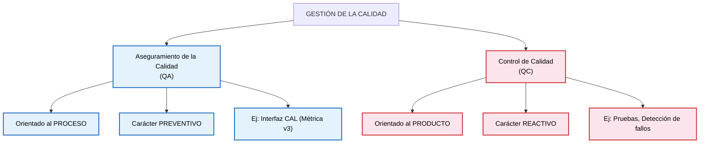
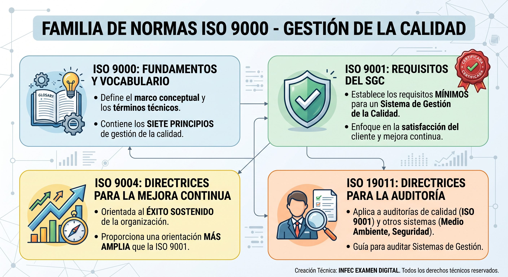
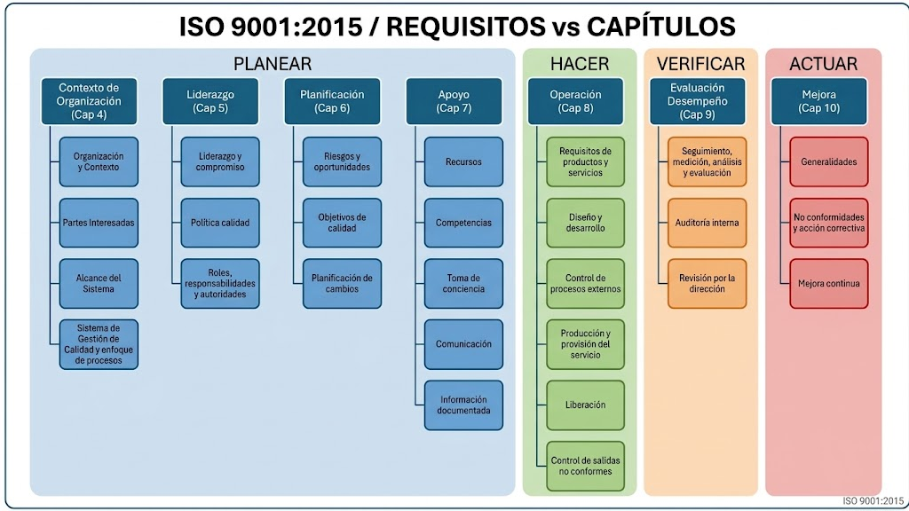
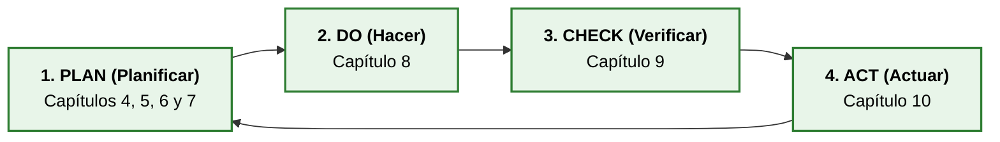

# Tema 6. Gestión de calidad en los sistemas y servicios TIC

## 1. Conceptos Clave de Calidad en TIC

La calidad en el desarrollo y servicio TIC no es que el software sea "bonito", sino que **cumpla exactamente con los requisitos** especificados y que sea **apto para el uso** del cliente. En el contexto del diseño y análisis de sistemas de información, la calidad abarca tanto los procesos de construcción como el producto final y los niveles de servicio entregados (SLA).

### 1.1. Aseguramiento vs. Control de Calidad

En las pruebas tipo test de la AGE es un clásico la trampa de intercambiar las definiciones de **QA** y **QC**:

*   **Aseguramiento de la Calidad** (*QA - Quality Assurance*):
    *   Orientado al **proceso**. 
    *   Es **preventivo**. 
    *   Define cómo se van a hacer las cosas para evitar errores desde la fase de diseño. 
    *   En **Métrica v3** existe una interfaz específica para esto (**Interfaz CAL - Calidad**), donde el **Grupo de Aseguramiento de la Calidad** elabora el **Plan de Calidad** y verifica que los productos intermedios cumplen las normas antes de pasar de fase.
*   **Control de Calidad** (*QC - Quality Control*):
    *   Orientado al **producto**. 
    *   Es **reactivo**. 
    *   Son las pruebas reales (unitarias, de integración, de sistema, de regresión) que se ejecutan sobre el software ya construido para **detectar y corregir fallos** antes de entregarlo al entorno de producción.

### 1.2. La Familia de Normas ISO 9000

La familia de normas **ISO 9000** es el marco internacional de referencia sobre **gestión de la calidad**.

*   **ISO 9000:** *Sistemas de gestión de la calidad — Fundamentos y vocabulario*. Define el marco conceptual, los términos técnicos y los siete principios de gestión de la calidad. **No es certificable**.
*   **ISO 9001:** *Sistemas de gestión de la calidad — Requisitos*. Establece los requisitos mínimos que debe cumplir un Sistema de Gestión de la Calidad (SGC). Es la **única de la familia que es certificable** por entidades externas de auditoría.
*   **ISO 9004:** *Sistemas de gestión de la calidad — Directrices para la mejora continua del desempeño*. Orientada a la gestión para el éxito sostenido de una organización. Proporciona una orientación más amplia que la **ISO 9001** pero **no es certificable**.
*   **ISO 19011:** *Directrices para la auditoría de los sistemas de gestión*. Aplica tanto a *auditorías de calidad* (**ISO 9001**) como de *medio ambiente* (**ISO 14001**) o *seguridad*.

### 1.3. Los 7 Principios de Gestión de la Calidad (ISO 9000:2015)

La versión **ISO 9000:2015** consolidó **7 principios de gestión de la calidad**

1.  **Enfoque al cliente:** El foco principal es cumplir los requisitos del cliente y esforzarse en exceder sus expectativas.
2.  **Liderazgo:** La alta dirección establece la unidad de propósito y la dirección, creando las condiciones para que las personas se impliquen en el logro de los objetivos de calidad.
3.  **Compromiso de las personas:** El personal competente, empoderado e implicado en todos los niveles de la organización es esencial para aumentar la capacidad de crear valor.
4.  **Enfoque a procesos:** Los resultados coherentes y previsibles se alcanzan de manera más eficaz y eficiente cuando las actividades se entienden y gestionan como procesos interrelacionados que funcionan como un sistema coherente.
5.  **Mejora:** Las organizaciones con éxito tienen un enfoque continuo hacia la mejora (basado en el ciclo **PDCA / Deming**).
6.  **Toma de decisiones basada en la evidencia:** Las decisiones basadas en el análisis y la evaluación de datos y hechos reales reducen la incertidumbre y producen mejores resultados.
7.  **Gestión de las relaciones:** Para un éxito sostenido, la organización gestiona sus relaciones con las partes interesadas pertinentes, tales como los proveedores y aliados tecnológicos.

> Reduciendo los 8 principios de la versión de 2008 al integrar el antiguo *enfoque de sistema* dentro del *enfoque a procesos*.

### 1.4. Calidad del servicio TIC

La **calidad de un servicio TIC** comprende la capacidad del servicio para **satisfacer** de forma consistente las **necesidades y requisitos** de las partes interesadas durante su prestación.

En un servicio TIC deben considerarse, entre otros:
*   disponibilidad y continuidad;
*   capacidad y rendimiento;
*   seguridad y confidencialidad;
*   integridad y disponibilidad de la información;
*   capacidad de respuesta;
*   accesibilidad y facilidad de uso;
*   cumplimiento de requisitos legales, reglamentarios y contractuales;
*   capacidad de soporte y resolución de incidencias;
*   satisfacción de los usuarios.

La **calidad del servicio debe evaluarse mediante objetivos y métricas definidos** previamente. 

Los **Acuerdos de Nivel de Servicio** (SLA) pueden **establecer objetivos cuantificables** para determinados atributos del servicio.

### 1.5. Gestión de la calidad, aseguramiento y control

La **gestión de la calidad** comprende las actividades mediante las que una organización dirige y controla sus procesos respecto de la calidad. Además, incopora tanto la prevención de problemas como la detección y tratamiento de no conformidades y la mejora continua.

El **aseguramiento de la calidad** proporciona confianza en que se cumplirán los requisitos de calidad mediante actividades planificadas y sistemáticas.

El **control de la calidad** se centra en la comprobación de que los productos o resultados cumplen los requisitos especificados.

### 1.6. No conformidades y acciones correctivas

Una **no conformidad** es el incumplimiento de un requisito.

Ante una no conformidad deben determinarse las causas y las acciones necesarias para corregirla y evitar, cuando proceda, su recurrencia. La eficacia de las acciones adoptadas debe evaluarse.

* La corrección elimina la no conformidad detectada.
* La acción correctiva actúa sobre la causa de una no conformidad para evitar que vuelva a producirse.

### 1.7. Medición y evaluación de la calidad

La evaluación de la calidad requiere establecer indicadores y métodos de medición adecuados. Los indicadores deben permitir conocer el grado de cumplimiento de los objetivos y detectar tendencias o desviaciones.

En servicios TIC pueden utilizarse indicadores relativos a disponibilidad, tiempos de respuesta, incidencias, cumplimiento de acuerdos de nivel de servicio, satisfacción de usuarios, tiempos de resolución, errores o capacidad.

Los resultados de la medición constituyen información de entrada para la toma de decisiones y la mejora.

## 2. El Modelo EFQM (Excelencia Organizativa)

El **Modelo EFQM** (*European Foundation for Quality Management*) no es una **norma ISO** de obligado cumplimiento ni certificable legalmente, sino un **marco de autoevaluación** voluntario diseñado para guiar a las organizaciones hacia la excelencia y la sostenibilidad. En España, su difusión y concesión de Sellos de Excelencia la gestiona el **Club Excelencia en Gestión**.

### 2.1. Modelo EFQM Clásico (Versión 2013 - 9 Criterios)

Se basa en una estricta **relación de Causa y Efecto** sumando un total de **9 criterios** que acumulan **1.000 puntos**:

*   **Agentes Facilitadores (500 pts):** Lo que la organización HACE - CAUSA.
    *   Liderazgo (100).
    *   Estrategia (100).
    *   Personas (100).
    *   Alianzas y Recursos (100).
    *   Procesos, Productos y Servicios (100).
*   **Resultados (500 pts):** Lo que LOGRA - EFECTO.
    *   Resultados en los Clientes (150).
    *   Resultados en las Personas (100).
    *   Resultados en la Sociedad (100).
    *   Resultados Clave (150).

**Matriz de Evaluación RADAR (REDER en español):**
Es la herramienta de puntuación que evalúa a la organización en el modelo clásico:
*   **R**esultados (*Results*): Determinar lo que se quiere lograr.
*   **E**nfoque (*Approach*): Planificar lo que se va a hacer para lograrlo.
*   **D**espliegue (*Deploy*): Aplicar el enfoque de manera estructurada.
*   **E**valuación y **R**evisión (*Assess and Refine*): Analizar, medir y aprender de los resultados para introducir mejoras.

### 2.2. Modelo EFQM Actualizado (Edición 2020)

Desde el año 2020, la EFQM renovó el modelo para adaptarlo a la transformación digital y la disrupción del mercado. En las oposiciones puede aparecer como actualización del modelo clásico:

**Estructura de 7 Criterios del Modelo 2020:**
1.  **Propósito, Visión y Estrategia** (Dirección - 100 pts).
2.  **Cultura de la Organización y Liderazgo** (Dirección - 100 pts).
3.  **Implicar a los Grupos de Interés** (Ejecución - 100 pts).
4.  **Crear Valor Sostenible** (Ejecución - 100 pts).
5.  **Impulsar el Rendimiento y la Transformación** (Ejecución - 200 pts).
6.  **Percepción de los Grupos de Interés** (Resultados - 200 pts).
7.  **Rendimiento Estratégico y Operativo** (Resultados - 200 pts).

**Diferencias Modelo 2013 vs 2020:**
*   **Terminología:** Se abandona el concepto estricto de "Excelencia" en favor de "organizaciones sobresalientes y sostenibles".
*   **Nº de Criterios:** Pasa de **9 criterios** (5 Agentes / 4 Resultados) a **7 criterios** (Dirección / Ejecución / Resultados).
*   **Transversalidad del Factor Humano:** El criterio aislado "Personas" desaparece como bloque independiente y se vuelve transversal a toda la organización (especialmente dentro del criterio 2).
*   **Puntuación:** Los Resultados bajan su peso relativo global de 500 a **400 puntos**, ganando peso la fase de Ejecución (400 pts) y Dirección (200 pts).

### 2.3. Evolución del Modelo EFQM

El Modelo EFQM ha evolucionado desde el modelo de 2013 hacia el modelo de 2020 y sus posteriores actualizaciones.

El modelo 2020 abandonó la estructura clásica de nueve criterios divididos en Agentes Facilitadores y Resultados y pasó a siete criterios agrupados en **Dirección, Ejecución y Resultados**.

La EFQM identifica actualmente el **Modelo EFQM 2025** como su modelo vigente. El modelo mantiene su finalidad como marco de gestión para ayudar a las organizaciones a gestionar el cambio y mejorar el rendimiento, con especial atención al desempeño sostenible.

### 2.4. EFQM y organizaciones públicas

El Modelo EFQM puede aplicarse a organizaciones públicas y a servicios orientados a ciudadanos y demás grupos de interés.

En este contexto, la evaluación debe considerar los resultados obtenidos para los diferentes grupos de interés, el cumplimiento del propósito y la estrategia, la capacidad de transformación, el rendimiento operativo y el impacto sostenible de la organización.

El modelo no prescribe una estructura organizativa concreta ni sustituye los requisitos legales o reglamentarios aplicables a una Administración Pública.

## 3. ISO 9001:2015 (Sistemas de Gestión de la Calidad)

La norma **ISO 9001:2015** es el estándar internacional certificable que establece los requisitos formales para un **Sistema de Gestión de la Calidad** (SGC).

### 3.1. Estructura de Alto Nivel (Anexo SL)

La versión 2015 adopta la plantilla común **Anexo SL**, que consta de 10 capítulos. Esto permite integrar fácilmente la ISO 9001 con otras normas como la **ISO 27001** (Seguridad) o la **ISO 14001** (Medio Ambiente):

1.  **Objeto y campo de aplicación**.
2.  **Referencias normativas**.
3.  **Términos y definiciones**.
4.  **Contexto de la organización** (Requisito exigible).
5.  **Liderazgo** (Requisito exigible).
6.  **Planificación** (Requisito exigible - Gestión de riesgos).
7.  **Apoyo** (Requisito exigible - Recursos, competencias, información documentada).
8.  **Operación** (Requisito exigible - Procesos operativos, diseño y desarrollo).
9.  **Evaluación del desempeño** (Requisito exigible - Auditorías internas, revisión por la dirección).
10. **Mejora** (Requisito exigible - No conformidades y acciones correctivas).

### 3.2. Mapeo del Ciclo PDCA (Deming) en ISO 9001:2015

Toda la sistemática de la norma **ISO 9001** se articula sobre el **Ciclo de Mejora Continua de Deming (PDCA)**:

### 3.3. Pensamiento Basado en Riesgos (*Risk-based Thinking*)

Uno de los cambios más trascendentales introducidos en **ISO 9001:2015** fue la sustitución del concepto tradicional de "acción preventiva" por el **enfoque basado en riesgos**. 

La norma exige a la organización identificar proactivamente los **riesgos y oportunidades** en la fase de planificación (**Capítulo 6**), evaluando su probabilidad e impacto. De esta forma, la prevención de fallos se convierte en una propiedad intrínseca a la propia estructura del **Sistema de Gestión de la Calidad**.

### 3.4. Contexto de la organización

El **capítulo 4 de ISO 9001:2015** exige determinar el contexto de la organización y las cuestiones externas e internas pertinentes para su propósito y dirección estratégica.

También deben determinarse las partes interesadas pertinentes para el **Sistema de Gestión de la Calidad** y sus requisitos relevantes, así como el alcance del sistema.

En una organización TIC deben considerarse, entre otros, los requisitos de usuarios, clientes, proveedores, organismos reguladores, personal, responsables de seguridad y otras partes interesadas pertinentes.

### 3.5. Liderazgo y enfoque al cliente

La **Alta Dirección** debe demostrar **liderazgo** y **compromiso** con el **Sistema de Gestión de la Calidad** y asegurar que la política y los objetivos de calidad sean compatibles con la dirección estratégica de la organización.

Debe promoverse el enfoque al cliente y asegurarse que los requisitos aplicables se determinan, comprenden y cumplen de forma consistente.

### 3.6. Planificación: riesgos, oportunidades y objetivos

La **planificación del SGC** debe considerar los **riesgos** y **oportunidades** que **pueden afectar a la conformidad** de productos y servicios y a la capacidad de aumentar la satisfacción del cliente.

Los **objetivos de calidad** deben ser coherentes con la política de calidad, medibles cuando sea posible, objeto de seguimiento, comunicados y actualizados cuando proceda.

### 3.7. Apoyo e información documentada

El **SGC** requiere disponer de los recursos necesarios, incluyendo personas competentes, infraestructura y entorno adecuados para la operación de los procesos.

La organización debe determinar y gestionar la competencia necesaria de las personas que realizan trabajos que afectan al desempeño y eficacia del **SGC**.

La **información documentada** debe controlarse de forma que esté disponible y sea adecuada para su utilización cuando y donde se necesite, y se encuentre protegida frente a pérdida de confidencialidad, uso inadecuado o pérdida de integridad.

### 3.8. Operación y diseño y desarrollo

El **capítulo 8** regula la **planificación y control operacional** y, cuando sea aplicable, el diseño y desarrollo de productos y servicios.

En proyectos TIC, el diseño y desarrollo debe planificarse y controlarse considerando etapas, responsabilidades, entradas, controles, resultados y cambios. Las entradas deben ser adecuadas, completas y no ambiguas, y los resultados deben ser adecuados para los procesos posteriores.

Los cambios de diseño y desarrollo deben identificarse, revisarse y controlarse para evitar efectos adversos sobre la conformidad.

### 3.9. Evaluación del desempeño

La **organización** debe determinar qué necesita ser monitorizado y medido, los métodos aplicables y cuándo deben realizarse las mediciones y analizarse sus resultados.

La **evaluación del desempeño** incluye, entre otros elementos, el seguimiento de la satisfacción del cliente, el análisis de datos, las auditorías internas y la revisión por la dirección.

### 3.10. Auditorías internas

Las **auditorías internas** deben realizarse a intervalos planificados para proporcionar información sobre si el **Sistema de Gestión de la Calidad**:
*   Es conforme con los requisitos propios de la organización y con los requisitos de **ISO 9001**.
*   Se encuentra eficazmente implementado y mantenido.

El **programa de auditoría** debe considerar la importancia de los **procesos**, los **cambios** que afectan a la organización y los **resultados** de auditorías anteriores.

### 3.11. Revisión por la dirección

La **alta dirección** debe revisar el **Sistema de Gestión de la Calidad** a intervalos planificados para asegurar su conveniencia, adecuación, eficacia y alineación continuas con la dirección estratégica.

Las **entradas de la revisión** incluyen, entre otros elementos, el estado de acciones de revisiones anteriores, cambios en cuestiones internas y externas, información sobre el desempeño y eficacia del SGC, adecuación de recursos y oportunidades de mejora.

### 3.12. Mejora

La **organización** debe determinar y seleccionar oportunidades de mejora e implementar las acciones necesarias para cumplir los requisitos de los clientes y aumentar su satisfacción.

Cuando se produce una **no conformidad**, deben reaccionar ante ella, controlarla y corregirla cuando sea aplicable, hacer frente a sus consecuencias y evaluar la necesidad de eliminar sus causas para evitar su recurrencia.

### 3.13. Certificación de ISO 9001

**ISO 9001** establece requisitos para el sistema de gestión de la calidad, pero la certificación de conformidad con la norma no es obligatoria.

La **certificación**, cuando una organización decide obtenerla, es realizada por un **organismo de certificación independiente**. La norma **ISO 9001** es la norma de la familia **ISO 9000** frente a la cual se puede realizar la certificación del sistema de gestión de la calidad.

### 3.14. Estado de las normas ISO 9000 y 9001

**ISO 9000:2026**, quinta edición, fue publicada en mayo de 2026 y sustituye a **ISO 9000:2015**. Proporciona los fundamentos y el vocabulario de los sistemas de gestión de la calidad.

**ISO 9001:2015** continúa siendo la edición publicada vigente en agosto de 2026 y fue modificada por **ISO 9001:2015/Amd 1:2024**. **ISO** tiene en proceso de publicación la sexta edición de **ISO 9001**, prevista para septiembre de 2026.

Por tanto, para el estudio debe distinguirse entre la **edición vigente publicada** y la nueva edición de **ISO 9001** que se encontraba en proceso de publicación.

## 4. Ejemplo Real (Caso Práctico)

Imaginemos el departamento de TI responsable de la **Sede Electrónica de un Ministerio**:

*   **Sistemas con ISO 9001 Certificada:**
    El departamento de TI ha documentado estrictamente el procedimiento de despliegue de nuevas versiones de la Sede Electrónica (Ciclo PDCA). Ante una auditoría externa de certificación, se demuestra que todos los cambios siguen la plantilla de control de cambios, que se realizan pruebas de regresión en el entorno de preproducción y que se registra la satisfacción de los ciudadanos. Si el auditor verifica que los requisitos de la norma se cumplen sin desviación, otorga o renueva el **Certificado ISO 9001**.

*   **Aplicación del Modelo EFQM:**
    La dirección del Ministerio busca evaluar la madurez global del servicio más allá de cumplir un estándar de requisitos. Realiza un ejercicio de autoevaluación midiendo el impacto medioambiental y social de la Sede Electrónica (Resultados en la Sociedad), la motivación y capacitación de los programadores públicos (Personas / Cultura) y la percepción directa de los usuarios (Resultados en Clientes). Aplica la matriz **RADAR/REDER** para puntuar estos bloques y obtiene una valoración que le da acceso a un **Sello de Excelencia EFQM (ej. 500+ Puntos)**.

## 5. Referencias normativas y técnicas

* **ISO 9000:2026**, *Quality management — Fundamentals and vocabulary*.
* **ISO 9001:2015**, *Quality management systems — Requirements*, incluida su modificación **ISO 9001:2015/Amd 1:2024**.
* **ISO 9004:2018**, *Quality management — Quality of an organization — Guidance to achieve sustained success*.
* **ISO 19011:2018**, *Guidelines for auditing management systems*.
* **EFQM, The EFQM Model 2025**.

## 6. Cuadro Síntesis de conceptos

| Concepto / Norma | Tipo de Herramienta | Enfoque Principal | Palabra Chivata / Clave en el Test |
| :--- | :--- | :--- | :--- |
| **Aseguramiento de Calidad (QA)** | Prevención en Procesos | Evitar la aparición de defectos mediante estándares. | "Procesos", "Preventivo", "Interfaz CAL de Métrica v3". |
| **Control de Calidad (QC)** | Detección en Producto | Identificar fallos en el software terminado. | "Producto", "Reactivo", "Pruebas/Inspección". |
| **ISO 9000** | Estándar de Fundamentos | Definiciones técnicas y vocabulario oficial. | "Fundamentos", "Vocabulario", "7 principios", "No certificable". |
| **ISO 9001** | Estándar de Requisitos | Especificación del Sistema de Gestión de Calidad (SGC). | **"Certificable"**, "Ciclo PDCA", "Riesgos y Oportunidades", "Anexo SL". |
| **ISO 9004** | Guía de Orientación | Directrices para la mejora continua del desempeño. | "Éxito sostenido", "Desempeño", "No certificable". |
| **Ciclo PDCA (Deming)** | Modelo | Estructura la iteración de mejora. | "Planificar, Hacer, Verificar, Actuar", "Mejora iterativa". |
| **EFQM Clásico (2013)** | Modelo de Autoevaluación | Marco de Excelencia en gestión de organizaciones. | "9 Criterios", "5 Agentes / 4 Resultados", "Matriz RADAR/REDER". |
| **EFQM Actualizado (2020)** | Modelo de Autoevaluación | Marco para organizaciones sobresalientes y sostenibles. | "7 Criterios", "Dirección-Ejecución-Resultados", "Estructura 200-400-400". |

## 7. Simulacro de Test

**Pregunta 1:**
*Dentro de los criterios del modelo de excelencia EFQM (versión clásica), ¿cuál de los siguientes elementos es considerado un "Agente Facilitador" y no un "Resultado"?*
a) Resultados en la sociedad.
b) El Liderazgo.
c) Satisfacción del cliente.
d) Resultados clave del negocio.

**Razonamiento Estructurado:**
1.  **Busca el patrón:** Te piden distinguir entre la "Causa" (lo que hacemos = Agente facilitador) y el "Efecto" (lo que conseguimos = Resultado).
2.  **Aplica tu patrón lógico de descarte:**
    *   (A) "Resultados en la sociedad": Contiene la palabra "resultado". Es el efecto que nuestra organización tiene en el entorno. Falsa.
    *   (C) "Satisfacción del cliente": Es la consecuencia (efecto) de dar un buen servicio. Es un resultado. Falsa.
    *   (D) "Resultados clave": Contiene la palabra "resultado". Falsa.
    *   (B) "El Liderazgo": ¿Es algo que *hacemos* internamente para mover la organización? Sí. Es la forma en que los directivos guían al equipo. Es una causa (Agente Facilitador).
3.  **Respuesta correcta:** B.

**Pregunta 2:**
*¿Cuál de las siguientes normas de la familia ISO 9000 es la única que resulta certificable por una entidad externa?*
a) ISO 9000.
b) ISO 9001.
c) ISO 9004.
d) ISO 19011.

**Razonamiento Estructurado:**
1.  ISO 9000 recoge solo fundamentos y vocabulario; ISO 9004 son directrices para la mejora del desempeño; ISO 19011 son directrices de auditoría. Ninguna de las tres establece requisitos certificables.
2.  ISO 9001 es la norma de "Requisitos" del Sistema de Gestión de Calidad, y es la única que una organización puede certificar frente a un organismo acreditado.
3.  **Respuesta correcta:** B.

**Pregunta 3:**
*Según el Modelo EFQM 2020, ¿cuál de las siguientes afirmaciones es correcta respecto a la versión anterior (2013)?*
a) Mantiene los 9 criterios agrupados en Agentes Facilitadores y Resultados.
b) Introduce un criterio específico y aislado llamado "Personas".
c) Se estructura en 7 criterios bajo la lógica Dirección-Ejecución-Resultados.
d) Elimina por completo la matriz REDER de evaluación.

**Razonamiento Estructurado:**
1.  (A) es falsa porque el modelo 2020 abandona la estructura de 9 criterios en favor de 7. (B) es falsa porque las Personas dejan de tener un criterio propio y pasan a ser transversales. (D) es falsa porque REDER sigue siendo la lógica de evaluación, solo cambia cómo se publican las tablas de puntuación.
2.  (C) describe exactamente la nueva estructura: Dirección (criterios 1-2), Ejecución (criterios 3-5) y Resultados (criterios 6-7).
3.  **Respuesta correcta:** C.
