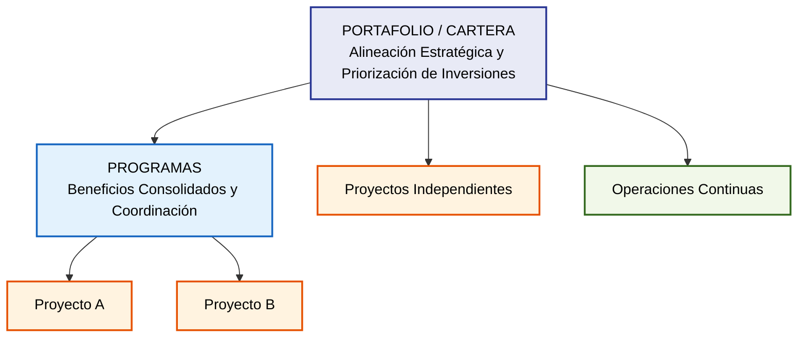
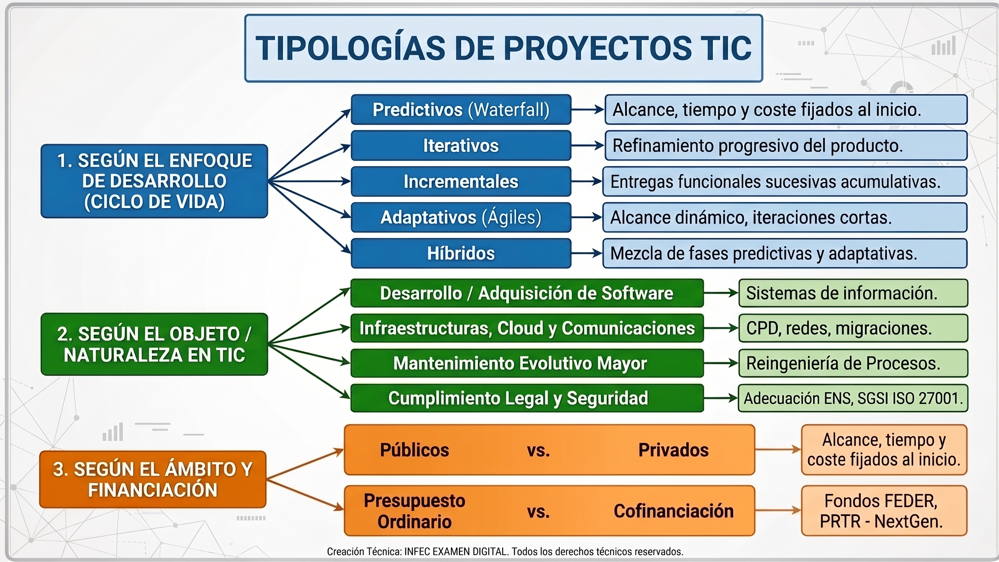
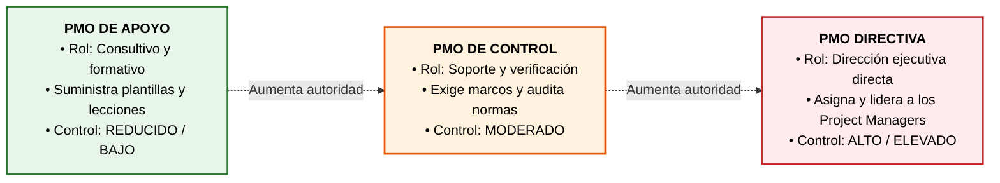

# Tema 2. Fundamentos y principios de la Gestión de Proyectos

## 1. Concepto de Proyecto y sus Características

Un **proyecto** es un esfuerzo temporal que se lleva a cabo para crear un producto, servicio o resultado único (definición formal del **PMBOK** e **ISO 21502**). Sus características esenciales son:

*   **Temporalidad:** Posee un inicio y un final delimitados. El cierre se alcanza al cumplir los objetivos, por inviabilidad demostrada, por extinción de la necesidad de negocio o por rescisión presupuestaria/contractual. Temporalidad no es sinónimo de corta duración.
*   **Unicidad del resultado:** El entregable o producto final posee características singulares que lo diferencian de cualquier otra unidad productiva previa, aun cuando existan componentes estandarizados o repetitivos.
*   **Elaboración progresiva (desarrollo gradual):** El proyecto avanza por etapas e incrementos. El alcance se define a alto nivel al inicio y se detalla conforme se profundiza en el dominio del problema.
*   **Incertidumbre y riesgo:** Derivado de su carácter singular, presenta mayor volatilidad y riesgo que las actividades operativas estandarizadas.
*   **Consumo y restricción de recursos:** Requiere la asignación formal y controlada de recursos humanos, tecnológicos, temporales y financieros.

### 1.1. Proyecto, Programa y Portafolio

*   **Proyecto:** Iniciativa temporal individual orientada a producir un entregable singular. Se centra en objetivos directos, alcance, tiempo y coste.
*   **Programa:** Conjunto de proyectos relacionados, subprogramas y actividades de programa gestionados de forma coordinada para obtener beneficios y sinergias que no se lograrían gestionándolos de forma individual.
*   **Portafolio (Cartera):** Conjunto de proyectos, programas, subportafolios y operaciones gestionados como un grupo global para alcanzar los objetivos estratégicos de la organización.

### 1.2. Cadena de Valor: Entregables, Resultados y Beneficios

*   **Entregable** (*Deliverable* / *Output*): Producto, servicio o capacidad técnica verificable y medible producido por el proyecto (ej. nueva sede electrónica desarrollada).
*   **Resultado** (*Outcome*): Cambio o efecto derivado del uso y adopción de los entregables por los usuarios (ej. los ciudadanos realizan los trámites en línea).
*   **Beneficio** (*Benefit*): Valor medible aportado a la organización o sociedad resultante del cambio (ej. reducción del 40% en tiempos de tramitación y ahorro de costes administrativos).

### 1.3. La Triple Restricción y el Triángulo de Hierro

*   **Triple Restricción Clásica:** Equilibrio indisociable entre **Alcance**, **Tiempo** y **Coste**. Cualquier variación en un vértice impacta forzosamente en los otros dos.

> **Restricción Ampliada (PMBOK / ISO 21502):** Añade **Calidad**, **Riesgos**, **Recursos** y **Satisfacción del Cliente/Valor**.

*   **Triángulo Invertido (Predictivo vs. Ágil):**
    *   **Enfoque Predictivo** (*Tradicional*): El **Alcance es fijo**; el Tiempo y el Coste se estiman y ajustan para cumplirlo.
    *   **Enfoque Adaptativo** (*Ágil*): El **Tiempo (Sprint) y el Coste/Recursos son fijos**; el **Alcance es variable** y se prioriza por valor mediante el **Product Backlog**.

## 2. Principios Generales de la Dirección de Proyectos

### 2.1. PMBOK 7ª Edición: Marco de 12 Principios y 8 Dominios

La **7ª edición** del **PMBOK** (*PMI, 2021*) supuso el cambio de un enfoque basado en procesos a un marco basado en **12 principios rectores**:

1.  **Administración responsable** (*Stewardship*): Actuar con integridad, cuidado, respeto y diligencia ética y normativa.
2.  **Entorno de equipo colaborativo:** Fomentar una cultura de responsabilidad compartida, confianza y alineación.
3.  **Involucrar a los interesados** (*Stakeholders*): Gestionar activamente sus expectativas, necesidades e influencia.
4.  **Centrarse en el valor:** Justificar el proyecto continuamente por el valor aportado al negocio/servicio público.
5.  **Pensamiento sistémico:** Evaluar las interacciones complejas entre el proyecto y el ecosistema organizativo.
6.  **Comportamientos de liderazgo:** Demostrar y promover liderazgo situacional y adaptativo en todos los niveles.
7.  **Adaptación** (*Tailoring*): Ajustar el marco de trabajo según la complejidad, escala, riesgo y entorno del proyecto.
8.  **Calidad en procesos y entregables:** Integrar la prevención y el aseguramiento en lugar de limitarse a la inspección.
9.  **Navegar por la complejidad:** Abordar la ambigüedad, el comportamiento dinámico y las interdependencias técnicas.
10. **Optimizar las respuestas a los riesgos:** Maximizar oportunidades (*positivos*) y mitigar amenazas (*negativos*).
11. **Adaptabilidad y resiliencia:** Mantener la capacidad de absorber impactos, recuperarse y evolucionar ante el cambio.
12. **Habilitar el cambio para alcanzar el estado futuro:** Guiar la transición organizativa para materializar los beneficios.

Estos principios gobiernan los **8 Dominios de Desempeño del Proyecto**: 

1. **Interesados**.
2. **Equipo**.
3. **Enfoque de Desarrollo y Ciclo de Vida**.
4. **Planificación**.
5. **Trabajo del Proyecto**.
6. **Entrega**.
7. **Medición**.
8. **Incertidumbre**.

### 2.2. PMBOK 8ª Edición (Noviembre 2025): Consolidación Estructural

La **8ª edición** simplifica y evoluciona la estructura de PMI manteniendo la orientación a principios:

*   **6 Principios Fundamentales:**
    1. Adoptar una visión holística.
    2. Centrarse en el valor.
    3. Integrar la calidad.
    4. Liderar con responsabilidad.
    5. Integrar la sostenibilidad.
    6. Construir equipos empoderados.
*   **7 Dominios de Desempeño:** 
    1. **Gobernanza**.
    2. **Alcance**.
    3. **Cronograma**.
    4. **Finanzas**.
    5. **Interesados**.
    6. **Recursos**.
    7. **Riesgo**.

### 2.3. Principios en ISO 21502:2020 y PRINCE2 7

*   **ISO 21502:2020:** Guía internacional de directrices para la gestión de proyectos (sustituyó a **ISO 21500:2012**, quedando **ISO 21500:2021** como marco paraguas de conceptos de **gobernanza**). Establece prácticas integradas de dirección aplicables a cualquier **ciclo de vida**.
*   **PRINCE2 7:** Método estructurado fundamentado en **7 Principios** (*Justificación comercial continua, Aprender de la experiencia, Roles y responsabilidades definidos, Gestión por fases, Gestión por excepción, Enfoque en los productos* y *Adaptación al entorno*).

## 3. Beneficios de la Gestión de Proyectos

*   **Alineación estratégica:** Asegura que los recursos públicos/corporativos materialicen los planes institucionales y normativas vigentes (**ENS RD 311/2022**, **RGPD**, Directiva **NIS2**).
*   **Gobernanza y trazabilidad:** Establece estructuras formales de decisión, niveles de autorización (*Sponsor*, *Comité de Dirección*, *Project Manager*) y mecanismos de escalado claros.
*   **Optimización de recursos y predictibilidad:** Maximiza la eficiencia presupuestaria, reduce desviaciones mediante líneas base y mitiga riesgos de forma proactiva.
*   **Gestión del cambio y entrega de valor:** Facilita la transición hacia operaciones y garantiza que el éxito se mida por beneficios obtenidos y no solo por entregables concluidos.

## 4. Tipología de Proyectos

## 5. Ciclo de Vida del Proyecto: Fases, Grupos de Procesos y Entregables

### 5.1. Comparativa de Ciclos de Vida y Fases según Marcos de Referencia

| Marco / Estándar | Fases / Procesos Clave | Entregables e Hitos Principales |
| :--- | :--- | :--- |
| **PMBOK (Tradicional)** | 1. **Inicio** 2. **Planificación** 3. **Ejecución** 4. **Monitoreo y Control** 5. **Cierre** | • Acta de Constitución (*Project Charter*) • Plan para la Dirección del Proyecto (*Líneas Base*) • Entregables verificados / Solicitudes de Cambio • Informes de desempeño (*Métricas EVM*) • Aceptación Formal y Lecciones Aprendidas |
| **Métrica v3 (GP)** | 1. **GPI** (Inicio) 2. **GPS** (Seguimiento y Control) 3. **GPF** (Finalización) | • Estimación (Puntos Función/COCOMO), Plan de Proyecto • Registro de Incidencias, Peticiones de Cambio • Acta de Aceptación, Informe de Cierre |
| **PRINCE2 7** | **7 Procesos**: SU, IP, CS, MP, SB, DP, CP | • **Business Case** (Detallado y Preliminar) • Plan de Proyecto / Planes de Fase • Registro de Cuestiones (*Issues*), Informe de Fin de Fase |
| **ITIL v4 (Transición/Ops)** | Habilitación del Cambio (*Change Enablement*) | • **RFC** (*Request for Change*) • **Plan de Back-out** (Reversión obligatoria) • Actualización de CIs en **CMDB** |

### 5.2. Los 5 Grupos de Procesos del PMBOK

1.  **Inicio:** Define el proyecto o fase y obtiene la autorización formal. Entregable: **Acta de Constitución del Proyecto** (*Project Charter*), que confiere autoridad al **Project Manager** y nombra al **Patrocinador** (*Sponsor*).
2.  **Planificación:** Establece el alcance total, define los objetivos y diseña el **Plan para la Dirección del Proyecto** (incluye la línea base de alcance `[EDT/WBS]`, cronograma y costes, más planes de calidad, riesgos, etc.).
3.  **Ejecución:** Coordina equipos y recursos para generar los entregables conforme a lo planificado. Consume la mayor proporción de esfuerzo y presupuesto.
4.  **Monitoreo y Control:** Proceso transversal que supervisa el avance, analiza desviaciones respecto a las líneas base y gestiona los cambios a través del **Comité de Control de Cambios (CCB)**.
5.  **Cierre:** Formaliza la finalización administrativa y contractual, transfiere los entregables a operaciones, archiva registros y documenta las **Lecciones Aprendidas**.

## 6. Oficina de Dirección de Proyectos (PMO)

La **PMO** (*Project Management Office*) es la entidad o estructura organizativa que estandariza los procesos de gobernanza del proyecto y facilita el intercambio de recursos, metodologías, herramientas y técnicas.

### 6.1. Tipología de PMO según su Nivel de Control (PMBOK)

*   **PMO de Apoyo** (*Supportive*): 
    *   Rol **consultivo**.
    *   Suministra plantillas, mejores prácticas, formación y acceso a la información histórica. 
    *   Control **Bajo**.
*   **PMO de Control** (*Controlling*): 
    *   Proporciona **soporte** pero exige conformidad mediante marcos específicos, plantillas obligatorias y auditorías de gobernanza. 
    *   Control **Moderado**.
*   **PMO Directiva** (*Directive*): 
    *   **Dirige y gestiona** directamente los proyectos.
    *   Los Directores de Proyecto dependen jerárquica y funcionalmente de la **PMO**.
    *   Control **Alto**.

### 6.2. Tipología de PMO según el Ámbito Organizativo

*   **PMO de Proyecto / Programa:** Creada para coordinar un megaproyecto específico; se disuelve tras su entrega.
*   **PMO Departamental / Divisional:** Soporta a una unidad o dirección técnica concreta (ej. PMO de Desarrollo TIC).
*   **PMO Corporativa / Empresarial** (EPMO - *Enterprise PMO*): Alinea los proyectos y programas con el plan estratégico de toda la organización/Consejería.
*   **VMO** (*Value Management Office*): Variante en marcos ágiles centrada en optimizar el flujo de valor (*Value Stream*) y la priorización continua de iniciativas.

## 7. Diferencias entre Proyectos y Operaciones

| Criterio | Proyecto | Operación |
| :--- | :--- | :--- |
| **Duración** | **Temporal:** Fecha de inicio y fin definidas. | **Continua e indefinida:** Sin horizonte temporal de término. |
| **Resultado** | **Único:** Entregable, servicio o producto singular. | **Repetitivo y estandarizado:** Bienes/servicios homogéneos. |
| **Objetivo** | Transformar la organización y cumplir metas concretas para cerrar. | Mantener la continuidad del negocio y optimizar procesos. |
| **Gestión Financiera** | **CAPEX** (*Capital Expenditure* - Inversión en activos). | **OPEX** (*Operational Expenditure* - Gasto corriente). |
| **Riesgo e Incertidumbre** | Elevado debido a la novedad y cambios intrínsecos. | Bajo / Controlado mediante procedimientos estables. |
| **Estructura de Trabajo** | Equipos temporales, multidisciplinares o matriciales. | Estructura funcional jerárquica permanente. |

> **Transición a la Operación:** Hito formal ejecutado en la fase de **Cierre del Proyecto**. Requiere la entrega de documentación técnica/manuales, formación a usuarios y administradores, suscripción de garantías, Acuerdos de Nivel de Servicio (**SLA**) y traspaso al Centro de Atención a Usuarios (**CAU**) o equipos de mantenimiento.

## 8. Gobernanza de Proyectos TIC en la Administración Pública

### 8.1. Interfaz de Gestión de Proyectos (GP) en Métrica v3

*   **GPI (Inicio del Proyecto):** Nace tras la aprobación del **Estudio de Viabilidad del Sistema** (*EVS*). Se centra en la **estimación** formal del **esfuerzo** (*Puntos Función*, *COCOMO*), asignación de recursos y elaboración del **Plan de Proyecto**.
*   **GPS (Seguimiento y Control):** Gestión de la ejecución técnica, monitorización de hitos, gestión de incidencias y tramitación formal de **Peticiones de Cambio de Requisitos**.
*   **GPF (Finalización del Proyecto):** Evaluación del rendimiento, aceptación formal, extracción de datos históricos para métricas organizativas y archivo formal.
*   **Gobernanza de Cambios:** El **Jefe de Proyecto** evalúa el **impacto técnico/financiero del cambio**, pero la aprobación formal es potestad exclusiva del **Comité de Seguimiento**.

### 8.2. Gestión del Cambio en Explotación (ITIL v4 - *Change Enablement*)

Tras la puesta en producción, los cambios operativos se canalizan mediante **ITIL v4**:
*   **Cambio Estándar:** Procedimiento recurrente, preautorizado y de bajo riesgo (ej. reinicio preventivo, asignación de permisos estándar).
*   **Cambio Normal:** Requiere solicitud formal (**RFC** - *Request for Change*), análisis de impacto, ventana de mantenimiento, **Plan de Back-out** (*reversión obligatoria*) y aprobación por el **CAB / CAC** (*Change Advisory Board*).
*   **Cambio de Emergencia:** Resolución urgente ante incidentes críticos de seguridad/disponibilidad; evaluado y autorizado ágilmente por el **ECAB / CAC de Emergencia**.

## 9. Ejemplo Real Integrado (Ámbito TIC Público)

**Caso:** Implantación del nuevo Sistema de Registro Electrónico de Entrada/Salida compatible con el **Sistema de Interconexión de Registros** (*SIR*) en una Consejería.

*   **Proyecto:** Definido en el *Project Charter*, con un plazo de 9 meses, presupuesto de fondos FEDER (CAPEX) y entrega de la aplicación certificada bajo el ENS.
*   **Operación:** Tras el cierre (GPF/Cierre PMBOK), el soporte diario de incidencias del registro, la renovación anual de certificados de sello y el mantenimiento correctivo se asumen como gasto corriente (OPEX) por el área de Sistemas.
*   **Gobernanza de la PMO:**
    *   *PMO de Apoyo:* Suministra la plantilla de matriz de trazabilidad de requisitos y la metodología.
    *   *PMO de Control:* Audita que el proyecto cumple los estándares de seguridad de las guías CCN-STIC del ENS y las fases de Métrica v3.
    *   *PMO Directiva:* Asigna al Ingeniero de Desarrollo como Director de Proyecto y controla directamente el presupuesto.

## 10. Resumen

| Concepto | Términos Clave |
| :--- | :--- |
| **Proyecto** | "Esfuerzo temporal", "Resultado/servicio único", "Elaboración progresiva". |
| **Operación** | "Continuo", "Repetitivo", "Mantenimiento del negocio", "OPEX". |
| **Programa** | "Beneficios consolidados", "Proyectos relacionados gestionados coordinadamente". |
| **Portafolio / Cartera** | "Alineación estratégica", "Priorización global de inversiones". |
| **PMBOK 7ª Edición** | "12 principios", "8 dominios de desempeño", "Enfoque en Valor". |
| **PMBOK 8ª Edición (2025)** | "6 principios", "7 dominios de desempeño", "Gobernanza y Sostenibilidad". |
| **ISO 21502:2020** | "Guía de gestión de proyectos", sustituye a ISO 21500:2012. |
| **PMO de Apoyo** | "Consultiva", "Suministra plantillas y lecciones", "Control bajo/reducido". |
| **PMO de Control** | "Exige cumplimiento", "Auditoría de gobernanza", "Control moderado". |
| **PMO Directiva** | "Dirige directamente", "Asigna Project Managers", "Control alto/elevado". |
| **Acta de Constitución** | "Autoriza formalmente el proyecto", "Confiere autoridad al PM". |
| **Comité de Seguimiento (M3)** | "Órgano que aprueba formalmente cambios de requisitos en Métrica v3". |
| **CAB / CAC (ITIL v4)** | "Comité Asesor de Cambios", "Aprueba cambios normales tras analizar impacto". |
| **Plan de Back-out** | "Plan de marcha atrás/reversión en caso de fallo del despliegue". |

## 11. Referencias Normativas y Técnicas

* **PMI**, *A Guide to the Project Management Body of Knowledge (PMBOK® Guide)* — 7ª Edición (2021) y 8ª Edición (Noviembre 2025).
* **ISO 21500:2021**, *Project, programme and portfolio management — Context and concepts*.
* **ISO 21502:2020**, *Project, programme and portfolio management — Guidance on project management*.
* **ISO 21505:2017**, *Project, programme and portfolio management — Guidance on governance*.
* **ISO 21506:2024**, *Project, programme and portfolio management — Vocabulary*.
* **PeopleCert**, *PRINCE2® 7 Management Framework*.
* **Ministerio de Hacienda y Función Pública**, *MÉTRICA Versión 3: Interfaz de Gestión de Proyectos (GP)*.
* **AXELOS**, *ITIL® 4: Create, Deliver and Support / Change Enablement Practice*.

## 12. Simulacro de Test Examen

**Pregunta 1:**
*Según la Guía PMBOK del PMI, ¿qué tipo de Oficina de Dirección de Proyectos (PMO) se caracteriza por tener un rol consultivo, suministrar plantillas, mejores prácticas y formación, ejerciendo un grado de control bajo sobre los proyectos?*
a) PMO Directiva.
b) PMO de Control.
c) PMO de Apoyo (*Supportive*).
d) PMO Estratégica / EPMO.

**Razonamiento Estructurado:**
1.  **Palabra chivata:** "Rol consultivo", "suministra plantillas", "grado de control bajo".
2.  **Descarte:** La PMO de Control (b) ejerce control moderado exigiendo marcos. La Directiva (a) ejerce control alto dirigiendo los proyectos.
3.  **Respuesta correcta:** **C**.

**Pregunta 2:**
*¿Cuál es la principal diferencia conceptual entre un proyecto y una operación en el ámbito de las tecnologías de la información?*
a) El proyecto busca mantener la continuidad del servicio, mientras que la operación genera un entregable único.
b) El proyecto se financia con OPEX recurrente, mientras que la operación se imputa como inversión de capital (CAPEX).
c) El proyecto es un esfuerzo temporal con inicio y fin orientados a un resultado único, mientras que la operación es un esfuerzo continuo y repetitivo.
d) El proyecto no asume riesgos ni incertidumbre, a diferencia de las operaciones de explotación.

**Razonamiento Estructurado:**
1.  **Análisis:** (a) y (b) tienen los términos invertidos. (d) es falsa porque los proyectos concentran mayor incertidumbre.
2.  (c) define de manera formal y literal la distinción según PMBOK e ISO 21502.
3.  **Respuesta correcta:** **C**.

**Pregunta 3:**
*En el marco de la metodología Métrica v3, si durante la ejecución de las actividades de Seguimiento y Control (GPS) el equipo detecta una desviación en el alcance y formula una Petición de Cambio de Requisitos, ¿qué órgano tiene la potestad formal de autorizar o rechazar dicha modificación?*
a) El Jefe de Proyecto de forma unilateral.
b) El Comité de Seguimiento del proyecto.
c) El Grupo de Aseguramiento de la Calidad (CAL).
d) El Director de Sistemas de Información.

**Razonamiento Estructurado:**
1.  **Análisis:** El Jefe de Proyecto analiza el impacto y propone la solución, pero en la interfaz GP de Métrica v3 la gobernanza y aprobación final recaen en el Comité de Seguimiento.
2.  **Respuesta correcta:** **B**.

**Pregunta 4:**
*En la gestión del ciclo de vida bajo ITIL v4, ¿qué elemento es un requisito obligatorio que acompaña a una Solicitud de Cambio Normal (RFC) para garantizar la restauración del servicio si el despliegue falla?*
a) Acta de Constitución del Cambio.
b) Plan de Back-out (Reversión).
c) Diagrama de flujo acumulado.
d) Estimación por Puntos de Función.

**Razonamiento Estructurado:**
1.  **Palabra chivata:** "Restauración del servicio si el despliegue falla".
2.  El Plan de Back-out (marcha atrás) es la salvaguarda obligatoria exigida por el CAB para autorizar un cambio normal.
3.  **Respuesta correcta:** **B**.
