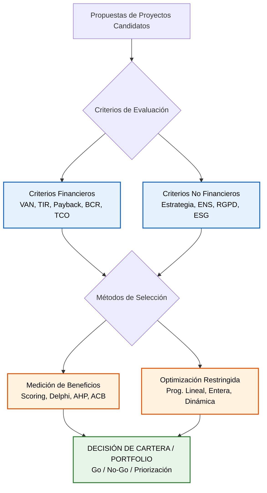
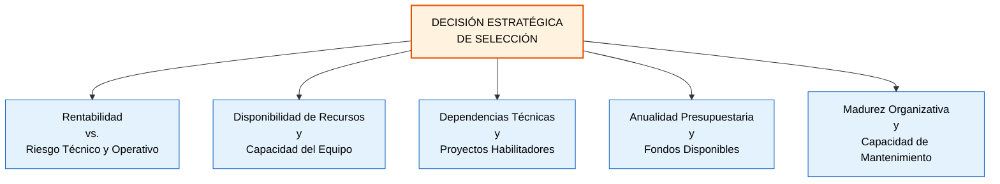

# Tema 3. Evaluación y selección de proyectos

La evaluación y selección de proyectos es un proceso estratégico de gobernanza mediante el cual la organización o la Administración Pública optimiza la asignación de sus recursos limitados (presupuesto, personal y capacidad técnica). 

Este proceso determina qué iniciativas se autorizan (*Go*), cuáles se posponen y cuáles se descartan (*No-Go*), garantizando la máxima aportación de valor y la alineación con los planes estratégicos corporativos e institucionales.

## 1. Criterios de Evaluación de Proyectos

La evaluación integral de un proyecto exige **combinar** el **análisis económico-financiero** con la **valoración estratégica, operativa y normativa**.

### 1.1. Criterios Financieros (Matemática de la Inversión)

Los métodos financieros cuantitativos **modelan los flujos de caja previstos** (ingresos/ahorros frente a inversiones y gastos operativos) a lo largo del horizonte temporal del proyecto.

#### 1.1.1. Valor Actual Neto (VAN / NPV - Net Present Value)
Es el criterio financiero prioritario por excelencia. Calcula el valor presente de los flujos netos de caja futuros descontados a una tasa de actualización $k$ (coste de oportunidad del capital o inflación), minorados por la inversión inicial $I_0$:

$$VAN = \sum_{t=1}^{n} \frac{F_t}{(1 + k)^t} - I_0$$

*   **Regla de decisión:**
    *   $VAN > 0$: El proyecto es **rentable** y genera valor económico neto por encima de la tasa exigida.
    *   $VAN = 0$: El proyecto recupera exactamente la inversión y la rentabilidad mínima exigida ($k$).
    *   $VAN < 0$: El proyecto destruye valor; debe **rechazarse**.

> Entre proyectos independientes o mutuamente excluyentes, **se selecciona** siempre el que posea el **mayor VAN absoluto**.

#### 1.1.2. Tasa Interna de Retorno (TIR / IRR - Internal Rate of Return)
Es la tasa de descuento $r$ que iguala el valor actual de los flujos de caja futuros con la inversión inicial, haciendo que el $VAN = 0$:

$$\sum_{t=1}^{n} \frac{F_t}{(1 + TIR)^t} - I_0 = 0$$

*   **Regla de decisión:** Se compara la $TIR$ con el coste de capital $k$ de la organización.
    *   $TIR > k$: El proyecto es financieramente **viable**.
    *   $TIR < k$: El proyecto debe **rechazarse**.

>   **Conflicto VAN vs. TIR** (*Cruce de Fisher*): En proyectos mutuamente excluyentes con diferente escala de inversión o distribución temporal de flujos, el $VAN$ y la $TIR$ pueden dar recomendaciones contradictorias. Es recomendable **priorizar** siempre el criterio del **VAN**, ya que mide el valor absoluto agregado a la organización.

#### 1.1.3. Relación Beneficio-Coste (RBC / BCR - Benefit-Cost Ratio)
Índice de rentabilidad que divide el valor actual de los flujos de beneficios ($PVB$) entre el valor actual de los flujos de costes ($PVC$):

$$BCR = \frac{\sum_{t=1}^{n} \frac{B_t}{(1+k)^t}}{\sum_{t=0}^{n} \frac{C_t}{(1+k)^t}} = \frac{PVB}{PVC}$$

*   **Regla de decisión:**
    *   $BCR > 1$: Los beneficios actualizados superan a los costes; el proyecto es **viable**.
    *   $BCR = 1$: Punto de equilibrio.
    *   $BCR < 1$: Los costes superan a los beneficios; el proyecto se **rechaza**.
*   **Diferencia con el VAN:** El $VAN$ es una medida absoluta (euros netos); el $BCR$ es un ratio relativo de eficiencia por cada euro invertido, **idóneo** para **comparar proyectos de distinta escala presupuestaria**.

#### 1.1.4. Plazo de Recuperación (Payback Period)
Mide el tiempo necesario para que los flujos netos de caja acumulados igualen la inversión inicial.
*   **Payback Simple:** No actualiza los flujos de caja en el tiempo. Mide **liquidez y riesgo temporal**, pero **no mide la rentabilidad global** (ignora los flujos generados tras la recuperación).
*   **Payback Descontado:** Incorpora la tasa de descuento $k$ en los flujos antes de calcular el periodo de recuperación.
*   **Regla de decisión:** Entre varias opciones, se elige la de **menor periodo de recuperación**.

#### 1.1.5. Retorno de la Inversión (ROI - Return on Investment)
Ratio contable básico que relaciona el beneficio neto obtenido con el capital total invertido:

$$ROI = \left( \frac{\text{Beneficio Neto}}{\text{Coste de Inversión}} \right) \times 100$$

#### 1.1.6. Costes de Oportunidad y Costes Hundidos
*   **Coste de Oportunidad:** Beneficio económico o valor que se deja de percibir al seleccionar una alternativa en detrimento de otra (*el valor de la mejor opción descartada*).
*   **Costes Hundidos** (*Sunk Costs*): **Gastos pasados** ya ejecutados que **no pueden recuperarse** independientemente de la decisión futura (*ej. licencias ya adquiridas no reembolsables*).

> Los **costes hundidos** NUNCA deben influir ni incluirse en las decisiones de continuar o cancelar un proyecto.

### 1.2. Criterios de Evaluación en el Sector Público

En las Administraciones Públicas, la justificación de una inversión trasciende el beneficio contable privado e incorpora el impacto social, legal y la eficiencia en el gasto público:

*   **Análisis Coste-Beneficio Social (ACB):** Cuantifica y monetiza tanto los costes directos como las externalidades positivas y negativas generadas para la sociedad (*ahorro de tiempo del ciudadano, reducción de emisiones, fomento del empleo*). Emplea una **tasa social de descuento** (generalmente inferior a la privada por el horizonte temporal público).
*   **Análisis Coste-Efectividad (ACE):** Aplicable cuando los beneficios esenciales del servicio público no pueden monetizarse con fiabilidad (*ej. nivel de ciberseguridad, vidas salvadas, tasa de escolarización*). Compara el coste monetario de distintas alternativas técnicas para alcanzar un mismo nivel de eficacia cuantificado en unidades físicas o métricas operativas.
*   **Coste del Ciclo de Vida (LCC / TCO - Total Cost of Ownership):** Exigido por el **artículo 148** de la **Ley 9/2017** de Contratos del Sector Público (**LCSP**). Integra el coste de adquisición, desarrollo, licencias, consumo energético, costes de operación, mantenimiento evolutivo y gastos de retirada o desmantelamiento.

### 1.3. Criterios No Financieros

*   **Alineación Estratégica:** Grado de contribución a planes directores (*ej. Estrategia de Digitalización de la Comunidad de Madrid, Plan de Recuperación, Transformación y Resiliencia*).
*   **Cumplimiento Normativo y Regulatorio:** Proyectos de implantación obligatoria por mandato legal (adecuación estricta al Esquema Nacional de Seguridad **RD 311/2022**, **RGPD UE 2016/679**, Directiva **NIS2**). Poseen prioridad ejecutiva con independencia de su rentabilidad financiera.
*   **Sostenibilidad y Criterios ESG** (*Environmental, Social and Governance*): Eficiencia energética (*Green IT*), accesibilidad universal (**Directiva UE 2016/2102**) e impacto ético.
*   **Viabilidad Organizativa y Riesgo Tecnológico:** Disponibilidad de recursos especializados, madurez en procesos (niveles **CMMI**) y nivel de obsolescencia tecnológica.

## 2. Métodos de Selección de Proyectos

La literatura internacional y el **PMBOK** dividen formalmente los métodos de selección en dos grandes familias:

### 2.1. Métodos de Medición de Beneficios (*Benefit Measurement Methods*)

Se basan en la comparación analítica de proyectos entre sí o frente a estándares establecidos:

*   **Modelos de Puntuación Ponderada** (*Weighted Scoring Models*): Se definen criterios clave ($C_i$) con un peso relativo asignado ($w_i$, donde $\sum w_i = 1$). Cada propuesta se puntúa en cada criterio ($P_{ij}$), obteniendo una puntuación final agregada:

$$S_j = \sum_{i=1}^{m} w_i \times P_{ij}$$

*   **Proceso Analítico Jerárquico (AHP - Saaty):** Método **multicriterio** estructurado que **descompone** la **decisión** en una jerarquía de objetivos, criterios y alternativas, **realizando comparaciones** pareadas entre elementos mediante matrices matemáticas para **calcular prioridades relativas**.
*   **Método Delphi:** Técnica iterativa y anónima para obtener **consenso** entre un panel de expertos. Se ejecutan rondas sucesivas de cuestionarios con retroalimentación controlada, **eliminando** el **sesgo** de líderes de opinión dominantes.
*   **Q-Sort:** Técnica de **ordenación** forzada donde los evaluadores clasifican una gran cantidad de propuestas en pilas o grupos homogéneos (Alta, Media, Baja prioridad) siguiendo una **distribución estadística** prefijada.
*   **Comité Asesino** (*Murder Board*): Panel de revisión técnica rigurosa que somete a los defensores del proyecto a preguntas exhaustivas para **detectar inconsistencias y vulnerabilidades** antes de conceder la autorización formal.

### 2.2. Métodos de Optimización Restringida (*Constrained Optimization Methods*)

Emplean **algoritmos matemáticos** para seleccionar la combinación óptima de proyectos dentro de un portafolio, **maximizando** una **función objetivo** (*ej. valor total o beneficio social*) sujeta a un sistema de **restricciones** simultáneas (*límite presupuestario anual, horas de desarrollo disponibles, dependencias técnicas*):

*   **Programación Lineal:** Variables continuas bajo relaciones lineales de restricción.
*   **Programación Entera y Binaria (0-1):** Modela la decisión de selección donde una variable toma valor 1 si el proyecto se aprueba y 0 si se descarta.
*   **Programación Dinámica:** Resuelve problemas secuenciales complejos descomponiéndolos en una serie de etapas o subproblemas entrelazados en el tiempo.

## 3. Factores Clave en la Toma de Decisiones

La selección no responde a una variable aislada, sino a la **conjunción de múltiples factores de gobernanza** (**ISO 21504**):

1.  **Balance Riesgo-Rentabilidad:** Un proyecto con alto $VAN$ puede ser desestimado si la probabilidad o impacto del riesgo tecnológico es inaceptable para la organización.
2.  **Capacidad de Ejecución y Recursos:** Disponibilidad real de personal capacitado, infraestructura y licitaciones viables en plazo.
3.  **Proyectos Habilitadores e Interdependencias:** Iniciativas con rentabilidad financiera nula o negativa (*ej. renovación del bus de integración o arquitectura base*) que son requisitos indispensables para ejecutar proyectos tractores de alto valor.
4.  **Restricciones Presupuestarias y Temporalidad:** En las Administraciones Públicas, encaje en los Presupuestos Generales del Estado/Comunidad y cumplimiento de hitos temporales para fondos europeos (**PRTR/Next Generation EU**).
5.  **Sostenibilidad y Operación Posterior:** Capacidad del área operativa (*Sistemas/CAU*) para asumir el mantenimiento del entregable tras el cierre del proyecto.

## 4. Herramientas y Técnicas de Selección y Priorización

### 4.1. El Caso de Negocio (*Business Case*)
Documento central de gobierno (definido en **PRINCE2** y **Five Case Model** de *HM Treasury*) que **justifica** la **inversión analizando opciones** (*no hacer nada, hacer lo mínimo, hacer algo*), costes del ciclo de vida, beneficios medibles, disbeneficios y riesgos.

### 4.2. Árboles de Decisión y Valor Monetario Esperado (VME / EMV)
**Técnica gráfica** que **evalúa decisiones bajo** condiciones de **incertidumbre**. 

El **Valor Monetario Esperado** cuantifica el impacto medio ponderado de eventos probabilísticos:

$$VME = \sum (P_i \times I_i)$$

Donde $P_i$ es la probabilidad del escenario $i$ e $I_i$ es el impacto económico del resultado.

### 4.3. Matriz de Priorización de Cartera $2 \times 2$ (Portfolio Management)
**Herramienta visual** que mapea los proyectos propuestos en cuadrantes cruzando **Valor / Beneficio Estratégico** frente a **Complejidad / Coste / Riesgo**:

| Cuadrante | Relación Valor / Complejidad | Decisión de Selección |
| :--- | :--- | :--- |
| **Victorias Rápidas** (*Quick Wins*) | Alto Valor / Bajo Coste-Riesgo | **Prioridad 1:** Aprobación y ejecución inmediata. |
| **Proyectos Estratégicos** | Alto Valor / Alto Coste-Riesgo | **Prioridad 2:** Aprobación con desglose en fases y mitigación de riesgos. |
| **Proyectos Menores / Relleno** | Bajo Valor / Bajo Coste-Riesgo | **Prioridad 3:** Ejecución sujeta a disponibilidad remanente de recursos. |
| **Proyectos Trampa / Descarte** | Bajo Valor / Alto Coste-Riesgo | **Descarte** (*No-Go*): Rechazo sistemático. |

### 4.4. Análisis de Sensibilidad y de Escenarios
*   **Análisis de Sensibilidad (Tornado Diagram):** Examina cómo varía el $VAN$ o la $TIR$ al modificar una única variable crítica (*ej. variación en el coste de licencias o inflación*) manteniendo constantes las demás.
*   **Análisis de Escenarios:** Modifica simultáneamente múltiples variables para evaluar situaciones globales alternativas (*Escenario Optimista, Más Probable y Pesimista*).

## 5. Resumen

| Concepto | Definición |
| :--- | :--- |
| **VAN / NPV** | "Valor presente de flujos futuros", "Criterio rey de rentabilidad", "Elegir el más alto". |
| **TIR / IRR** | "Tasa de descuento que hace VAN=0", "Rentabilidad intrínseca en porcentaje". |
| **Payback** | "Tiempo en recuperar la inversión", "Mide liquidez y riesgo, NO rentabilidad global". |
| **BCR / RBC** | "Ratio PVB / PVC", "Eficiencia relativa", "Viable si es mayor que 1". |
| **Coste de Oportunidad** | "Valor de la mejor alternativa descartada", no se suma al coste real. |
| **Costes Hundidos** (*Sunk Costs*) | "Costes ya incurridos e irrecuperables", "**NUNCA** influyen en decisiones futuras". |
| **Métodos de Medición de Beneficios** | "Comparativos", "Scoring models, análisis económico, Delphi, Q-Sort, Murder Board". |
| **Métodos de Optimización Restringida** | "Matemáticos de cartera", "Programación lineal, entera, dinámica, algoritmos multiobjetivo". |
| **Método Delphi** | "Panel de expertos", "Iterativo, anónimo, cuestionarios por rondas, busca consenso". |
| **VME** (*Valor Monetario Esperado*) | "Árboles de decisión", "Probabilidad por impacto económico". |
| **Coste del Ciclo de Vida (LCC / TCO)** | **Art. 148 LCSP**, "Coste total: adquisición, desarrollo, mantenimiento y retirada". |

## 6. Referencias Normativas y Técnicas

* **Project Management Institute (PMI)**, *A Guide to the Project Management Body of Knowledge (PMBOK® Guide)* — 7ª y 8ª Edición.
* **ISO 21504:2022**, *Project, programme and portfolio management — Guidance on portfolio management*.
* **ISO 21502:2020**, *Project, programme and portfolio management — Guidance on project management*.
* **ISO 21500:2021**, *Project, programme and portfolio management — Context and concepts*.
* **Ley 9/2017 (LCSP)**, de 8 de noviembre, de Contratos del Sector Público (especialmente art. 148 sobre Coste del Ciclo de Vida).
* **HM Treasury**, *The Green Book: Central Government Guidance on Appraisal and Evaluation*.

