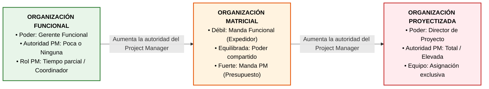
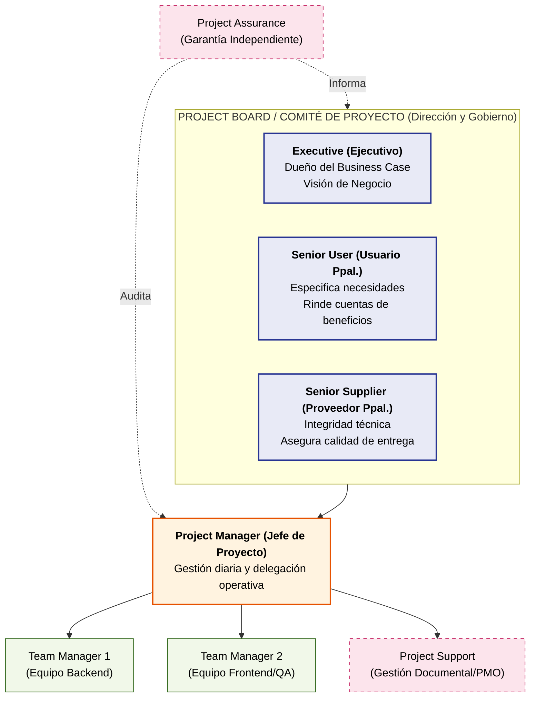
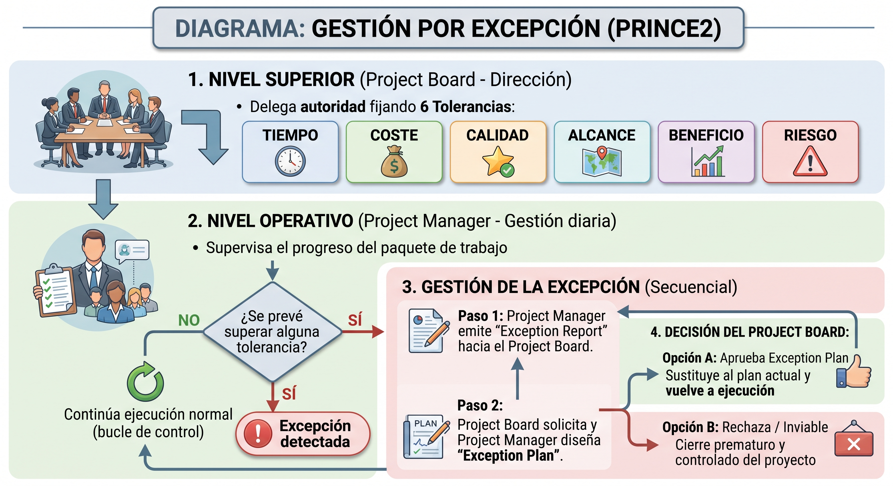
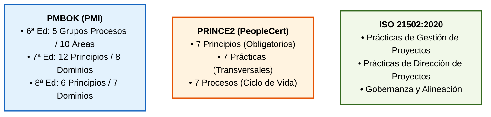
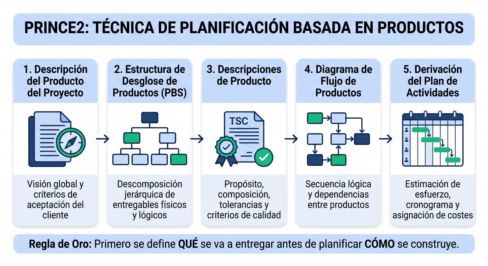

# Tema 4. Ejecución de proyectos

## 1. Formas de Organización de los Proyectos

La **estructura organizativa** de una entidad condiciona de forma directa la disponibilidad de recursos, los canales de comunicación, los mecanismos de resolución de conflictos y el grado de autoridad y autonomía del **Director de Proyecto** (*Project Manager*).

### 1.1. Tipologías Organizativas Clásicas (PMBOK / ISO 21502)

1.  **Organización Funcional (Jerárquica Tradicional):** 
    * La entidad se estructura por **departamentos especializados** (*ej. Desarrollo, Sistemas, Redes, Base de Datos*). 
    * El personal responde únicamente ante su **jefe funcional**. 
    * El **Director de Proyecto** tiene **autoridad escasa o nula**, actúa como mero **coordinador** o enlace a tiempo parcial y el **presupuesto** lo controla el **Gerente Funcional**.
2.  **Organización Orientada a Proyectos (Proyectizada):** 
    * Los integrantes del equipo se asignan contractualmente o funcionalmente al proyecto a tiempo completo, respondiendo en exclusiva ante el **Director de Proyecto**. 
    * El **Director de Proyecto** ostenta **autoridad total o casi total** sobre la asignación de recursos, gestión del equipo y control presupuestario. 
    * Al finalizar el proyecto, el equipo pasa a otro proyecto o requiere recolocación.
3.  **Organización Matricial:** 
    * **Estructura híbrida** donde los **recursos** técnicos pertenecen a un departamento funcional pero se asignan **temporalmente** a uno o varios proyectos. 
    * Presenta tres variantes fundamentales según el balance de poder:
        *   **Matricial Débil:** El **Gerente Funcional** mantiene el **control** de **recursos** y **presupuesto**. El **Director de Proyecto** actúa como **coordinador o facilitador/expedidor (*project expeditor*)**, con **autoridad limitada** y **dedicación parcial**.
        *   **Matricial Equilibrada:** La **autoridad** y la **toma de decisiones** se comparten de forma **paritaria** entre el **Director de Proyecto** y el **Gerente Funcional**. El **Director de Proyecto** suele tener dedicación a **tiempo completo**.
        *   **Matricial Fuerte:** Posee características próximas a la proyectizada. El **Director de Proyecto** dispone de **autoridad elevada**, gestiona directamente el **presupuesto** del proyecto y cuenta con personal administrativo de gestión propio a **tiempo completo**.
4.  **Organización Compuesta o Híbrida:** 
    * **Modelo real** en el que coexisten departamentos funcionales tradicionales con estructuras proyectizadas independientes creadas ad hoc para iniciativas estratégicas de gran envergadura o bajo la tutela de una **PMO** directiva.

### 1.2. Tabla Resumen de Atributos Organizativos

| Tipo de Estructura | Autoridad del Director de Proyecto | Control Presupuestario | Disponibilidad de Recursos | Rol del Director de Proyecto |
| :--- | :--- | :--- | :--- | :--- |
| **Funcional** | Poca o Ninguna | Gerente Funcional | Poca o Ninguna | Tiempo parcial |
| **Matricial Débil** | Limitada | Gerente Funcional | Baja | Tiempo parcial (*Coordinador*) |
| **Matricial Equilibrada** | Baja a Moderada | Mixto / Compartido | Moderada | Tiempo completo |
| **Matricial Fuerte** | Moderada a Alta | Director de Proyecto | Alta | Tiempo completo |
| **Proyectizada** | Alta a Casi Total | Director de Proyecto | Alta a Total | Tiempo completo |

## 2. Roles y Responsabilidades Clave en Proyectos TIC

La gobernanza de proyectos exige una distribución inequívoca de la autoridad, definiendo quién aprueba, quién supervisa, quién gestiona y quién ejecuta los entregables para evitar vacíos de atribución y facilitar el escalado.

### 2.1. Estructura de Gobernanza en PRINCE2 (Project Board)

En **PRINCE2**, el máximo órgano colegiado de gobierno es el **Project Board** (*Comité de Proyecto*), que representa los tres intereses clave del proyecto:

*   **Executive** (*Ejecutivo*): 
    *   **Responsable** individual último del proyecto. 
    *   Es el **propietario del Business Case** y asegura que la iniciativa aporte valor por el dinero invertido (*Value for Money*). 
    *   Posee **voto de calidad** en el **Comité**.
*   **Senior User** (*Usuario Principal*): 
    *   Representa a los **usuarios finales** y **unidades de negocio** operativas. 
    *   **Especifica** los **requisitos funcionales**, define los **criterios de aceptación**.
    *   **Responsable** de la **materialización de los beneficios** tras la puesta en **producción**.
*   **Senior Supplier** (*Proveedor Principal*): 
    *   Representa a quienes **suministran** los **recursos, diseñan y construyen la solución** (*desarrolladores, integradores, arquitectos*). 
    *   Responde formalmente de la **integridad técnica y metodológica** de los entregables.

**Roles** operativos y de soporte en **PRINCE2**:
*   **Project Manager:** Gestiona el proyecto en el día a día dentro de las tolerancias fijadas por el Board.
*   **Team Manager** (*Jefe de Equipo*): Coordina la ejecución técnica directa de los paquetes de trabajo (*Work Packages*).
*   **Project Assurance** (*Garantía del Proyecto*): Supervisión independiente delegada por el **Project Board** para auditar que el proyecto sigue alineado con el negocio, los usuarios y la viabilidad técnica. No puede ser asumida por el **Project Manager**.
*   **Project Support:** Soporte administrativo, gestión de configuración, repositorio documental y herramientas de gestión.

### 2.2. Roles en la Metodología Métrica v3

En las Administraciones Públicas españolas, **Métrica v3** formaliza la gobernanza mediante comités y figuras claramente delimitadas:

*   **Comité de Dirección:** Órgano promotor de alto nivel. Asigna los recursos globales, resuelve conflictos estratégicos y **aprueba formalmente el paso entre procesos mayores** (ej. aprueba el Plan de Sistemas de Información PSI o la Aceptación Final y paso a Explotación).
*   **Comité de Seguimiento:** Órgano colegiado de control técnico y operativo del proyecto. Es el responsable exclusivo de **aprobar o rechazar las Peticiones de Cambio de Requisitos** elevadas por el Jefe de Proyecto tras el análisis de impacto.
*   **Jefe de Proyecto:** Responsable de la planificación operativa (PERT/Gantt), estimación de esfuerzo (Puntos Función/COCOMO), asignación de tareas, seguimiento del cronograma, registro y análisis de incidencias y elaboración del informe final de cierre y archivo histórico de datos.
*   **Directores de los Usuarios:** Representantes acreditados de las áreas funcionales encargados de consensuar los requisitos y validar los resultados en las pruebas de aceptación.

### 2.3. Comparativa de Roles: Predictivo vs. Ágil (Scrum)

| Función de Gestión | Enfoque Predictivo (Métrica v3 / PRINCE2) | Enfoque Ágil (Scrum Guide 2020) |
| :--- | :--- | :--- |
| **Definición de Negocio y Valor** | Executive / Senior User / Comité Dirección | Product Owner (Voz del cliente y orden del Backlog) |
| **Gestión del Proceso y Facilitación** | Project Manager / Jefe de Proyecto | Scrum Master (Líder servicial, elimina impedimentos) |
| **Construcción de Entregables** | Equipo de Desarrollo / Team Manager | Developers (Equipo multidisciplinar autogestionado) |
| **Aprobación de Cambios** | Comité de Seguimiento / CCB (*Change Control Board*) | Product Owner (reordena el Product Backlog dinámicamente) |

## 3. Gestión por Excepción

La **Gestión por Excepción** (*Management by Exception*) es un principio troncal de **PRINCE2** que optimiza el tiempo de la alta dirección estableciendo límites de control delegados.

### 3.1. Las 6 Tolerancias de PRINCE2

Para evitar la microgestión, la autoridad se transfiere definiendo un margen de variación permitido en seis variables de desempeño:

1.  **Tiempo:** Límite máximo de adelanto o retraso aceptable respecto a las fechas de los hitos del plan de fase.
2.  **Coste:** Margen de desviación presupuestaria permitida sobre el plan (ej. $\pm 10\%$ o importe dinerario).
3.  **Calidad:** Margen de holgura en los criterios de aceptación técnicos de los productos (definidos en las *Product Descriptions*).
4.  **Alcance:** Funcionalidades obligatorias frente a prescindibles mediante priorización estructurada (ej. técnicas MoSCoW: *Must, Should, Could, Won't*).
5.  **Beneficio:** Grado de desviación admisible en las métricas de rentabilidad o valor esperadas en el *Business Case*.
6.  **Riesgo:** Umbral máximo de exposición agregada al riesgo que el proyecto puede asumir sin requerir intervención superior.

### 3.2. Procedimiento de Gestión de Excepciones

*   **Detección:** En cuanto el **Project Manager** pronostica que una tolerancia se va a superar, se declara una **excepción**.
*   **Informe de Excepción** (*Exception Report*): Documento formal inmediato remitido al **Project Board** donde se describe la causa raíz de la desviación, el impacto sobre el plan y las opciones viables de respuesta.
*   **Plan de Excepción** (*Exception Plan*): Si el **Project Board** lo requiere, se elabora un plan detallado de reconfiguración que, una vez aprobado formalmente por el **Project Board**, **sustituye** íntegramente al **plan de fase o plan de proyecto previo** que ha perdido validez.

## 4. Gestión de Dominios o Ámbitos y de Procesos

La dirección de proyectos organiza las actividades mediante diferentes marcos conceptuales según el estándar de referencia:

### 4.1. Evolución de los Marcos PMBOK (6ª, 7ª y 8ª Edición)

*   **PMBOK 6ª Edición (Estructura Matricial por Procesos):** Dividía la gestión en **5 Grupos de Procesos** (*Inicio, Planificación, Ejecución, Monitoreo y Control, Cierre*) cruzados con **10 Áreas de Conocimiento** (*Integración, Alcance, Cronograma, Costes, Calidad, Recursos, Comunicaciones, Riesgos, Adquisiciones e Interesados*), sumando 49 procesos formales.
*   **PMBOK 7ª Edición (Enfoque por Principios y Dominios):** Sustituyó las áreas de conocimiento por **8 Dominios de Desempeño** (*Interesados, Equipo, Enfoque de Desarrollo y Ciclo de Vida, Planificación, Trabajo del Proyecto, Entrega, Medición, Incertidumbre*) gobernados por 12 principios rectores.
*   **PMBOK 8ª Edición (Noviembre 2025):** Simplifica y consolida la estructura en **7 Dominios de Desempeño** (*Gobernanza, Alcance, Cronograma, Finanzas, Interesados, Recursos y Riesgo*) basados en 6 principios rectores, reincorporando la guía de procesos de manera flexible y no prescriptiva.

### 4.2. Prácticas y Procesos en PRINCE2 7

*   **Las 7 Prácticas (Antiguos Temas en v6):** *Business Case, Organización, Calidad, Planes, Riesgo, Cuestiones (Issues)* y *Progreso*.
*   **Los 7 Procesos:**
    1.  *Puesta en Marcha (SU - Starting Up a Project):* Preproyecto y filtro de viabilidad.
    2.  *Dirección de un Proyecto (DP - Directing a Project):* Gestión global del Project Board.
    3.  *Inicio de un Proyecto (IP - Initiating a Project):* Planificación detallada y PID.
    4.  *Control de una Fase (CS - Controlling a Stage):* Gestión diaria del Project Manager.
    5.  *Gestión de la Entrega de Productos (MP - Managing Product Delivery):* Producción técnica.
    6.  *Gestión de los Límites de Fase (SB - Managing a Stage Boundary):* Evaluación y cierre de fase.
    7.  *Cierre de un Proyecto (CP - Closing a Project):* Desmantelamiento y entrega final.

## 5. Enfoque en Productos y Planificación Basada en Productos

El principio de **Enfoque en los Productos** (*Focus on Products*) de **PRINCE2** establece que la planificación debe comenzar definiendo con precisión qué debe entregarse antes de secuenciar las actividades necesarias para construirlo.

*   **Enfoque en Producto vs. Enfoque en Actividades:** Centrarse exclusivamente en actividades (*programar módulo, diseñar pantalla*) incrementa el riesgo de desviar el alcance. El enfoque en producto define el resultado verificable y sus **Criterios de Calidad** precisos antes de autorizar el trabajo.
*   **Descripciones de Producto** (*Product Descriptions*): Artefacto formal que documenta el propósito del producto, su composición, formato, responsabilidades, criterios de calidad medibles y el procedimiento formal de aceptación.

## 6. Adaptación al Entorno del Proyecto (*Tailoring*)

La **Adaptación** (*Tailoring*) es un principio obligatorio y universal en **PRINCE2**, **PMBOK 7/8** e **ISO 21502**. **Garantiza** que el **marco de gestión** **se ajuste** a la **escala**, **complejidad**, **criticidad**, **nivel de riesgo** y **contexto organizativo** sin derivar en una burocracia ineficaz.

### 6.1. Reglas Ineludibles de la Adaptación

*   **Los Principios NO se adaptan:** Los 7 principios de **PRINCE2** o los principios del **PMBOK** son obligatorios; **omitir** un principio **invalida** la metodología.
*   **Lo que SÍ se adapta:** Se ajusta la formalidad de los procesos, el nivel de detalle de la documentación, la periodicidad de los informes, las herramientas de control y la fusión de roles compatibles (ej. unificar *Project Manager* y *Team Manager* en proyectos pequeños).
*   **El Cumplimiento Legal NO se elimina:** El *tailoring* metodológico nunca puede utilizarse para relajar obligaciones de obligado cumplimiento (Esquema Nacional de Seguridad **ENS**, **RGPD** o requisitos de la **Ley 9/2017 LCSP**).

### 6.2. Factores Condicionantes del *Tailoring*

*   **Escala y Duración:** Proyectos de pocas semanas frente a programas plurianuales.
*   **Complejidad Técnica e Incertidumbre:** Selección de enfoques predictivos, adaptativos (*Scrum*) o híbridos.
*   **Cultura y Madurez Organizativa:** Nivel de implantación de estándares (*CMMI, ISO 9001*).
*   **Modelo de Relación Contractual:** Desarrollo interno frente a contratos de licitación pública con terceros.

## 7. Ejemplo Real Integrado (Ámbito TIC Público)

**Escenario:** Desarrollo de un nuevo Módulo de Pago Telemático de Tasas e Impuestos para el portal web de una Administración Local.

*   **Estructura Organizativa:** Organización **Matricial Fuerte**. Los ingenieros de desarrollo pertenecen al Servicio de Informática, pero se asignan al proyecto con dedicación exclusiva bajo la autoridad técnica y presupuestaria del Director de Proyecto.
*   **Gobernanza:**
    *   *Comité de Dirección (Métrica v3):* El Concejal de Hacienda y el Director de TIC aprueban el inicio y el paso final a explotación.
    *   *Comité de Seguimiento (Métrica v3):* Valida las peticiones de cambio si la pasarela bancaria exige modificaciones de alcance.
    *   *Project Board (PRINCE2):* Formado por el Interventor Municipal (*Executive*), el Jefe de Recaudación (*Senior User*) y el Responsable de Arquitectura TIC (*Senior Supplier*).
*   **Planificación Basada en Productos:** Antes de programar, se aprueba la *Product Description* del componente "Pasarela de Cobro Redsys", estableciendo como criterio de calidad innegociable el cumplimiento del estándar PCI-DSS y el cifrado TLS 1.3.
*   **Gestión por Excepción:** Se fijó una tolerancia de coste de $\pm 10.000\text{ \euro}$. Al detectarse que las licencias del módulo criptográfico HSM requieren $18.000\text{ \euro}$ imprevistos, se superan las tolerancias. El Project Manager emite un **Exception Report** y formula un **Exception Plan** para que el Project Board decida su aprobación formal.
*   **Adaptación** (*Tailoring*): Dada la urgencia del proyecto, se fusionan los informes quincenales en revisiones semanales de progreso y se simplifica la gestión documental sin relajar las auditorías de seguridad del ENS.

## 8. Resumen

| Concepto | Términos Clave |
| :--- | :--- |
| **Org. Funcional** | "Especialidades departamentales", "Autoridad escasa o nula del PM", "Presupuesto del Gerente Funcional". |
| **Matricial Débil** | "PM como coordinador o expedidor", "Poder en el Gerente Funcional". |
| **Matricial Fuerte** | "PM gestiona presupuesto", "Autoridad alta del PM", "Dedicación a tiempo completo". |
| **Org. Proyectizada** | "Autoridad total del PM", "Equipo asignado en exclusiva", "Sin departamento funcional fijo". |
| **Executive (PRINCE2)** | "Responsable final individual", "Dueño del Business Case", "Value for money". |
| **Senior User (PRINCE2)** | "Especifica requisitos", "Garantiza satisfacción de usuarios", "Rinde cuentas de beneficios". |
| **Senior Supplier (PRINCE2)** | "Integridad técnica", "Calidad de entregables", "Aporta recursos técnicos". |
| **Comité de Seguimiento (M3)** | "Aprueba o rechaza formalmente Peticiones de Cambio de Requisitos". |
| **Gestión por Excepción** | "Tolerancias (Tiempo, Coste, Calidad, Alcance, Beneficio, Riesgo)", "Exception Report", "Exception Plan". |
| **PMBOK 8ª Edición** | "7 Dominios de Desempeño", "6 Principios", "Gobernanza y Sostenibilidad". |
| **Enfoque en Productos** | "Product-based planning", "PBS", "Product Descriptions y Criterios de Calidad". |
| **Tailoring (Adaptación)** | "Ajustar al contexto", "**NUNCA** elimina principios ni normativas legales". |

## 9. Referencias Normativas y Técnicas

* **Project Management Institute (PMI)**, *A Guide to the Project Management Body of Knowledge (PMBOK® Guide)* — 6ª, 7ª y 8ª Edición (Noviembre 2025).
* **PeopleCert**, *PRINCE2® Project Management (Version 7)*.
* **ISO 21502:2020**, *Project, programme and portfolio management — Guidance on project management*.
* **Ministerio de Administraciones Públicas**, *MÉTRICA Versión 3: Estructura de Organización y Gestión de Proyectos (GP)*.

## 10. Simulacro de Test

**Pregunta 1:**
*En una organización donde el Director de Proyecto actúa con dedicación a tiempo parcial, ejerciendo fundamentalmente un rol de coordinador de tareas o facilitador de comunicaciones y sin control sobre el presupuesto del proyecto, ¿qué estructura organizativa está implementada?*
a) Organización Matricial Fuerte.
b) Organización Orientada a Proyectos (Proyectizada).
c) Organización Matricial Débil.
d) Organización Matricial Equilibrada.

**Razonamiento Estructurado:**
1.  **Palabras clave:** "Dedicación parcial", "rol de coordinador o facilitador", "sin control del presupuesto".
2.  **Descarte:** En la Proyectizada (b) y Matricial Fuerte (a) el Director de Proyecto controla el presupuesto y tiene dedicación completa. En la Equilibrada (d) el poder es compartido. La figura del coordinador/expedidor con control del gerente funcional define a la **Matricial Débil**.
3.  **Respuesta correcta: C.**

**Pregunta 2:**
*Según la metodología PRINCE2, ¿cuál de las siguientes opciones define con exactitud la responsabilidad del rol de Senior User dentro del Project Board?*
a) Garantizar la rentabilidad financiera y la justificación continua del Business Case.
b) Asegurar la integridad técnica y la calidad metodológica de los componentes desarrollados.
c) Especificar los requisitos funcionales, validar los criterios de aceptación y rendir cuentas de la obtención efectiva de los beneficios esperados.
d) Asignar y dirigir operativamente los paquetes de trabajo del equipo de programación.

**Razonamiento Estructurado:**
1.  **Análisis:** (a) corresponde al *Executive*; (b) corresponde al *Senior Supplier*; (d) corresponde al *Team Manager*.
2.  (c) define de manera literal las obligaciones del **Senior User** en el marco de gobierno de PRINCE2.
3.  **Respuesta correcta: C.**

**Pregunta 3:**
*Durante la ejecución de un proyecto bajo PRINCE2, el Project Manager calcula que una desviación en las pruebas de integración retrasará la entrega del hito principal en 4 semanas, rebasando el límite de tolerancia de tiempo de 2 semanas fijado por el Project Board. ¿Cuál es la actuación metodológica obligatoria que debe seguir el Project Manager?*
a) Rediseñar el cronograma y aprobar unilateralmente la extensión del plazo al tratarse de un problema técnico.
b) Emitir de inmediato un Exception Report al Project Board informando del pronóstico y esperar directrices para la elaboración de un Exception Plan.
c) Cancelar inmediatamente el proyecto al haberse vulnerado una de las seis tolerancias directivas.
d) Transferir el impacto al registro de riesgos sin elevar la incidencia hasta la reunión de cierre de fase.

**Razonamiento Estructurado:**
1.  **Principio aplicable:** Principio de **Gestión por Excepción**.
2.  **Procedimiento:** Al prever la superación de una tolerancia, el Director de Proyecto no tiene autoridad para autoaprobar el retraso ni cancelar el proyecto; debe emitir formalmente un **Exception Report** al Project Board.
3.  **Respuesta correcta: B.**

**Pregunta 4:**
*En el marco de la metodología Métrica v3, si un nuevo requerimiento legal exige una modificación sustancial del alcance durante las actividades de Seguimiento y Control (GPS), ¿a qué órgano corresponde la aprobación formal de dicha Petición de Cambio de Requisitos?*
a) Al Comité de Dirección.
b) Al Jefe de Proyecto.
c) Al Comité de Seguimiento.
d) Al Equipo de Aseguramiento de la Calidad (CAL).

**Razonamiento Estructurado:**
1.  **Gobernanza Métrica v3:** El Jefe de Proyecto evalúa el impacto en tiempo/coste pero no decide. El Comité de Dirección aprueba procesos mayores de fase.
2.  La aprobación formal de cambios en los requisitos del sistema es potestad reglada del **Comité de Seguimiento**.
3.  **Respuesta correcta: C.**

**Pregunta 5:**
*Al aplicar el principio de Adaptación (Tailoring) en un proyecto público gestionado bajo PRINCE2 o PMBOK, ¿cuál de las siguientes actuaciones se considera contraria a las buenas prácticas metodológicas?*
a) Fusionar la documentación de inicio y planificación en un único artefacto formal para un proyecto pequeño.
b) Eliminar el principio de justificación comercial continua al considerar que el proyecto es de obligado cumplimiento normativo.
c) Ajustar la frecuencia de los informes de seguimiento pasando de entregas semanales a quincenales.
d) Delegar la función de Team Manager en el propio Project Manager en un equipo de desarrollo reducido.

**Razonamiento Estructurado:**
1.  **Regla de oro:** El *tailoring* permite simplificar documentos, procesos, herramientas e integrar roles, pero **nunca permite eliminar principios universales**.
2.  Omitir la Justificación Comercial Continua (b) viola las bases del método, siendo la respuesta contraria a la norma.
3.  **Respuesta correcta: B.**
