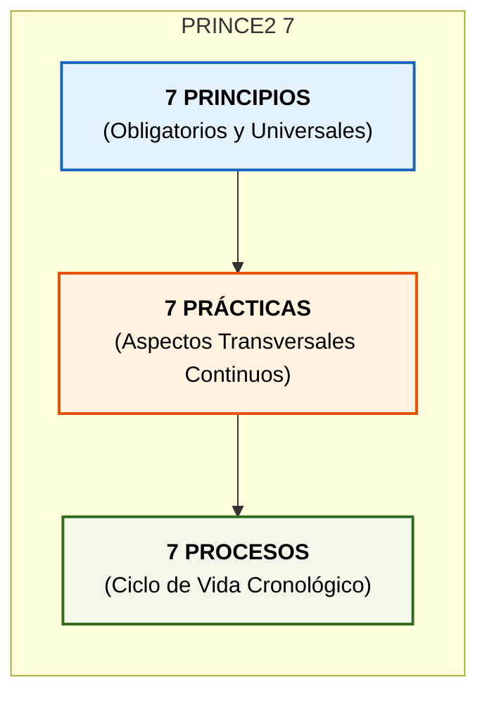
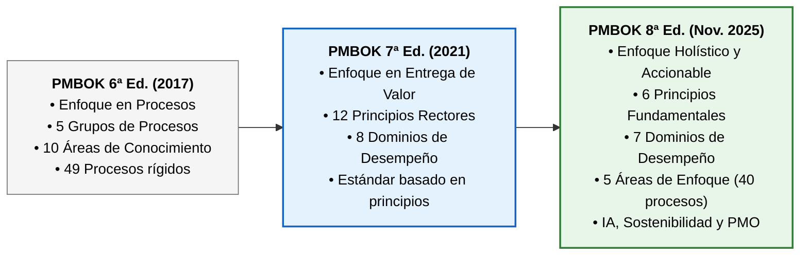
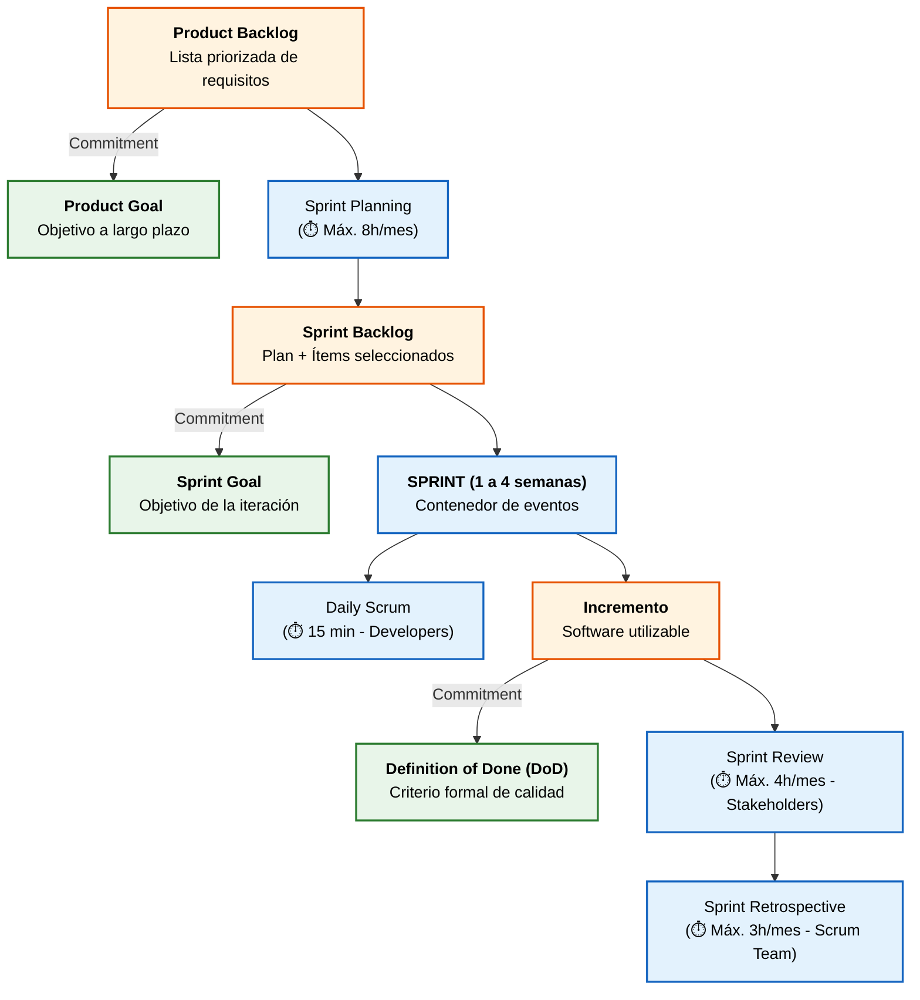
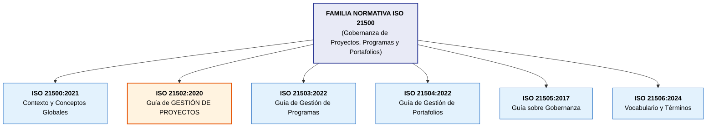

# Tema 5. Estándares y Marcos de Referencia para la Gestión de Proyecto

## 1. PRINCE2 (PRojects IN Controlled Environments)

**PRINCE2** (mantenido por *PeopleCert*) es una **metodología estructurada y orientada a procesos** para la gestión eficaz de proyectos. A diferencia de una guía de buenas prácticas, establece un método prescriptivo de **gobernanza y control** diseñado para **minimizar la incertidumbre**.

### 1.1. Pilares Conceptuales de PRINCE2
*   **Justificación Comercial Continua** (*Business Case*): 
    *   Es el motor del proyecto. 
    *   La iniciativa solo debe iniciarse y continuar si se demuestra en todo momento que los beneficios superan a los costes y riesgos. 
    *   Si deja de ser viable en algún límite de fase, debe cerrarse de forma controlada.
*   **Gestión por Excepción** (*Management by Exception*): 
    *   Se delega autoridad mediante **6 tolerancias** (Tiempo, Coste, Calidad, Alcance, Beneficio y Riesgo). 
    *   Si se prevé superar un límite, se escala al *Project Board* mediante un *Exception Report* y un *Exception Plan*.
*   **Enfoque en los Productos** (*Focus on Products*): 
    *   La planificación parte de la definición formal de los entregables y sus criterios de calidad (*Product Descriptions* / PBS) antes de secuenciar las actividades.
*   **Aprender de la Experiencia:** 
    *   Se recopilan y aplican lecciones aprendidas de proyectos previos y a lo largo de la ejecución.
*   **Roles y Responsabilidades Definidos:** 
    *   Estructura organizativa con representación explícita del negocio, usuarios y proveedores.
*   **Gestión por Fases:** 
    *   División del proyecto en etapas manejables de planificación, supervisión y control.
*   **Adaptación al Entorno** (*Tailoring*): 
    *   Ajuste del método a la escala, complejidad, criticidad y riesgo, sin omitir ningún principio universal.

### 1.2. Gobernanza: El Project Board
El máximo órgano de gobierno gerencial está integrado por tres roles obligatorios:
*   **Executive (Ejecutivo):** Responsable individual último; propietario del *Business Case* y garante de la relación calidad-precio (*Value for Money*).
*   **Senior User (Usuario Principal):** Representa a quienes usarán la solución; especifica necesidades y rinde cuentas de la consecución de beneficios.
*   **Senior Supplier (Proveedor Principal):** Representa a los desarrolladores y técnicos; responde de la integridad técnica y calidad de los entregables.

### 1.3. PRINCE2 7: Las 7 Prácticas y los 7 Procesos
En **PRINCE2 7**, los antiguos "Temas" de la edición 6 pasan a denominarse formalmente **Prácticas**:

| 7 Prácticas (*Practices*) | 7 Procesos (*Processes*) |
| :--- | :--- |
| 1. **Business Case** (Caso de Negocio) 2. **Organizing** (Organización) 3. **Plans** (Planes) 4. **Quality** (Calidad) 5. **Risk** (Riesgo) 6. **Issues** (Cuestiones, sustituye a Cambio) 7. **Progress** (Progreso) | 1. **SU** - *Starting Up a Project* (Puesta en Marcha) 2. **DP** - *Directing a Project* (Dirección de un Proyecto) 3. **IP** - *Initiating a Project* (Inicio de un Proyecto) 4. **CS** - *Controlling a Stage* (Control de una Fase) 5. **MP** - *Managing Product Delivery* (Entrega de Productos) 6. **SB** - *Managing a Stage Boundary* (Límites de Fase) 7. **CP** - *Closing a Project* (Cierre del Proyecto) |

> **Novedades de PRINCE2 7**: Incorpora la gestión de personas como elemento transversal, sostenibilidad (*Green IT*), gobernanza de datos y modelos de entrega híbridos y adaptativos.

## 2. PMBOK (Project Management Body of Knowledge)

El **PMBOK** (publicado por el *PMI*) es un estándar *ANSI* y una **guía de fundamentos y buenas prácticas**, de carácter no prescriptivo.

### 2.1. PMBOK 7ª Edición (2021)
Estableció la transición desde la estructura basada en procesos hacia un modelo orientado a la entrega de valor:
*   **12 Principios Rectores:** *Stewardship* (administración diligente), equipo colaborativo, interesados, enfoque en valor, pensamiento sistémico, liderazgo, *tailoring*, calidad, complejidad, riesgos, adaptabilidad/resiliencia y gestión del cambio.
*   **8 Dominios de Desempeño:** *Interesados, Equipo, Enfoque de Desarrollo y Ciclo de Vida, Planificación, Trabajo del Proyecto, Entrega, Medición* e *Incertidumbre*.

### 2.2. PMBOK 8ª Edición (Noviembre 2025)
Consolida y hace más práctica la guía, manteniendo los principios y dominios pero reintroduciendo orientación por procesos de forma no prescriptiva:

*   **6 Principios Fundamentales:**
    1. Adoptar una visión holística.
    2. Centrarse en el valor.
    3. Integrar la calidad.
    4. Liderar con responsabilidad (*Accountability*).
    5. Integrar la sostenibilidad.
    6. Construir equipos empoderados.
*   **7 Dominios de Desempeño:** *Gobernanza, Alcance, Cronograma, Finanzas, Interesados, Recursos* y *Riesgo*.
*   **5 Áreas de Enfoque** (*Focus Areas*): Recupera la orientación estructurada de 40 procesos distribuidos en *Inicio, Planificación, Ejecución, Monitoreo y Control*, y *Cierre*.
*   **Novedades Tecnológicas y de Gestión:** Incorporación formal del impacto de la **Inteligencia Artificial**, oficinas de dirección de proyectos (**PMO**), adquisiciones avanzadas y sostenibilidad ambiental/social.

### 2.3. Comparativa Estructural PMBOK 7ª vs. PMBOK 8ª

| Aspecto | PMBOK 7ª Edición (2021) | PMBOK 8ª Edición (Noviembre 2025) |
| :--- | :--- | :--- |
| **Principios** | **12 Principios** | **6 Principios Fundamentales** |
| **Dominios de Desempeño** | **8 Dominios** | **7 Dominios** |
| **Orientación de Procesos** | Eliminó los procesos rígidos en el estándar principal | **5 Áreas de Enfoque** con 40 procesos no prescriptivos |
| **Enfoque de Valor** | Entrega de valor en cualquier ciclo de vida | Entrega de valor integrada con gobernanza financiera y sostenibilidad |
| **Nuevas Dimensiones** | Modelos predictivos, ágiles e híbridos | **Inteligencia Artificial**, PMO, ESG y gobernanza de adquisiciones |

---

## 3. Metodologías Ágiles: Scrum y Kanban

Orientadas a proyectos en entornos complejos con alta volatilidad de requisitos, donde la entrega temprana de valor y la inspección continua priman sobre la planificación exhaustiva.

### 3.1. Scrum (Scrum Guide 2020)
Marco de trabajo (*framework*) iterativo e incremental basado en el **empirismo** (conocimiento derivado de la experiencia) y el control de procesos **Lean**.

*   **Los 3 Pilares Empíricos:** *Transparencia, Inspección y Adaptación*.
*   **Los 5 Valores:** *Compromiso, Foco, Apertura, Respeto y Coraje*.
*   **Estructura del Scrum Team (10 o menos personas, autogestionado):**
    *   **Product Owner:** Maximiza el valor del producto; gestiona y prioriza en exclusiva el *Product Backlog*.
    *   **Scrum Master:** Responsable de la efectividad del equipo y de liderar la adopción de Scrum; actúa como líder servicial eliminando impedimentos.
    *   **Developers:** Profesionales comprometidos a construir cualquier aspecto de un Incremento utilizable en cada Sprint.
*   **Los 3 Artefactos y sus 3 Compromisos** (*Commitments*):
    1.  **Product Backlog** $\rightarrow$ Su compromiso es el **Product Goal** (meta del producto a largo plazo).
    2.  **Sprint Backlog** $\rightarrow$ Su compromiso es el **Sprint Goal** (meta concreta de la iteración).
    3.  **Increment (Incremento)** $\rightarrow$ Su compromiso es la **Definition of Done (DoD)** (definición formal de terminado y estándar de calidad).

### 3.2. Kanban
Método de gestión visual del flujo de trabajo continuo ("just-in-time") derivado de Lean Manufacturing. No prescribe Sprints con duración fija ni roles predeterminados.

*   **Prácticas Fundamentales:**
    1.  *Visualizar el flujo:* Tablero segmentado por estados (Backlog, Análisis, Desarrollo, Test, Done).
    2.  *Limitar el Trabajo en Curso (WIP - Work In Progress):* **Regla cardinal**. Fija el límite máximo de tarjetas por columna para evitar la sobrecarga y aflorar cuellos de botella.
    3.  *Gestionar y medir el flujo:* Optimización continua mediante políticas explícitas.
*   **Métricas Clave de Flujo:**
    *   **Lead Time:** Tiempo transcurrido desde que la tarea es solicitada por el usuario hasta su entrega final.
    *   **Cycle Time:** Tiempo transcurrido desde que el equipo inicia el desarrollo activo de la tarea hasta su compleción.
    *   **Ley de Little:** $\text{WIP} = \text{Throughput} \times \text{Lead Time}$.
*   **Scrumban:** Enfoque híbrido que aplica tableros y límites WIP de Kanban dentro de los Sprints y eventos de Scrum.

## 4. ISO 21502:2020 y la Familia Normativa ISO 21500

La norma **ISO 21502:2020** (*Project, programme and portfolio management — Guidance on project management*) proporciona directrices para la gestión de proyectos en cualquier organización. Sustituye a la anterior **ISO 21500:2012**.

### 4.1. Características Esenciales de ISO 21502:2020
*   **Carácter No Certificable:** Al igual que el modelo **EFQM**, es una guía de directrices de alto nivel y buenas prácticas; las organizaciones no se certifican bajo **ISO 21502** (a diferencia de **ISO 9001** o **ISO 27001**).
*   **Agnóstica del Ciclo de Vida:** Admite modelos predictivos, incrementales, iterativos, adaptativos (ágiles) e híbridos.
*   **Enfoque de Proceso Integrado:** Estructura la gestión en prácticas previas, dirección, inicio, control, entrega, cierre y actividades posteriores, vinculadas a puntos de decisión (*gates* o compuertas de fase).
*   **Delimitación Temática:** Aunque el título del comité paraguas incluye programas y portafolios, **ISO 21502 se ocupa exclusivamente de proyectos**.

## 5. Relación con la Transición a Operaciones (ITIL v4)

La finalización de un proyecto TIC implica transferir los entregables a los equipos de explotación y soporte continuo. La práctica de **Habilitación del Cambio** (*Change Enablement*) de **ITIL v4** gobierna esta transición técnica para minimizar el impacto en la disponibilidad del servicio:

*   **Cambio Estándar:** Modificación recurrente, documentada, de bajo riesgo y preautorizada (*ej. reemplazo rutinario de hardware, parches estándar en preproducción*).
*   **Cambio Normal:** Modificación no recurrente que requiere solicitud formal (**RFC** - *Request for Change*), análisis de riesgos e impacto, ventana de mantenimiento, **Plan de Back-out obligatorio** (plan de reversión en caso de fallo) y aprobación por el **CAB / CAC** (*Change Advisory Board*).
*   **Cambio de Emergencia:** Resolución rápida ante incidentes críticos que amenazan la continuidad o seguridad; evaluado con urgencia por el **ECAB / CAC de Emergencia**.

## 6. Resumen

| Estándar / Marco | Enfoque Principal | Conceptos Clave / Palabras Chivata en Test |
| :--- | :--- | :--- |
| **PRINCE2 7** | Metodología estructurada de procesos | "Justificación comercial continua", "6 Tolerancias", "7 Prácticas, 7 Principios, 7 Procesos", "Project Board". |
| **PMBOK 7ª Ed.** | Guía de estándares de valor | "12 Principios", "8 Dominios de Desempeño", "The Standard for Project Management". |
| **PMBOK 8ª Ed. (2025)** | Guía estructurada holística | "6 Principios", "7 Dominios", "5 Áreas de Enfoque (40 procesos)", "IA y Sostenibilidad". |
| **Scrum** | Framework ágil empírico | "Transparencia-Inspección-Adaptación", "PO, SM, Developers", "Sprint (1-4 sem)", "3 Compromisos (Product Goal, Sprint Goal, DoD)". |
| **Kanban** | Método de flujo continuo | "Limitar el WIP (Trabajo en curso)", "Visualizar el flujo", "Lead Time vs. Cycle Time", "Ley de Little". |
| **ISO 21502:2020** | Guía de directrices de proyecto | "No certificable", "Agnóstica del ciclo de vida", "Solo proyectos dentro de la serie ISO 21500", "Puntos de decisión (Gates)". |
| **ITIL v4** | Gestión de servicios y cambios | "Change Enablement", "Cambio Normal (RFC, Back-out, CAB/CAC)", "Cambio Estándar preautorizado". |

## 7. Referencias Normativas y Técnicas

* **Project Management Institute (PMI)**, *A Guide to the Project Management Body of Knowledge (PMBOK® Guide)* — 7ª Edición (2021) y 8ª Edición (Noviembre 2025).
* **PeopleCert**, *PRINCE2® 7 Management Framework* (2023/2024).
* **Ken Schwaber y Jeff Sutherland**, *The Scrum Guide: The Definitive Guide to Scrum* (Noviembre 2020).
* **David J. Anderson**, *Kanban: Successful Evolutionary Change for Your Technology Business*.
* **ISO 21500:2021**, *Project, programme and portfolio management — Context and concepts*.
* **ISO 21502:2020**, *Project, programme and portfolio management — Guidance on project management*.
* **AXELOS**, *ITIL® 4: Create, Deliver and Support / Service Management Framework*.

## 8. Simulacro de Test

**Pregunta 1:**
*Un equipo de desarrollo ágil utiliza un tablero visual Kanban y establece una regla estricta que prohíbe tener más de 3 tareas simultáneas en la columna de "Pruebas de Integración". ¿Qué práctica fundamental de Kanban se está aplicando?*
a) Definición del Sprint Backlog.
b) Limitación del Trabajo en Curso (WIP - Work in Progress).
c) Control de la Velocidad mediante Burndown Chart.
d) Estimación por Planning Poker.

**Razonamiento Estructurado:**
1.  **Palabra chivata:** "Prohíbe tener más de X tareas simultáneas en una columna".
2.  **Descarte:** Scrum limita por tiempo en Sprints (a); Kanban se basa en el flujo continuo y limita explícitamente el WIP por fase para evitar cuellos de botella.
3.  **Respuesta correcta: B.**

**Pregunta 2:**
*¿Cuál de las siguientes afirmaciones describe con precisión la evolución estructural de la Guía PMBOK publicada por el PMI en su 8ª Edición (noviembre de 2025) frente a la 7ª Edición (2021)?*
a) La 8ª Edición restaura íntegramente las 10 Áreas de Conocimiento y 49 procesos rígidos de la 6ª Edición.
b) La 8ª Edición simplifica la estructura a 6 Principios Fundamentales, 7 Dominios de Desempeño y 5 Áreas de Enfoque con 40 procesos no prescriptivos, incorporando IA y sostenibilidad.
c) La 8ª Edición suprime todos los dominios de desempeño adoptando el modelo estricto de PRINCE2.
d) Ambas ediciones comparten idéntica cantidad de 12 principios y 8 dominios sin cambios.

**Razonamiento Estructurado:**
1.  **Análisis:** La 8ª Edición no vuelve a la 6ª Edición (a), sino que evoluciona el modelo a 6 principios, 7 dominios y 5 áreas de enfoque (*Focus Areas*) con orientación de procesos no prescriptiva y foco en IA/ESG.
2.  **Respuesta correcta: B.**

**Pregunta 3:**
*En el marco de la norma internacional ISO 21502:2020 sobre gestión de proyectos, ¿cuál de las siguientes afirmaciones es correcta respecto a su naturaleza y alcance?*
a) Es una norma certificable por entidades acreditadas externas mediante auditoría de conformidad formal.
b) Establece directrices de gestión de proyectos de alto nivel, no es certificable y resulta agnóstica respecto al ciclo de vida o enfoque de desarrollo adoptado.
c) Regula de forma exclusiva y exhaustiva la gestión de programas y portafolios estratégicos.
d) Impone obligatoriamente un ciclo de vida en cascada con 5 fases secuenciales estrictas.

**Razonamiento Estructurado:**
1.  **Análisis:** ISO 21502 es una guía de directrices no certificable (a falsa); se centra en proyectos y no en programas/portafolios (c falsa); admite cualquier enfoque de ciclo de vida predictivo o adaptativo (d falsa).
2.  (b) recoge con total rigor sus características fundamentales.
3.  **Respuesta correcta: B.**

**Pregunta 4:**
*Según la Guía Scrum oficial (edición 2020), ¿cuál es el compromiso formal asociado al artefacto del Product Backlog?*
a) El Sprint Goal.
b) La Definition of Done (DoD).
c) El Product Goal (Objetivo del Producto).
d) La Matriz de Trazabilidad de Requisitos.

**Razonamiento Estructurado:**
1.  **Correspondencias oficiales:**
    *   Product Backlog $\rightarrow$ **Product Goal**.
    *   Sprint Backlog $\rightarrow$ **Sprint Goal**.
    *   Incremento $\rightarrow$ **Definition of Done**.
2.  **Respuesta correcta: C.**

**Pregunta 5:**
*Para desplegar en el entorno de producción de una Consejería una actualización mayor del sistema de nóminas que requiere parada de servicio programada, ¿cómo debe tramitarse el cambio bajo el marco ITIL v4?*
a) Como un Cambio Estándar preautorizado.
b) Como un Cambio Normal, requiriendo solicitud RFC, evaluación de riesgos, Plan de Back-out y aprobación del CAB/CAC.
c) Como una Excepción no planificada de PRINCE2.
d) Mediante un Cambio de Emergencia sin documentación técnica previa.

**Razonamiento Estructurado:**
1.  **Análisis:** Los cambios mayores no rutinarios con impacto en el servicio son **Cambios Normales**.
2.  Requieren registro formal (RFC), análisis de impacto, ventana de parada, Plan de Back-out de reversión y autorización del CAB/CAC.
3.  **Respuesta correcta: B.**
