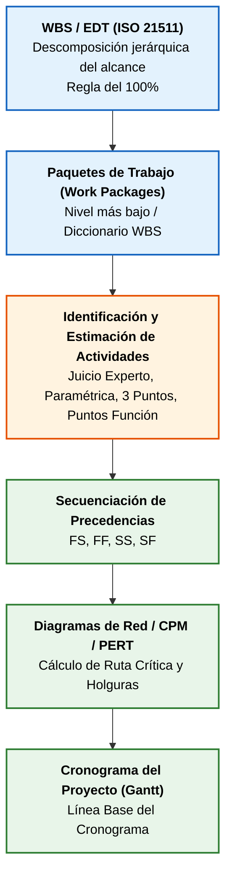
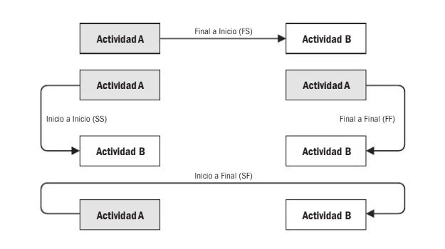
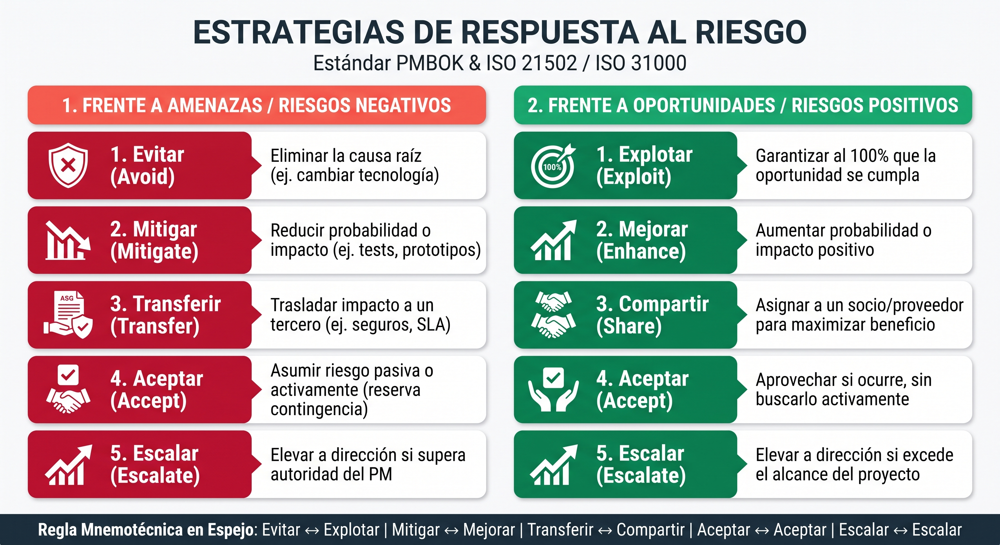
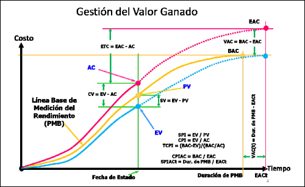
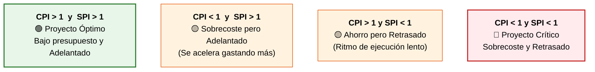

# Tema 6. Herramientas y Técnicas de Gestión

Este tema constituye el núcleo operativo de la ingeniería de gestión de proyectos y servicios TIC, integrando los procesos de planificación de **Métrica v3** (*interfaz GP*), los estándares del **PMI** (*PMBOK*), las directrices internacionales **ISO** (*ISO 21511, ISO 21508*) y las mejores prácticas de gestión del servicio de **ITIL v4**.

## 1. Planificación: WBS/EDT, Cronogramas y Estimación

La planificación técnica transforma los requisitos y el alcance en entregables cuantificables, cronogramas viables y líneas base de control.

### 1.1. Estructura de Desglose del Trabajo (WBS / EDT - ISO 21511)

La **WBS (Work Breakdown Structure)** o **EDT (Estructura de Descomposición del Trabajo)** es la descomposición jerárquica, orientada a entregables, del alcance total del trabajo que el equipo debe ejecutar:

*   **Regla del 100%:** Principio fundamental que establece que la **WBS debe incluir el 100% del alcance del proyecto** (tanto los entregables del producto como el trabajo de gestión del proyecto) y nada que esté fuera de él. La suma del trabajo de los niveles inferiores debe ser exactamente igual al nivel superior.
*   **Paquete de Trabajo** (*Work Package*): Es el **nivel más bajo de la descomposición** jerárquica de la WBS. En este nivel, el coste, el cronograma y los recursos pueden ser estimados, asignados y controlados con máxima fiabilidad.
*   **Cuenta de Control** (*Control Account*): Punto de control de gestión donde **se integran el alcance, el presupuesto y el cronograma** para la **medición** del desempeño mediante **Valor Ganado** (EVM). Una cuenta de control engloba uno o varios paquetes de trabajo.
*   **Diccionario de la WBS** (*WBS Dictionary*): Documento formal que **detalla cada componente de la WBS**, incluyendo el código identificador, descripción del trabajo, entregables asociados, responsable, recursos asignados, supuestos, restricciones y criterios de aceptación.

### 1.2. Técnicas de Estimación de Esfuerzo, Duración y Coste

*   **Estimación Análoga** (*Top-Down*): Utiliza la duración o coste real de proyectos anteriores similares. Rápida y de bajo coste, pero con menor precisión.
*   **Estimación Paramétrica:** Emplea algoritmos matemáticos basados en relaciones estadísticas entre datos históricos y parámetros del proyecto (*ej. coste por punto de función o coste por línea de código*).
*   **Estimación Ascendente** (*Bottom-Up*): Estima el esfuerzo o coste de cada paquete de trabajo o actividad individual de la WBS y luego agrega los resultados hacia los niveles superiores. Máxima precisión, pero mayor consumo de tiempo.
*   **Puntos de Función** (*FPA - Albrecht / Mark II*): Métrica estándar independiente del lenguaje de programación que cuantifica el tamaño funcional del software a partir de cinco componentes: Entradas Externas (EI), Salidas Externas (EO), Consultas Externas (EQ), Archivos Lógicos Internos (ILF) y Archivos de Interfaz Externos (EIF).
*   **COCOMO** (*Constructive Cost Model - Barry Boehm*): Modelo paramétrico empírico basado en el volumen de líneas de código fuente (KLOC) y factores de coste multiplicadores. Posee tres variantes: Básico, Intermedio y Detallado.
*   **Staffing Size** (*Orientación a Objetos*): Estima el esfuerzo a partir del número de clases clave y secundarias del modelo de dominio.
*   **Técnica Delphi y Delphi de Banda Ancha** (*Wideband Delphi*): Método cualitativo de consenso estructurado basado en rondas sucesivas y anónimas entre expertos para mitigar sesgos individuales.

### 1.3. Secuenciación y Dependencias entre Actividades

Las relaciones de precedencia entre actividades en los diagramas de red se clasifican en cuatro tipos:

*   **Fin a Inicio** (FS): La actividad predecesora debe terminar antes de que la sucesora pueda comenzar (la relación más habitual en desarrollo software).
*   **Inicio a Inicio** (SS): La actividad sucesora no puede comenzar hasta que haya comenzado la predecesora.
*   **Fin a Fin** (FF): La actividad sucesora no puede finalizar hasta que haya finalizado la predecesora.
*   **Inicio a Fin** (SF): La actividad sucesora no puede finalizar hasta que haya comenzado la predecesora (la relación menos frecuente).
*   **Adelanto** (*Lead*): Tiempo en el que una actividad sucesora puede anticiparse respecto a la predecesora (FS con desfase negativo).
*   **Retraso** (*Lag*): Tiempo de espera obligado entre la finalización de una actividad y el inicio de la siguiente (FS con desfase positivo).

### 1.4. Métodos de Análisis de Redes: CPM y PERT

*   **Método de la Ruta Crítica** (CPM - *Critical Path Method*): Modelo determinista que calcula las fechas tempranas y tardías de inicio y fin de todas las actividades.
    *   **Ruta Crítica:** Es la secuencia continua de actividades dependientes que suma la **mayor duración total** del proyecto y determina la **duración mínima posible** para completarlo.
    *   **Holgura:** Las actividades sobre la ruta crítica tienen **holgura total cero** ($HT = 0$). Cualquier retraso en una actividad crítica retrasa forzosamente la fecha de fin del proyecto.
*   **Técnica PERT** (*Program Evaluation and Review Technique*): Modelo probabilístico que incorpora la incertidumbre mediante la **estimación de tres puntos**:
    *   *Optimista ($O$):* Duración mínima si todo transcurre en condiciones ideales.
    *   *Más Probable ($M$):* Duración más realista en condiciones estándar.
    *   *Pesimista ($P$):* Duración máxima si se materializan los problemas previstos.

$$\text{Duración Esperada PERT } (\mu_E) = \frac{O + 4M + P}{6}$$

$$\text{Varianza de la Actividad } (\sigma^2) = \left( \frac{P - O}{6} \right)^2 \quad \Longrightarrow \quad \text{Desviación Típica } (\sigma) = \frac{P - O}{6}$$

*   **Tipos de Holgura** (*Float / Slack*):
    *   **Holgura Total (*Total Float*):** Margen de tiempo que una actividad puede retrasarse sin retrasar la fecha final del proyecto ($HT = \text{Fin Tardío} - \text{Fin Temprano} = \text{Inicio Tardío} - \text{Inicio Temprano}$).
    *   **Holgura Libre** (*Free Float*): Margen de tiempo que una actividad puede retrasarse sin retrasar la fecha de inicio temprano de ninguna de sus sucesoras inmediatas.
*   **Diagrama de Gantt:** Gráfico de barras horizontales sobre un eje temporal que permite visualizar la programación de actividades, sus duraciones, dependencias e hitos (*milestones*).

### 1.5. Líneas Base (*Baselines*) del Proyecto

Una **línea base** es la versión aprobada y formalizada de un plan de trabajo que solo puede modificarse a través de un procedimiento formal de control de cambios. Constituye el patrón de referencia frente al cual se mide el desempeño real:
*   **Línea Base del Alcance:** Integrada por el Enunciado del Alcance del Proyecto, la **WBS**/**EDT** y el Diccionario de la **WBS**.
*   **Línea Base del Cronograma:** Versión formal del cronograma con fechas de inicio y fin acordadas.
*   **Línea Base de Costes (Presupuesto del Proyecto):** Presupuesto distribuido en el tiempo (Curva S) que incluye los costes de los paquetes de trabajo más las **Reservas de Contingencia** (para riesgos conocidos/identificados). 
  
> Las **Reservas de Gestión** (para imprevistos/riesgos no identificados) forman parte del presupuesto total del proyecto pero no de la línea base de costes.

## 2. Gestión de Riesgos, Control de Cambios y Configuración

### 2.1. Gestión Integral de Riesgos

Un **riesgo** en un proyecto es un evento o condición incierta que, de materializarse, tiene un impacto positivo (oportunidad) o negativo (amenaza) sobre uno o varios objetivos del proyecto (alcance, tiempo, coste, calidad).

*   **Tipología de Riesgos por su Estado:**
    *   *Riesgo Inherente:* Nivel de riesgo en bruto antes de aplicar medidas de mitigación o salvaguardas.
    *   *Riesgo Residual:* Nivel de riesgo que permanece tras la aplicación efectiva de las respuestas al riesgo.
    *   *Riesgo Secundario:* Nuevo riesgo que aparece como consecuencia directa de haber implementado una respuesta a un riesgo previo.
    *   *Riesgo Emergente:* Riesgo imprevisto que surge durante la ejecución fruto de cambios en el entorno.
*   **Análisis Cualitativo vs. Cuantitativo:**
    *   *Cualitativo:* Evalúa y clasifica los riesgos mediante una **Matriz de Probabilidad e Impacto** ($P \times I$), priorizándolos por su urgencia y proximidad.
    *   *Cuantitativo:* Asigna valores numéricos e impacto monetario a los riesgos mediante técnicas como la **Simulación de Monte Carlo**, el **Árbol de Decisiones** y el **Valor Monetario Esperado ($VME = \sum P_i \times I_i$)**.

 

### 2.2. Control Integrado de Cambios (Métrica v3 y PMBOK)

Toda modificación que altere las líneas base del proyecto debe gestionarse mediante el **Control Integrado de Cambios**:
1.  **Registro de la Solicitud:** Se formaliza la petición de cambio detallando la necesidad y el origen.
2.  **Análisis de Impacto Técnico y Económico:** El Director de Proyecto evalúa el impacto sobre el alcance, cronograma, presupuesto, calidad y riesgos.
3.  **Aprobación Formal:**
    *   *En Métrica v3 (fase GPS - Seguimiento y Control):* El **Jefe de Proyecto** analiza el **impacto**, pero la **autorización** reglada corresponde exclusivamente al **Comité de Seguimiento**.
    *   *En PMBOK:* Corresponde al **Comité de Control de Cambios** (CCB - *Change Control Board*).
4.  **Actualización de Líneas Base:** Si el cambio se aprueba, se reconfiguran las líneas base y se comunica a los interesados.

### 2.3. Habilitación del Cambio en Explotación (ITIL v4 - *Change Enablement*)

Cuando el proyecto transfiere entregables a entornos productivos, los cambios se gestionan bajo la práctica de *Change Enablement* de **ITIL v4**:

| Tipo de Cambio | Nivel de Riesgo | Procedimiento de Autorización | Requisitos Clave |
| :--- | :--- | :--- | :--- |
| **Cambio Estándar** | Muy bajo / Conocido | **Preautorizado**; no requiere paso por el CAB en cada ejecución. | Procedimiento repetitivo, probado y documentado. |
| **Cambio Normal** | Medio a Alto | Evaluado y aprobado por el **CAB / CAC (*Change Advisory Board*)**. | Solicitud formal (**RFC**), análisis de impacto, ventana de parada y **Plan de Back-out obligatorio**. |
| **Cambio de Emergencia** | Crítico / Urgente | Autorización ágil por el **ECAB / CAC de Emergencia**. | Restauración de un incidente grave de seguridad o indisponibilidad. |

### 2.4. Gestión de la Configuración y Control de Versiones

*   **Elemento de Configuración** (CI - *Configuration Item*): Cualquier componente (hardware, software, documentación, contrato, base de datos) necesario para prestar un servicio TIC y que se encuentra bajo control de cambios.
*   **CMDB** (*Configuration Management Database*): Base de datos que almacena todos los CIs, sus atributos técnicos, estado operativo y las relaciones de dependencia existentes entre ellos.
*   **Sistemas de Control de Versiones** (VCS - Git, SVN):
    *   *Repositorio:* Almacenamiento centralizado o distribuido del código y sus versiones.
    *   *Commit:* Registro inmutable de un conjunto atómico de cambios.
    *   *Branch (Rama):* Línea de desarrollo independiente y bifurcada.
    *   *Merge:* Integración y fusión de cambios entre ramas.
    *   *Tag:* Etiqueta inmutable que marca un hito o versión concreta (ej. `v2.1.0`).

## 3. Métricas de Desempeño: Valor Ganado (EVM - ISO 21508 / ISO 21512)

El **Earned Value Management (EVM)** es una metodología objetiva que integra la medición del alcance, el cronograma y el coste en una única estructura de análisis para evaluar el rendimiento y predecir el comportamiento futuro del proyecto.

 

### 3.1. Magnitudes Fundamentales del EVM

*   **PV** (*Planned Value* - Valor Planificado): Presupuesto autorizado asignado al trabajo programado que debería haberse completado hasta la fecha de control.
*   **EV** (*Earned Value* - Valor Ganado): Presupuesto autorizado del trabajo que ha sido **físicamente completado** a la fecha de control.
*   **AC** (*Actual Cost* - Coste Real): Coste real total incurrido para ejecutar el trabajo completado a la fecha de control.
*   **BAC** (*Budget at Completion* - Presupuesto a la Conclusión): Presupuesto total aprobado para completar el 100% del proyecto (la suma de todos los $PV$).

### 3.2. Variaciones e Índices de Rendimiento

| Métrica | Fórmula | Interpretación Matemática | Significado Práctico |
| :--- | :--- | :--- | :--- |
| **Variación del Coste (CV)** | $$CV = EV - AC$$ | • $CV > 0$: Favorable • $CV = 0$: En presupuesto • $CV < 0$: Desfavorable | • $CV > 0$: Gasto menor que el valor generado (ahorro). • $CV < 0$: Sobrecoste presupuestario. |
| **Variación del Cronograma (SV)** | $$SV = EV - PV$$ | • $SV > 0$: Favorable • $SV = 0$: En tiempo • $SV < 0$: Desfavorable | • $SV > 0$: Ritmo de avance superior al previsto (adelanto). • $SV < 0$: Retraso en el cronograma. |
| **Índice de Rendimiento de Costes (CPI)** | $$CPI = \frac{EV}{AC}$$ | • $CPI > 1$: Eficiente • $CPI = 1$: En línea • $CPI < 1$: Ineficiente | Por cada 1 € gastado realmente, se generan $CPI$ euros de valor presupuestado. |
| **Índice de Rendimiento del Cronograma (SPI)** | $$SPI = \frac{EV}{PV}$$ | • $SPI > 1$: Eficiente • $SPI = 1$: En línea • $SPI < 1$: Ineficiente | Progreso realizado respecto al ritmo planificado a la fecha. |

### 3.3. Métricas de Previsión (*Forecasting*)

*   **EAC** (*Estimate at Completion* - Estimación a la Conclusión): Coste total proyectado al finalizar el proyecto.
    *   *Hipótesis típica (el desempeño actual de costes continuará en el futuro):*

$$EAC = \frac{BAC}{CPI}$$

    *   *Hipótesis de desviaciones atípicas (el trabajo restante se ejecutará según el plan presupuestado):*

$$EAC = AC + (BAC - EV)$$

    *   *Hipótesis combinada (influyen tanto el CPI como el SPI en el trabajo restante):*

$$EAC = AC + \frac{BAC - EV}{CPI \times SPI}$$

*   **ETC** (*Estimate to Complete* - Estimación hasta la Conclusión): Coste estimado restante necesario para finalizar el proyecto:

$$ETC = EAC - AC$$

*   **VAC** (*Variance at Completion* - Variación a la Conclusión): Diferencia presupuestaria proyectada al cierre del proyecto:

$$VAC = BAC - EAC$$

*   **TCPI** (*To-Complete Performance Index* - Índice de Rendimiento del Trabajo por Completar): Eficiencia de costes requerida para completar el trabajo restante dentro de una meta determinada (el $BAC$ o un nuevo $EAC$ aprobado):

$$\text{Para cumplir el } BAC: \quad TCPI = \frac{BAC - EV}{BAC - AC}$$

## 4. Herramientas Colaborativas, Gestión de Incidentes e Informes

### 4.1. Seguimiento de Incidentes (*Issue Tracking / Bugtracking*)
Sistemas orientados al registro, categorización, asignación, trazabilidad y resolución de incidencias en proyectos y servicios TIC:
*   **Soluciones destacadas:** GLPI (gestión de inventario y helpdesk open source), Jira Software, OTRS / Znuny, BMC Helix / Remedy, Redmine.
*   **Métricas Operativas de SLA y Disponibilidad:**
    *   **MTTR** (*Mean Time to Repair / Recovery*): Tiempo medio transcurrido desde que se produce un fallo hasta que el servicio es reparado y restaurado. Mide la eficacia del soporte técnico.
    *   **MTBF** (*Mean Time Between Failures*): Tiempo medio transcurrido entre fallos sucesivos de un elemento. Mide la fiabilidad del sistema.
    *   **MTTF** (*Mean Time to Failure*): Tiempo medio hasta el fallo en elementos no reparables.

$$\text{Disponibilidad } (A) = \frac{\text{MTBF}}{\text{MTBF} + \text{MTTR}}$$

### 4.2. Tipología de Informes de Proyecto y Cuadros de Mando

*   **Informes de Estado** (*Status Reports*): Describen la situación del proyecto a la fecha de corte actual (hitos concluidos, paquetes de trabajo en curso, desviaciones $CV$ y $SV$).
*   **Informes de Progreso** (*Progress Reports*): Analizan el avance logrado durante un intervalo temporal específico.
*   **Informes de Tendencias y Previsiones** (*Trend / Forecast Reports*): Extrapolan el rendimiento histórico para predecir costes y plazos finales ($EAC$, fechas proyectadas).
*   **Cuadros de Mando** (*Dashboards*): Representaciones visuales sintéticas (gráficos de semáforos, diagramas de quemado, métricas EVM y KPIs de calidad) diseñadas para la toma ágil de decisiones directivas.

## 5. Resumen

| Concepto | Términos Clave |
| :--- | :--- |
| **WBS / EDT** | "Descomposición jerárquica orientada a entregables", "Regla del 100%", "Paquete de trabajo", "ISO 21511". |
| **Diccionario WBS** | "Documento que detalla cada paquete de trabajo: responsable, criterios de aceptación, recursos". |
| **Ruta Crítica (CPM)** | "Secuencia de mayor duración", "Holgura total cero ($HT=0$)", "Determina duración mínima del proyecto". |
| **PERT** | "Estimación probabilística de 3 puntos", "$\mu_E = \frac{O + 4M + P}{6}$", "Varianza $\sigma^2 = \left(\frac{P-O}{6}\right)^2$". |
| **Puntos de Función** | "Métrica funcional independiente del lenguaje", "Entradas, Salidas, Consultas, ILF, EIF", "Albrecht". |
| **EVM (Valor Ganado)** | "ISO 21508", "$CV = EV - AC$", "$SV = EV - PV$", "$CPI = EV/AC$", "$SPI = EV/PV$", "$EAC = BAC/CPI$". |
| **Comité de Seguimiento (M3)** | "Aprueba formalmente las Peticiones de Cambio de Requisitos en Métrica v3". |
| **ITIL v4 Change Enablement** | "Cambio Normal (RFC, Back-out, CAB)", "Cambio Estándar preautorizado", "Cambio Emergencia (eCAB)". |
| **CMDB y CIs** | "Base de datos de configuración", "Elementos de configuración y sus dependencias". |
| **MTTR vs. MTBF** | "MTTR = Tiempo medio de reparación", "MTBF = Tiempo medio entre fallos (fiabilidad)". |

## 6. Referencias Normativas y Técnicas

* **ISO 21511:2018**, *Work breakdown structures for project and programme management*.
* **ISO 21508:2026**, *Project, programme and portfolio management — Earned value management*.
* **ISO 21512:2024**, *Project, programme and portfolio management — Earned value management implementation guidance*.
* **Project Management Institute (PMI)**, *A Guide to the Project Management Body of Knowledge (PMBOK® Guide)* — 7ª y 8ª Edición (Noviembre 2025).
* **PMI**, *Practice Standard for Work Breakdown Structures* & *Practice Standard for Earned Value Management*.
* **AXELOS / PeopleCert**, *ITIL® 4: Service Management Framework / Change Enablement Practice*.
* **Ministerio de Hacienda y Función Pública**, *MÉTRICA Versión 3: Interfaz de Gestión de Proyectos (GP)*.
