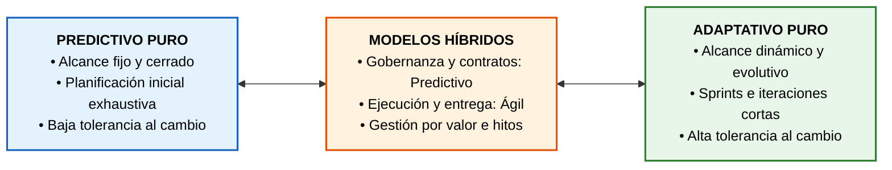
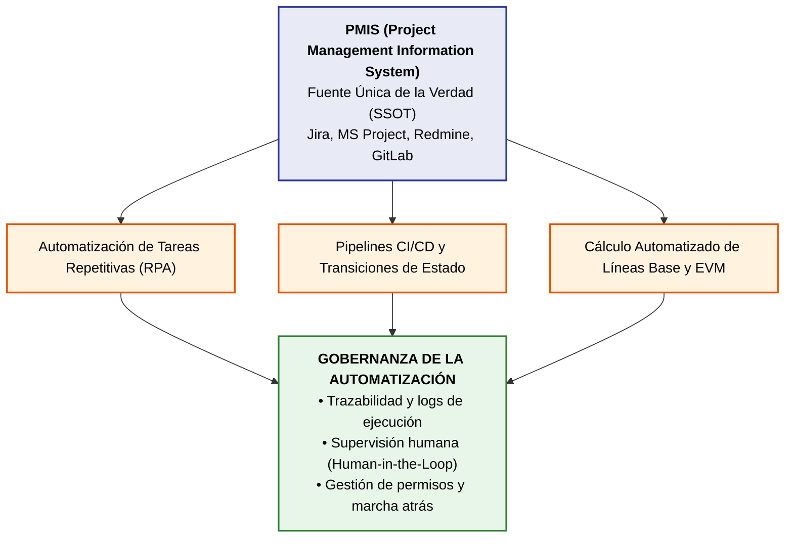
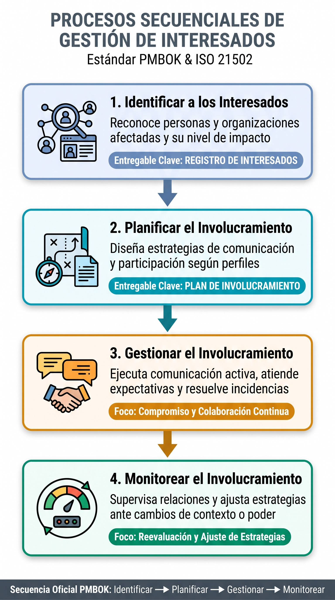
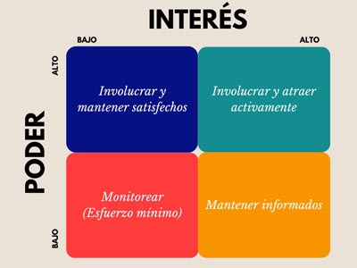
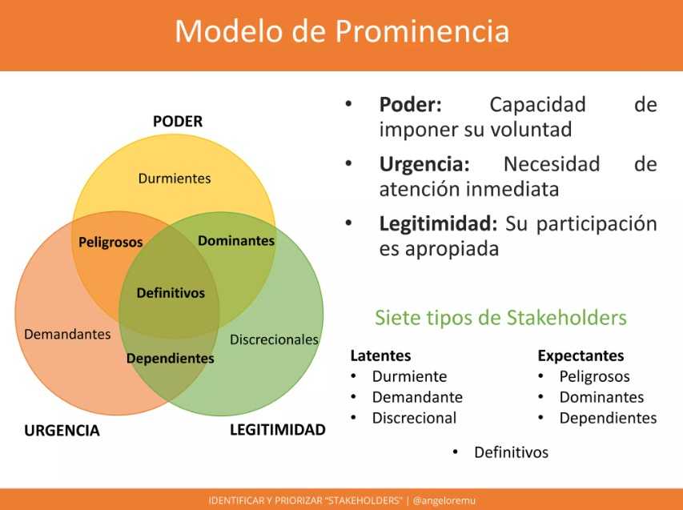
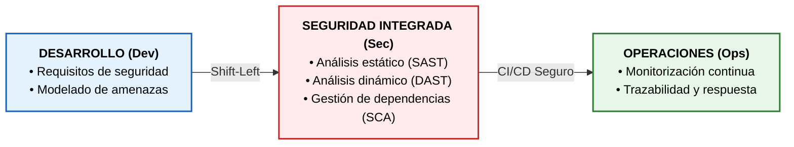
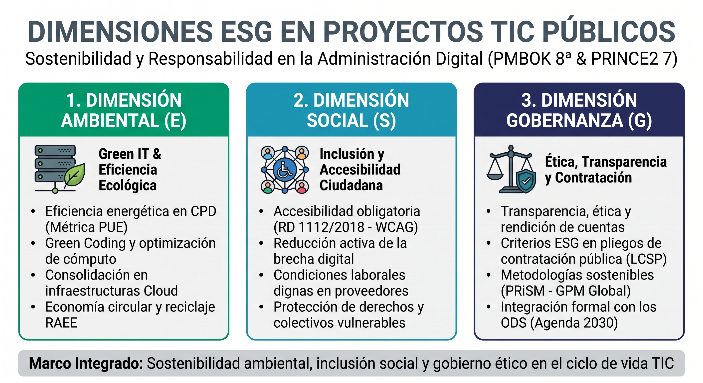
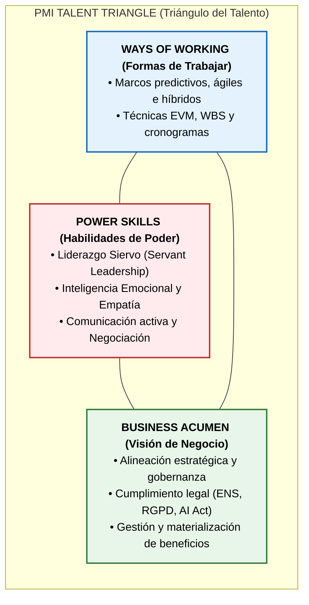

# Tema 7. Tendencias en la Gestión de Proyectos

La evolución de la dirección de proyectos responde a la necesidad de gestionar la complejidad técnica, la volatilidad de los requisitos, las exigencias regulatorias y la demanda de valor continuo en los servicios digitales públicos. La gestión moderna complementa los marcos tradicionales con enfoques híbridos, automatización avanzada, inteligencia artificial, ciberseguridad desde el diseño (*Security by Design*), criterios ESG de sostenibilidad y competencias interpersonales (*Power Skills*).

## 1. Hibridación de Metodologías (Predictivo + Agile)

La práctica actual en la Administración Pública y la industria TIC no plantea una disyuntiva excluyente entre enfoques predictivos (en cascada) y adaptativos (ágiles), sino su integración estructurada mediante **modelos híbridos**.

### 1.1. Fundamentos de la Hibridación y Patrones de Aplicación

*   **Espectro de Desarrollo (PMBOK 7ª y 8ª Edición):** El dominio de desempeño de *Enfoque de Desarrollo y Ciclo de Vida* establece que los proyectos se sitúan en un espectro continuo entre predictivo y adaptativo.
*   **Patrón Agile-Fall (Cascada con Sprints Internos):** Modelo predominante en el sector público. La gobernanza de alto nivel, la contratación (**Ley 9/2017 LCSP**), la consignación presupuestaria, la justificación normativa y la aceptación formal se gestionan de forma predictiva mediante hitos de control (*gates*), mientras que la construcción técnica del software se ejecuta mediante iteraciones ágiles (Scrum o Kanban).
*   **Criterios de Adaptación** (*Tailoring*): La decisión de hibridación depende de factores como la volatilidad de requisitos, criticidad del servicio, exigencias regulatorias, tamaño y dispersión del equipo, y la madurez organizativa.

### 1.2. Marcos y Modelos Híbridos Oficiales

*   **PRINCE2 Agile (PeopleCert):** Extensión que combina la estructura de gobernanza, justificación comercial continua (*Business Case*) y tolerancias de **PRINCE2** con marcos de entrega ágil (*Scrum, Kanban, Lean*). **PRINCE2** define la dirección, el control y los productos comprometidos, mientras que el marco ágil gestiona el desarrollo de los paquetes de trabajo.
*   **Disciplined Agile (DA - PMI):** Kit de herramientas (*toolkit*) orientado a procesos que ayuda a los equipos a elegir y evolucionar su propia "forma de trabajar" (*Way of Working - WoW*) en función del contexto técnico y organizativo.
*   **Bimodal IT (Gartner):** Modelo de gestión organizativa TIC estructurado en dos velocidades:
    *   *Modo 1 (Predictivo / Tradicional):* Enfocado en la estabilidad, seguridad, fiabilidad y mantenimiento de sistemas troncales (*core* o *legacy*).
    *   *Modo 2 (Ágil / Exploratorio):* Enfocado en la innovación, experimentación, rapidez de despliegue (*time-to-market*) y nuevos canales digitales.

## 2. Automatización y Herramientas Digitales de Gestión

La dirección de proyectos se apoya en ecosistemas digitales interconectados que sustituyen la gestión manual por flujos de información centralizados y automatizados.

### 2.1. Sistemas de Información para la Dirección de Proyectos (PMIS)
El **PMIS** es el conjunto de herramientas de software y procesos integrados que centralizan la recopilación, almacenamiento, análisis y distribución de los datos del proyecto, actuando como **fuente única de la verdad** (*Single Source of Truth - SSOT*):
*   Integra cronogramas, costes, presupuestos, registros de riesgos, flujos de cambios, incidencias, gestión documental y tableros Kanban interactivos.

### 2.2. Automatización de Flujos y RPA en la Gobernanza
*   **Automatización de Procesos Robóticos (RPA):** Aplicación de scripts y bots a la gestión de proyectos para tareas mecánicas: generación desatendida de informes de estado **EVM**, sincronización periódica de inventarios en la **CMDB** y actualización automática de registros de riesgos tras alertas críticas.
*   **Transiciones de Estado Automatizadas:** Integración de herramientas de seguimiento (*Jira, GitLab*) con cadenas de despliegue continuo (**CI/CD**). Al completarse una tarea de desarrollo o cerrarse un *pull request*, se desencadenan automáticamente pruebas unitarias, análisis de código o notificaciones a los responsables de validación.
*   **Gobernanza de la Automatización:** Exige control de accesos, registro inmutable de auditoría (trazabilidad de ejecuciones), reglas claras de escalado y supervisión humana obligatoria (*Human-in-the-Loop*) para validar decisiones críticas.

## 3. Gestión de Interesados en el Proyecto (*Stakeholders*)

Un interesado es cualquier individuo, grupo u organización que puede influir, verse afectado o percibirse a sí mismo como afectado por una decisión, actividad o resultado del proyecto.

### 3.1. Los 4 Procesos de Gestión de Interesados (PMBOK)

### 3.2. Modelos de Clasificación y Análisis de Interesados

#### A) Matriz de Poder vs. Interés (Matriz de Mendelow)

Clasifica a los interesados en cuatro cuadrantes para asignar el nivel de esfuerzo de comunicación:

| Nivel de Poder / Interés | Bajo Interés | Alto Interés |
| :--- | :--- | :--- |
| **Alto Poder** | **Mantener Satisfecho** • Resúmenes ejecutivos e informes periódicos. • Evitar que se conviertan en detractores. | **Gestionar Estrechamente** (*Key Players*) • Máxima implicación y colaboración directa. • Socios clave en la toma de decisiones. |
| **Bajo Poder** | **Monitorizar** (*Mínimo Esfuerzo*) • Supervisión periódica sin saturar recursos. • Comprobación de posibles cambios de estado. | **Mantener Informado** • Canales de retroalimentación y boletines. • Actúan como facilitadores o evangelizadores. |

#### B) Modelo de Prominencia (*Salience Model* - Mitchell, Agle y Wood)
Clasifica a los interesados analizando la interacción de tres variables clave:

 

*   **Poder:** Capacidad de imponer su voluntad o influir en las decisiones del proyecto.
*   **Legitimidad:** Adecuación o derecho legal/moral de su participación en el proyecto.
*   **Urgencia:** Necesidad o exigencia de atención inmediata a sus demandas.
*   *Interesado Definitivo (*Definitive Stakeholder*):* Se sitúa en la intersección simultánea de **Poder, Legitimidad y Urgencia**, requiriendo atención prioritaria inmediata por parte de la dirección del proyecto.

#### C) Clasificación por Dirección de Influencia
*   *Ascendente:* Alta dirección, patrocinador (*Sponsor*), comités de gobierno.
*   *Descendente:* Equipo del proyecto y especialistas técnicos.
*   *Horizontal:* Pares del Director de Proyecto, otros jefes de área funcional.
*   *Externa:* Ciudadanía, proveedores, contratistas, órganos reguladores y de auditoría.

## 4. Ciberseguridad y Cumplimiento Normativo en Proyectos TIC

En el sector público, la seguridad y el cumplimiento legal no constituyen una fase final de auditoría, sino requisitos funcionales y restricciones del sistema integrados desde el diseño (*Security by Design*).

### 4.1. Paradigmas de Seguridad en el Desarrollo
*   **Seguridad desde el Diseño** (*Security by Design*): Incorporación de salvaguardas y modelado de amenazas en las fases de análisis y arquitectura, evitando parches correctivos a posteriori.
*   **DevSecOps** (*Shift-Left Security*): Integración de controles automáticos de seguridad dentro del ciclo de vida ágil y los pipelines **CI/CD** desde el primer **Sprint**:
    *   *SAST (Static Application Security Testing):* Análisis estático del código fuente en busca de vulnerabilidades.
    *   *DAST (Dynamic Application Security Testing):* Pruebas dinámicas de penetración sobre la aplicación en ejecución.
    *   *SCA (Software Composition Analysis):* Análisis de librerías de terceros y componentes de código abierto para mitigar riesgos en la cadena de suministro de software.

### 4.2. Marco Regulatorio Obligatorio en el Sector Público Español

*   **Esquema Nacional de Seguridad (ENS - Real Decreto 311/2022):**
    *   Regula los principios básicos y requisitos mínimos para garantizar la seguridad de los sistemas de información en el sector público.
    *   *Dimensiones de Seguridad:* **Confidencialidad, Integridad, Trazabilidad, Autenticidad y Disponibilidad** (C-I-T-A-D).
    *   *Categorización del Sistema:* Determina el nivel (**Básico, Medio o Alto**) en función del impacto potencial de un incidente sobre dichas dimensiones, exigiendo la elaboración formal de la **Declaración de Aplicabilidad** de medidas de seguridad.
*   **Protección de Datos (RGPD UE 2016/679 y LOPDGDD 3/2018):**
    *   **Art. 25 RGPD:** **Protección de datos desde el diseño y por defecto** (minimización, limitación de plazo y seudonimización obligatorias).
    *   **Art. 35 RGPD:** Obligación de realizar una **Evaluación de Impacto en la Protección de Datos (EIPD / DPIA)** antes del tratamiento cuando este entrañe un alto riesgo para los derechos y libertades (*ej. uso masivo de nuevas tecnologías o datos biométricos*).
*   **Esquema Nacional de Interoperabilidad (ENI - Real Decreto 4/2010):** Condiciones para el intercambio seguro y normalizado de datos y servicios entre Administraciones Públicas mediante estándares abiertos.

## 5. Gestión de Proyectos en IA y Gestión Basada en Datos (*Data-Driven*)

### 5.1. Ciclo de Vida y Gobierno de Proyectos de Inteligencia Artificial
La implantación de soluciones de IA exige una gestión técnica específica centrada en los datos, los algoritmos y la supervisión humana:

*   **Principio GIGO** (*Garbage In, Garbage Out*): Si los datos de entrenamiento o inferencia son defectuosos, sesgados o incompletos, los resultados del modelo carecerán de validez con independencia de la calidad técnica del algoritmo.
*   **Gobernanza del Dato** (*Data Governance*): Garantiza la procedencia legítima, calidad, completitud, metadatos, control de acceso y trazabilidad de los conjuntos de datos.
*   **Gestión de la Deriva del Modelo** (*Model Drift*): Monitorización continua del rendimiento del modelo en explotación para detectar la degradación de su precisión frente a cambios en los datos reales del entorno.

### 5.2. Marco Regulatorio: Reglamento Europeo de Inteligencia Artificial (AI Act - Reglamento UE 2024/1689)
Establece un marco jurídico armonizado basado en un **enfoque de riesgo** (Riesgo Inaceptable, Alto Riesgo, Riesgo Específico de Transparencia, Riesgo Mínimo).

*   **Requisitos para Sistemas de IA de Alto Riesgo (Art. 15):** Exigencia legal de garantizar niveles adecuados de **precisión, robustez y ciberseguridad** a lo largo de todo el ciclo de vida del sistema.
*   **Obligaciones de Gestión en Proyectos de IA:**
    *   Implantación de un sistema formal de gestión de riesgos durante todo el ciclo de vida.
    *   Gobernanza estricta de los datos de entrenamiento, validación y prueba para mitigar sesgos discriminatorios.
    *   Supervisión humana efectiva (*Human Oversight*) y transparencia/explicabilidad técnica hacia los usuarios.
    *   Registro continuo de eventos (*logging*) para asegurar la trazabilidad del funcionamiento del modelo.

### 5.3. Tipología de Analítica en la Gestión de Proyectos TIC

| Tipo de Analítica | Pregunta Clave | Aplicación Práctica en Dirección de Proyectos |
| :--- | :--- | :--- |
| **Descriptiva** | *¿Qué ocurrió?* | Informes de estado, avance de tareas e histórico de costes reales ($AC$). |
| **Diagnóstica** | *¿Por qué ocurrió?* | Análisis de causa raíz de desviaciones ($CV$, $SV$) y cuellos de botella en Kanban. |
| **Predictiva** | *¿Qué pasará?* | Estimación de probabilidad de retraso o sobrecoste mediante modelos de Machine Learning y EVM predictivo. |
| **Prescriptiva** | *¿Qué debemos hacer?* | Algoritmos de optimización para reasignación automática de recursos y mitigación de riesgos. |

## 6. Sostenibilidad y Responsabilidad Social (ESG y Green IT)

La sostenibilidad se ha consolidado como un dominio de desempeño explícito en el **PMBOK 8ª Edición** y una dimensión transversal en **PRINCE2 7** e **ISO 21502:2020**.

 

*   **Green Project Management (GPM) y Metodología PRiSM:** *Projects integrating Sustainable Methods* es un marco estructurado que extiende el ciclo de vida del proyecto para evaluar y reducir el impacto ambiental y social del producto resultante.
*   **Accesibilidad Web y Móvil (Real Decreto 1112/2018):** Obligación legal en el sector público de garantizar que todos los desarrollos cumplan los estándares de accesibilidad (norma **UNE-EN 301549** / directrices **WCAG**).
*   **Alineación con los ODS:** Integración de los Objetivos de Desarrollo Sostenible de la **Agenda 2030** (especialmente **ODS 9**: Innovación e Infraestructuras, **ODS 12**: Producción y Consumo Responsables, y **ODS 13**: Acción por el Clima) como criterios de éxito del proyecto.

## 7. Habilidades Blandas (*Power Skills*) y el Triángulo del Talento del PMI

El éxito en la dirección técnica de proyectos depende de un equilibrio entre la competencia metodológica, el liderazgo interpersonal y la visión estratégica.

1.  **Ways of Working** (Formas de Trabajar - antes *Technical Project Management*): Dominio y aplicación de marcos predictivos, ágiles (Scrum, Kanban) e híbridos, técnicas de estimación, diagramas de red, análisis EVM y gestión de riesgos.
2.  **Power Skills** (Habilidades de Poder - antes *Leadership*): Habilidades interpersonales y de comportamiento que permiten influir positivamente, inspirar al equipo y resolver conflictos:
    *   *Liderazgo Siervo (Servant Leadership):* Paradigma central en marcos ágiles (Scrum Master) y adoptado por PMBOK 7/8, donde el líder actúa como facilitador al servicio del equipo, eliminando impedimentos, protegiendo de distracciones externas y fomentando la autogestión.
    *   *Inteligencia Emocional y Empatía:* Gestión de la presión en hitos críticos y comprensión de las expectativas de los interesados.
    *   *Negociación y Gestión de Conflictos:* Prevención y arbitraje ante desviaciones de alcance (*scope creep*) y competencia por recursos escasos.
3.  **Business Acumen** (Visión de Negocio - antes *Strategic and Business Management*): Comprensión del contexto institucional o empresarial, gestión orientada a la materialización de beneficios, alineación estratégica y cumplimiento estricto del marco legal aplicable.

## 8. Resumen

| Concepto | Términos Clave |
| :--- | :--- |
| **Modelos Híbridos** | "Gobernanza predictiva + Ejecución ágil", "Agile-fall", "Espectro continuo". |
| **PRINCE2 Agile** | "Gobernanza de PRINCE2 + Entrega con Scrum/Kanban", "PeopleCert". |
| **Disciplined Agile (DA)** | "Kit de herramientas del PMI", "Elegir la forma de trabajar (*Way of Working - WoW*)". |
| **Bimodal IT (Gartner)** | "Modo 1 (Estabilidad/Predictivo) vs. Modo 2 (Innovación/Ágil)". |
| **PMIS** | "Sistema de Información para la Dirección de Proyectos", "Fuente única de verdad (SSOT)". |
| **Matriz de Mendelow** | "Poder vs. Interés", "Alto Poder/Bajo Interés = Mantener Satisfecho". |
| **Modelo de Prominencia** | "Poder, Legitimidad y Urgencia", "Interesado Definitivo (intersección de las 3)". |
| **Procesos Interesados** | "Identificar $\rightarrow$ Planificar involucramiento $\rightarrow$ Gestionar $\rightarrow$ Monitorear". |
| **DevSecOps** | "Seguridad integrada en CI/CD", "Shift-Left", "SAST / DAST / SCA". |
| **ENS (RD 311/2022)** | "Dimensiones: C-I-T-A-D", "Categorías: Básica, Media, Alta", "Declaración de Aplicabilidad". |
| **AI Act (Reg. UE 2024/1689)** | "Enfoque basado en riesgos", "Alto Riesgo (Art. 15): Precisión, Robustez, Ciberseguridad". |
| **Principio GIGO** | "*Garbage In, Garbage Out*", "Datos de mala calidad generan resultados inválidos". |
| **Sostenibilidad / ESG** | "Criterios Ambientales, Sociales y de Gobernanza", "PRiSM / Green IT", "PUE", "RD 1112/2018". |
| **PMI Talent Triangle** | "*Ways of Working* + *Power Skills* + *Business Acumen*". |
| **Liderazgo Siervo** | "*Servant Leadership*", "Eliminar impedimentos", "Facilitador al servicio del equipo". |

## 9. Referencias Normativas y Técnicas

* **Project Management Institute (PMI)**, *A Guide to the Project Management Body of Knowledge (PMBOK® Guide)* — 7ª y 8ª Edición (Noviembre 2025).
* **PMI**, *PMI Talent Triangle® Competency Framework*.
* **PeopleCert / AXELOS**, *PRINCE2® Agile Guidance* & *PRINCE2® 7 Management Framework*.
* **ISO 21502:2020**, *Project, programme and portfolio management — Guidance on project management*.
* **Real Decreto 311/2022**, de 3 de mayo, por el que se regula el Esquema Nacional de Seguridad (ENS).
* **Reglamento (UE) 2016/679 (RGPD)** y **Ley Orgánica 3/2018 (LOPDGDD)** (especialmente arts. 25 y 35).
* **Reglamento (UE) 2024/1689 (AI Act)**, por el que se establecen normas armonizadas en materia de inteligencia artificial.
* **Real Decreto 1112/2018**, sobre accesibilidad de los sitios web y aplicaciones para dispositivos móviles del sector público.

## 10. Simulacro de Test

**Pregunta 1:**
*En un proyecto de administración digital gestionado con un enfoque híbrido, la dirección identifica a un alto cargo institucional con un elevado nivel de autoridad y poder de decisión sobre el presupuesto, pero con muy escaso interés en los detalles técnicos de los desarrollos diarios. Según la matriz de Poder/Interés de Mendelow, ¿cuál es la estrategia de comunicación adecuada?*
a) Gestionar estrechamente mediante reuniones diarias de seguimiento técnico.
b) Mantenerle satisfecho a través de resúmenes ejecutivos e informes de hitos periódicos.
c) Informarle exclusivamente si se produce una parada total del servicio en producción.
d) Monitorizarle con el mínimo esfuerzo sin remitirle comunicación formal.

**Razonamiento Estructurado:**
1.  **Clasificación en la matriz:** El interesado posee **Alto Poder** y **Bajo Interés**.
2.  **Descarte:**
    *   *Gestionar estrechamente* (a) es para Alto Poder y Alto Interés.
    *   *Monitorizar* (d) es para Bajo Poder y Bajo Interés.
    *   *Mantener informado* es para Bajo Poder y Alto Interés.
3.  La estrategia formal de Mendelow para este cuadrante es **Mantener Satisfecho** (b), facilitando información de alto nivel para asegurar su respaldo sin sobrecargarle con detalles operativos.
4.  **Respuesta correcta: B.**

**Pregunta 2:**
*Según los estándares de gestión de interesados de la Guía PMBOK, ¿en qué proceso se elabora por primera vez el Registro de Interesados (*Stakeholder Register*), donde se documenta la clasificación inicial de los agentes como favorables, neutrales u opositores?*
a) Planificar el Involucramiento de los Interesados.
b) Identificar a los Interesados.
c) Gestionar el Involucramiento de los Interesados.
d) Monitorear el Involucramiento de los Interesados.

**Razonamiento Estructurado:**
1.  **Artefacto evaluado:** El **Registro de Interesados**.
2.  **Secuencia metodológica:** Se crea formalmente durante el primer proceso (**Identificar a los Interesados**). Los procesos posteriores (Planificar, Gestionar y Monitorear) utilizan, enriquecen y actualizan este registro, pero su generación original corresponde al proceso de identificación.
3.  **Respuesta correcta: B.**

**Pregunta 3:**
*¿Cómo se denomina la filosofía de liderazgo adoptada en los marcos ágiles (Scrum) y reconocida en las 'Power Skills' del PMI, en la que el responsable del proyecto enfoca su labor en remover bloqueos técnicos, facilitar recursos y proteger al equipo de interferencias externas, en lugar de dirigir mediante jerarquía y órdenes directivas?*
a) Liderazgo Autocrático.
b) Liderazgo Transaccional.
c) Liderazgo Siervo (*Servant Leadership*).
d) Liderazgo Pasivo (*Laissez-Faire*).

**Razonamiento Estructurado:**
1.  **Definición evaluada:** Líder enfocado en la facilitación, eliminación de impedimentos y servicio al equipo para potenciar su autogestión.
2.  Corresponde literalmente al **Liderazgo Siervo (*Servant Leadership*)**, rol nuclear del *Scrum Master* e integrado en el PMBOK 7/8.
3.  **Respuesta correcta: C.**

**Pregunta 4:**
*En un proyecto de desarrollo software para una Consejería, los análisis estáticos de código (SAST), la comprobación de dependencias (SCA) y las auditorías de conformidad con el Esquema Nacional de Seguridad (ENS) se integran y ejecutan de forma automatizada en el pipeline de despliegue continuo desde el inicio del proyecto. ¿Qué tendencia técnica define esta práctica?*
a) Bimodal IT.
b) Agile-fall.
c) DevSecOps (*Shift-Left Security*).
d) PRiSM Management.

**Razonamiento Estructurado:**
1.  **Patrón identificado:** Integración de la seguridad de forma automatizada, continua y temprana (*Shift-Left*) dentro de las cadenas CI/CD de desarrollo y operaciones.
2.  Define el paradigma **DevSecOps** (b/c/d descartadas).
3.  **Respuesta correcta: C.**

**Pregunta 5:**
*De acuerdo con el Reglamento (UE) 2024/1689 (AI Act), ¿qué requisitos técnicos esenciales establece el artículo 15 para los proyectos que desarrollen o implanten sistemas de inteligencia artificial clasificados como de alto riesgo?*
a) Garantizar un VAN positivo y un periodo de recuperación inferior a 2 años.
b) Diseñar los sistemas de modo que alcancen niveles adecuados de precisión, robustez y ciberseguridad a lo largo de su ciclo de vida.
c) Exclusividad en el uso de modelos de lenguaje de código abierto no supervisados.
d) Delegación íntegra de la toma de decisiones sin supervisión humana obligatoria.

**Razonamiento Estructurado:**
1.  **Referencia legal:** Artículo 15 del Reglamento de Inteligencia Artificial (AI Act).
2.  **Exigencia normativa:** Exige explícitamente que los sistemas de IA de alto riesgo mantengan niveles adecuados de **precisión, robustez y ciberseguridad** durante todo su ciclo de vida, acompañados de supervisión humana (descartando la opción d).
3.  **Respuesta correcta: B.**
