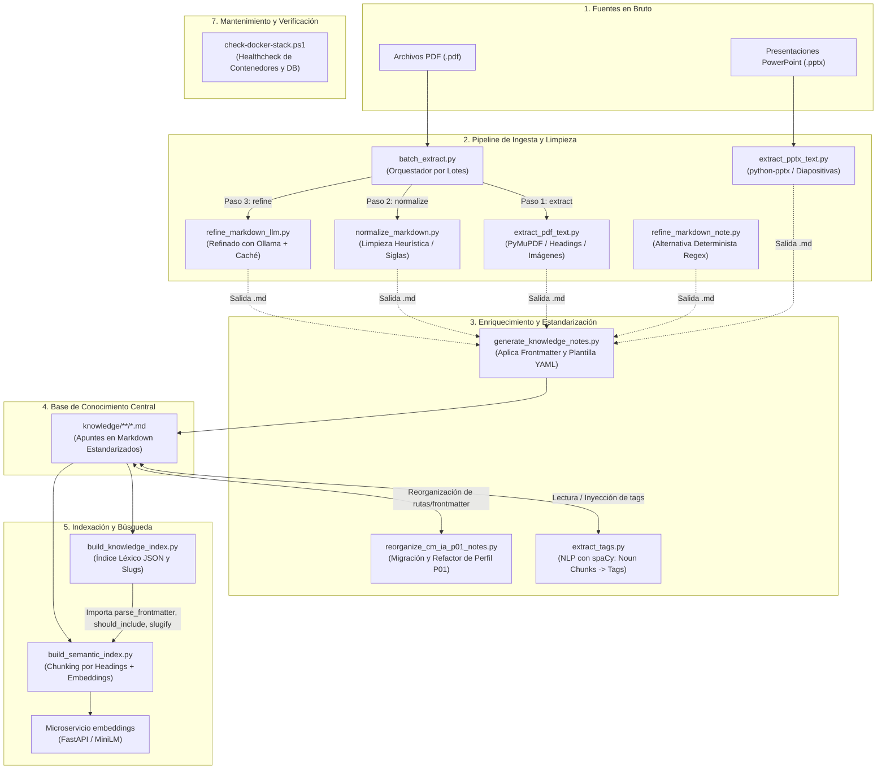

# Guía y Catálogo de Scripts de Preparaopos

Este documento describe detalladamente la funcionalidad, parámetros, dependencias y relaciones de colaboración de todos los scripts ubicados en la carpeta [`scripts/`](file:///c:/repositories/preparaopos/scripts).

---

## 1. Mapa Global de Relaciones y Pipelines

Los scripts del repositorio no son piezas aisladas; conforman varios **pipelines de procesamiento por etapas** donde las salidas de unos alimentan directamente las entradas de otros.



---

## 2. Clasificación y Detalle de los Scripts

---

### Grupo A: Pipeline de Ingesta, Extracción y Conversión

Transforman documentos originales (temarios en PDF y diapositivas en PowerPoint) a formato Markdown limpio y uniforme.

#### 1. [`batch_extract.py`](file:///c:/repositories/preparaopos/scripts/batch_extract.py)
* **Propósito:** Orquestador integral de procesamiento por lotes para directorios completos de PDFs. Ejecuta de forma encadenada las tres etapas del pipeline (extracción $\rightarrow$ normalización $\rightarrow$ refinado).
* **Cómo colabora con otros scripts:**
  * Importa y llama a `extract_pdf_to_markdown()` de [`extract_pdf_text.py`](file:///c:/repositories/preparaopos/scripts/extract_pdf_text.py).
  * Importa y llama a `normalize_markdown()` de [`normalize_markdown.py`](file:///c:/repositories/preparaopos/scripts/normalize_markdown.py).
  * Importa y llama a `refine_markdown_document()` de [`refine_markdown_llm.py`](file:///c:/repositories/preparaopos/scripts/refine_markdown_llm.py).
* **Etapas y carpetas intermedias:**
  * `01_extracted/`: Salida de la extracción de texto e imágenes.
  * `02_normalized/`: Salida de la limpieza de ruido, saltos y tablas de siglas.
  * `03_refined/`: Salida final tras la revisión por LLM (Ollama).
* **Parámetros principales:**
  * `input_dir` y `output_dir`: Directorios de origen y destino.
  * `--stage {extract,normalize,refine}`: Permite detenerse en una etapa intermedia (por defecto: `refine`).
  * `--keep-intermediate`: Conserva los archivos temporales de `01_extracted` y `02_normalized`.
  * `--no-images`: Omite la extracción de imágenes.
  * `--force`: Reprocesa ficheros ya existentes.
  * `--ollama-url`, `--model`, `--temperature`, `--max-tokens`: Ajustes del modelo LLM.
* **Ejemplo de uso:**
  ```powershell
  python .\scripts\batch_extract.py .\fuentes_pdf\ .\salida_markdown\ --stage refine
  ```

---

#### 2. [`extract_pdf_text.py`](file:///c:/repositories/preparaopos/scripts/extract_pdf_text.py)
* **Propósito:** Extractor especializado en documentos PDF utilizando PyMuPDF (`fitz`).
* **Características clave:**
  * **Detección de cabeceras y pies de página recurrentes:** Analiza la frecuencia de firmas de texto en bandas superiores e inferiores ($y \le 12\%$ e $y \ge 88\%$) para descartar membretes repetidos a lo largo de todo el documento.
  * **Detección de índices en bruto (TOC):** Identifica páginas de índice para no incorporarlas como texto de contenido redundante.
  * **Inferencia de jerarquía de títulos:** Calcula la mediana del tamaño tipográfico del texto del cuerpo y asigna automáticamente niveles de encabezado Markdown (`##`, `###`, `####`) en función del tamaño relativo de la fuente.
  * **Extracción de imágenes:** Extrae imágenes incrustadas convirtiéndolas a `.png` en una subcarpeta dedicada `images/`.
* **Entrada:** Archivo `.pdf`.
* **Salida:** Archivo `.md` y directorio de imágenes.
* **Ejemplo de uso:**
  ```powershell
  python .\scripts\extract_pdf_text.py .\apunte.pdf .\apunte.md
  ```

---

#### 3. [`extract_pptx_text.py`](file:///c:/repositories/preparaopos/scripts/extract_pptx_text.py)
* **Propósito:** Extractor de presentaciones PowerPoint (`.pptx`) a Markdown utilizando `python-pptx`.
* **Características clave:**
  * Extrae cuadros de texto diapositiva por diapositiva.
  * Convierte tablas incrustadas en las diapositivas a formato tabular Markdown (`| col1 | col2 |`).
  * Extrae imágenes incrustadas preservando el formato original o convirtiéndolas a PNG.
  * Extrae las **notas del orador** (`notes_slide`), especialmente valiosas en apuntes de academias de oposiciones.
* **Ejemplo de uso:**
  ```powershell
  python .\scripts\extract_pptx_text.py .\presentacion.pptx .\apunte_pptx.md
  ```

---

#### 4. [`normalize_markdown.py`](file:///c:/repositories/preparaopos/scripts/normalize_markdown.py)
* **Propósito:** Limpieza y estandarización puramente determinista y heurística de Markdown proveniente de OCR o extractores.
* **Reglas implementadas:**
  * Normalización de espacios en blanco y saltos de línea Windows/Unix.
  * Eliminación de marcadores de página (`### Página 14`, cabeceras repetidas de centros de estudios TIC, textos *"mostrar más / mostrar menos"*).
  * Reensamblado de párrafos partidos por saltos de línea involuntarios (`join_broken_paragraphs`).
  * Reparación de viñetas de listas fragmentadas o con viñetas no estándar (`•`, `*`).
  * Detección de glosarios de siglas (`Las siglas empleadas en este documento son...`) y conversión automática en tablas Markdown (`| Sigla | Significado |`).
  * Deduplicación de líneas consecutivas idénticas.
* **Ejemplo de uso:**
  ```powershell
  python .\scripts\normalize_markdown.py .\01_extracted\ .\02_normalized\ --overwrite
  ```

---

#### 5. [`refine_markdown_llm.py`](file:///c:/repositories/preparaopos/scripts/refine_markdown_llm.py)
* **Propósito:** Refinado ortotipográfico y estructural de alta fidelidad mediante un modelo de lenguaje local (Ollama).
* **Características clave:**
  * **Sin alucinaciones ni resúmenes:** Prompt de edición riguroso que instruye al modelo a devolver exclusivamente el contenido original corrigiendo sangrías, listas rotas, tablas y saltos, sin resumir ni inventar información técnica.
  * **Fragmentación inteligente:** Trocea el documento por marcadores de página (`## Página N`) o por tamaño de caracteres (`MAX_CHUNK_CHARS = 2000`).
  * **Sistema de Caché Local SHA-256 (`.llm_cache/`):** Calcula el hash criptográfico de cada fragmento enviado; si el bloque ya fue procesado con éxito anteriormente, se recupera de disco instantáneamente sin gastar ciclos de CPU del LLM.
* **Ejemplo de uso:**
  ```powershell
  python .\scripts\refine_markdown_llm.py .\02_normalized\ .\03_refined\ --model llama3.1:latest
  ```

---

#### 6. [`refine_markdown_note.py`](file:///c:/repositories/preparaopos/scripts/refine_markdown_note.py)
* **Propósito:** Alternativa rápida y determinista a `refine_markdown_llm.py` basada exclusivamente en expresiones regulares avanzadas.
* **Uso recomendado:** Cuando no se disponga de Ollama o se desee una limpieza inmediata sin consumo de CPU/GPU. Repara párrafos cortados (evaluando signos de puntuación finales y letras minúsculas al inicio de línea), normaliza viñetas a `- ` y añade separaciones antes de listas cuando el párrafo precedente termina en dos puntos (`:`).
* **Ejemplo de uso:**
  ```powershell
  python .\scripts\refine_markdown_note.py .\documento_sucio.md .\documento_limpio.md
  ```

---

### Grupo B: Pipeline de Enriquecimiento y Organización de Apuntes

Transforman los documentos limpios en apuntes oficiales del catálogo dentro de `knowledge/`.

#### 7. [`extract_tags.py`](file:///c:/repositories/preparaopos/scripts/extract_tags.py)
* **Propósito:** Extracción automática de conceptos clave y etiquetas temáticas mediante Procesamiento de Lenguaje Natural (NLP).
* **Tecnología:** Utiliza la librería **spaCy** con el modelo en español `es_core_news_sm`.
* **Cómo opera:**
  1. Separa el frontmatter YAML y limpia el cuerpo Markdown de encabezados y tablas para dejar texto continuo.
  2. Procesa el texto identificando sintagmas nominales (*noun chunks*) y entidades con nombre (*entities*).
  3. Convierte los términos a slugs en minúsculas sin acentos (`"Constitución Española"` $\rightarrow$ `"constitucion-espanola"`).
  4. Descarta *stop words* estructurales (`"tema"`, `"resumen"`, `"apartado"`, `"introduccion"`).
  5. Ordena por frecuencia ponderada y actualiza o inserta el bloque `tags:` en el frontmatter del archivo `.md`.
* **Ejemplo de uso:**
  ```powershell
  python .\scripts\extract_tags.py .\knowledge\processes\age\a2-gsi\apuntes\ .\knowledge\processes\age\a2-gsi\apuntes\ --overwrite --max-tags 8
  ```

---

#### 8. [`generate_knowledge_notes.py`](file:///c:/repositories/preparaopos/scripts/generate_knowledge_notes.py)
* **Propósito:** Ensamblador masivo de apuntes formales a partir de notas en bruto y plantillas YAML.
* **Cómo opera:**
  * Lee la plantilla base (`knowledge/_template/apunte-fuente-privada.md`) y el archivo de configuración `knowledge-note-generator.yml`.
  * Deduce metadatos a partir de la estructura de carpetas (proceso selectivo, perfil TIC, número de tema).
  * Construye un identificador canónico (`id`), añade fecha de creación (`created_at`) y marcas de revisión (`needs_human_review: true`).
  * Emite el apunte final con su frontmatter completo seguido del cuerpo del apunte.
* **Ejemplo de uso:**
  ```powershell
  python .\scripts\generate_knowledge_notes.py .\entradas\ .\knowledge\ --profile-key age/a2-gsi-cetic
  ```

---

#### 9. [`reorganize_cm_ia_p01_notes.py`](file:///c:/repositories/preparaopos/scripts/reorganize_cm_ia_p01_notes.py)
* **Propósito:** Script de migración y refactorización estructural específico para los apuntes de la Comunidad de Madrid (perfil P01 - Consultor de IA).
* **Funciones:**
  * Mueve y renombra archivos al esquema estándar `p01-tema-XXX-nombre.md`.
  * Actualiza las claves de frontmatter: asigna ID con prefijo `cm-ad-ia-p01`, configura `processes`, `profiles` y `official_profile`.
  * Soporta modo **Dry-run** (simulación sin cambios) y modo **Apply** (`--apply`).
* **Ejemplo de uso:**
  ```powershell
  # Simulación previa:
  python .\scripts\reorganize_cm_ia_p01_notes.py
  # Aplicar cambios en disco:
  python .\scripts\reorganize_cm_ia_p01_notes.py --apply
  ```

---

### Grupo C: Pipeline de Indexación y Búsqueda para Study Assistant

Construyen las estructuras de datos que permiten la navegación y búsqueda en la aplicación web **Study Assistant**.

#### 10. [`build_knowledge_index.py`](file:///c:/repositories/preparaopos/scripts/build_knowledge_index.py)
* **Propósito:** Genera el índice léxico central en JSON para Study Assistant (`apps/studyassistant/data/knowledge_index.json`).
* **Operaciones:**
  * Escanea recursivamente `knowledge/` descartando plantillas (`_template`) y archivos de soporte.
  * Parsea el frontmatter YAML nativo de cada apunte (`id`, `title`, `official_topic`, `processes`, `tags`, `status`, etc.).
  * Extrae los títulos `##`, `###`, `####` y calcula slugs de anclaje estables.
  * Genera un extracto contextual (`excerpt`) y un blob de texto plano defensivo (`content_text`, máx. 4000 caracteres) para búsquedas rápidas por coincidencia de texto en PHP.
* **Ejemplo de uso:**
  ```powershell
  python .\scripts\build_knowledge_index.py
  ```

---

#### 11. [`build_semantic_index.py`](file:///c:/repositories/preparaopos/scripts/build_semantic_index.py)
* **Propósito:** Construye el índice vectorial de fragmentos semánticos y sus embeddings correspondientes.
* **Cómo colabora con `build_knowledge_index.py`:**
  * Reutiliza directamente las funciones `parse_frontmatter()`, `should_include()` y `slugify()` de [`build_knowledge_index.py`](file:///c:/repositories/preparaopos/scripts/build_knowledge_index.py) para garantizar que ambos índices procesen exactamente los mismos archivos con idénticos criterios.
* **Operaciones:**
  1. Trocea cada apunte en fragmentos a nivel de sección (`split_into_heading_chunks`), preservando el título del apunte y del heading en cada bloque.
  2. Codifica los fragmentos a vectores densos mediante el modelo `paraphrase-multilingual-MiniLM-L12-v2` de Sentence Transformers.
  3. Exporta los metadatos de los fragmentos a `apps/studyassistant/data/semantic_chunks.json`.
  4. Exporta la matriz densa en formato binario a `apps/studyassistant/data/semantic_embeddings.npy`.
* **Entorno de ejecución:** Requiere librerías de ML (`sentence-transformers`, `torch`, `numpy`), por lo que está diseñado para ejecutarse dentro del contenedor Docker `embeddings`:
  ```powershell
  docker compose exec embeddings python scripts/build_semantic_index.py
  docker compose restart embeddings
  ```

---

### Grupo D: Mantenimiento, Parcheo y DevOps

Herramientas auxiliares para la infraestructura, base de datos y depuración de código.

#### 12. [`check-docker-stack.ps1`](file:///c:/repositories/preparaopos/scripts/check-docker-stack.ps1)
* **Propósito:** Script PowerShell de comprobación integral del estado de la infraestructura Docker Compose.
* **Comprobaciones:**
  * Lista el estado de los contenedores (`docker compose ps`).
  * Realiza peticiones HTTP de comprobación a la aplicación web (`http://localhost:8080`) y phpMyAdmin (`http://localhost:8081`).
  * Entra al contenedor MariaDB (`db`) y verifica la presencia de tablas obligatorias (`ptype`, `incorrectas`, `rtype`).
* **Ejemplo de uso:**
  ```powershell
  .\scripts\check-docker-stack.ps1
  ```

---

## 3. Matriz de Colaboración entre Scripts

La siguiente tabla resume qué scripts trabajan juntos, el mecanismo de comunicación y los artefactos compartidos:

| Script Principal | Colabora con | Tipo de Colaboración | Artefacto / Dato Compartido |
| :--- | :--- | :--- | :--- |
| **`batch_extract.py`** | `extract_pdf_text.py` | Import directo de función Python | Función `extract_pdf_to_markdown()` |
| **`batch_extract.py`** | `normalize_markdown.py` | Import directo de función Python | Función `normalize_markdown()` |
| **`batch_extract.py`** | `refine_markdown_llm.py` | Import directo de función Python | Función `refine_markdown_document()` |
| **`build_semantic_index.py`** | `build_knowledge_index.py` | Import directo de funciones Python | Funciones `parse_frontmatter()`, `should_include()`, `slugify()` |
| **`build_knowledge_index.py`** | Study Assistant (`index.php`, `note.php`) | Salida a fichero compartido | `apps/studyassistant/data/knowledge_index.json` |
| **`build_semantic_index.py`** | Microservicio `embeddings` (`main.py`) | Salida a ficheros compartidos | `data/semantic_chunks.json` y `data/semantic_embeddings.npy` |
| **`extract_tags.py`** | `knowledge/**/*.md` | Lectura y reescritura de metadatos | Campo `tags:` del frontmatter YAML |

---

## 4. Requisitos y Entorno de Ejecución

Las dependencias Python requeridas para la ejecución de los scripts de ingesta y NLP se encuentran centralizadas en [`scripts/requirements.txt`](file:///c:/repositories/preparaopos/scripts/requirements.txt):

```text
PyMuPDF
python-pptx==1.0.2
PyYAML
spacy
```

Para instalar las dependencias en local:
```powershell
pip install -r .\scripts\requirements.txt
python -m spacy download es_core_news_sm
```

> [!NOTE]
> Los scripts que requieren `torch` o `sentence-transformers` (como `build_semantic_index.py`) están diseñados preferentemente para ejecutarse dentro del contenedor Docker `embeddings`, donde ya se encuentran preinstaladas dichas dependencias pesadas.

