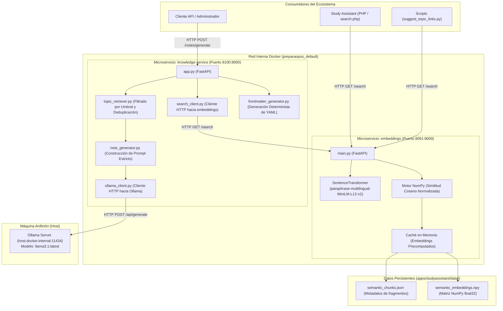
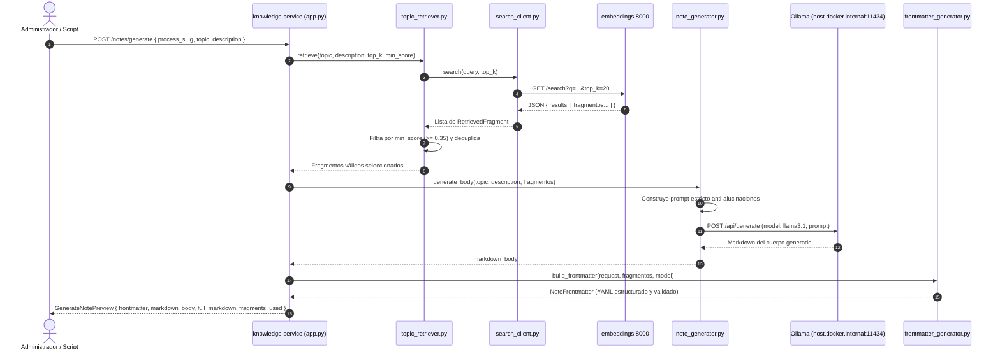

# Arquitectura de la Capa de Servicios (services/)

Documento técnico de arquitectura de la capa de microservicios backend de **preparaopos**, que implementa la búsqueda semántica vectorial y la generación asistida de apuntes mediante Recuperación Aumentada por Generación (RAG) en infraestructura 100% local.

---

## 1. Visión General y Filosofía de Diseño

La capa de servicios (`services/`) alberga microservicios independientes contenerizados en Docker que dotan de capacidades de Inteligencia Artificial y Procesamiento de Lenguaje Natural (NLP) a las aplicaciones web del monorepo (`studyassistant` y `preparadortai`).

### Principios Fundamentales:
1. **Desacoplamiento RAG en dos etapas:**
   * La **búsqueda y recuperación vectorial** se aísla en un microservicio especializado (`embeddings`), optimizado para cálculo matricial rápido en CPU con `Sentence-Transformers` y NumPy.
   * La **generación y orquestación con LLMs** reside en un servicio independiente (`knowledge-service`), que consume la API del servicio de búsqueda y se comunica con Ollama.
2. **Local-First y Zero-Cloud-Cost:**
   * Inferencia vectorial en CPU local con modelos compactos y de alto rendimiento en español (`paraphrase-multilingual-MiniLM-L12-v2`).
   * Inferencia de LLM local a través de Ollama (`llama3.1:latest`), garantizando privacidad absoluta de los datos y cero costes de uso.
3. **Generación Determinista de Metadatos:**
   * El LLM se restringe exclusivamente a la redacción del cuerpo del apunte en base a los fragmentos recuperados.
   * El **frontmatter YAML**, identificadores, slugs, fechas y listas de trazabilidad son generados de forma 100% determinista por código Python, impidiendo alucinaciones en la estructura de metadatos.
4. **Principio de Mínimo Privilegio e Imágenes Ligeras:**
   * El servicio `knowledge` no instala dependencias pesadas de Machine Learning (`torch`, `transformers`); se mantiene como una imagen ultraligera con FastAPI y `httpx`.
   * Los contenedores operan bajo usuarios sin privilegios (`appuser`).

---

## 2. Diagrama de Arquitectura de Servicios

---

## 3. Catálogo de Microservicios

### 3.1. `services/embeddings` (Búsqueda Semántica Vectorial)

* **Propósito:** Ofrece un motor de búsqueda por significado de muy baja latencia sobre todos los fragmentos de la base de conocimiento Markdown.
* **Stack Tecnológico:** Python 3.11, FastAPI, Uvicorn, Sentence-Transformers, PyTorch, NumPy.
* **Modelo Vectorial:** `paraphrase-multilingual-MiniLM-L12-v2` (384 dimensiones, optimizado para español y multilingüe).
* **Ciclo de Carga en Memoria:**
  * Al inicializarse el servicio (`@app.on_event("startup")`), lee los ficheros generados por `scripts/build_semantic_index.py`:
    * `semantic_chunks.json`: Lista de metadatos de cada fragmento (`note_id`, `heading`, `anchor`, `text_preview`, `tags`).
    * `semantic_embeddings.npy`: Matriz NumPy de vectores flotantes.
  * Normaliza todas las filas a norma $L_2 = 1$ una sola vez al arrancar:
    $$\mathbf{v}_{\text{norm}} = \frac{\mathbf{v}}{\|\mathbf{v}\|_2}$$
* **Cálculo de Similitud Coseno:**
  * Al recibir una consulta, codifica el texto de la query en un vector unitario $\mathbf{q}$.
  * El cálculo de similitud coseno para todos los fragmentos se reduce a una sola multiplicación matricial en CPU:
    $$\text{scores} = \mathbf{E}_{\text{norm}} \cdot \mathbf{q}$$
  * Ordena los resultados mediante `np.argsort(-scores)` y devuelve los Top-$K$ elementos en milisegundos.

#### Endpoints:
| Método | Ruta | Descripción |
| :--- | :--- | :--- |
| `GET` | `/health` | Estado del servicio, modelo cargado y número total de fragmentos indexados. |
| `GET` | `/search?q={query}&top_k={k}` | Búsqueda semántica vectorial. Devuelve lista de resultados ordenados con score de relevancia (0.0 a 1.0). |

---

### 3.2. `services/knowledge` (Generador RAG de Apuntes)

* **Propósito:** Genera borradores de nuevos apuntes de estudio y síntesis teóricas a partir de temas y descripciones proporcionadas por el usuario, fundamentándose exclusivamente en la evidencia de los fragmentos recuperados.
* **Stack Tecnológico:** Python 3.11, FastAPI, Uvicorn, Pydantic v2, HTTPX. (Sin PyTorch ni librerías pesadas).
* **Componentes Internos:**
  * **`SearchClient` (`search_client.py`):** Cliente HTTP asíncrono con control de timeouts que realiza llamadas REST a `http://embeddings:8000/search`.
  * **`TopicRetriever` (`topic_retriever.py`):** Filtra los resultados descartando fragmentos con similitud inferior al umbral (`min_score`, por defecto 0.35), elimina duplicados exactos y formatea los bloques de evidencia.
  * **`NoteGenerator` (`note_generator.py`):** Carga la plantilla de prompt (`prompts/note_generation.txt`), inyecta los fragmentos y solicita al modelo LLM la redacción del cuerpo del apunte en Markdown.
  * **`OllamaClient` (`ollama_client.py`):** Cliente de comunicación con la API de Ollama (`/api/generate`) gestionando timeouts largos para modelos densos y control de temperatura (`temperature: 0.0` para máxima fidelidad).
  * **`FrontmatterGenerator` (`frontmatter_generator.py`):** Ensambla deterministamente el bloque YAML del apunte (identificador canónico, etiquetas agregadas de los fragmentos fuente, marcas `ai_generated: true`, `needs_human_review: true` y trazabilidad del modelo utilizado).

#### Endpoints:
| Método | Ruta | Descripción |
| :--- | :--- | :--- |
| `GET` | `/health` | Comprobación de liveness del servicio. |
| `POST` | `/notes/generate` | Genera una **vista previa** del apunte completo con su frontmatter YAML y la lista de fragmentos empleados para su redacción. |

---

## 4. Diagrama de Secuencia: Flujo RAG para Generación de un Apunte

---

## 5. Configuración de Red y Variables de Entorno

Ambos servicios se configuran mediante variables de entorno declaradas en `docker-compose.yml`:

### Variables de `services/embeddings`:
* `DATA_DIR`: Ruta a la carpeta que contiene los índices precomputados (por defecto: `/workspace/apps/studyassistant/data`).
* `MODEL_NAME`: Identificador Hugging Face del modelo (por defecto: `paraphrase-multilingual-MiniLM-L12-v2`).

### Variables de `services/knowledge`:
* `SEARCH_SERVICE_URL`: URL interna del microservicio de embeddings (`http://embeddings:8000`).
* `SEARCH_TIMEOUT_SECONDS`: Tiempo límite para consultas de búsqueda (por defecto: `10.0`).
* `OLLAMA_URL`: URL del servidor Ollama en la máquina host (`http://host.docker.internal:11434`).
* `OLLAMA_MODEL`: Nombre del modelo LLM configurado en Ollama (por defecto: `llama3.1:latest`).
* `OLLAMA_READ_TIMEOUT_SECONDS`: Timeout de lectura para generación de texto extenso (por defecto: `600.0`).
* `NOTE_GENERATION_TOP_K`: Número máximo de fragmentos recuperados para contexto (por defecto: `20`).
* `NOTE_GENERATION_MIN_SCORE`: Umbral mínimo de similitud coseno para admitir un fragmento (por defecto: `0.35`).

---

## 6. Seguridad y Resiliencia

1. **Aislamiento de Red:**
   El microservicio `embeddings` no necesita exponerse a internet ni a clientes externos en un despliegue de producción. Solo necesita ser alcanzable por `studyassistant` y `knowledge-service` dentro de la red privada de Docker.
2. **Usuario no-root:**
   El `Dockerfile` de `knowledge-service` crea un usuario de sistema dedicado `appuser` (UID 1000) y descarta privilegios de root para la ejecución del servidor Uvicorn.
3. **Control de Timeouts y Errores:**
   Tanto `search_client.py` como `ollama_client.py` implementan manejo de excepciones HTTP personalizadas (`SearchClientError`, `OllamaClientError`), traduciendo caídas de servicios externos en respuestas HTTP estructuradas con códigos `502 Bad Gateway` y `504 Gateway Timeout` sin exponer trazas de depuración internas.

